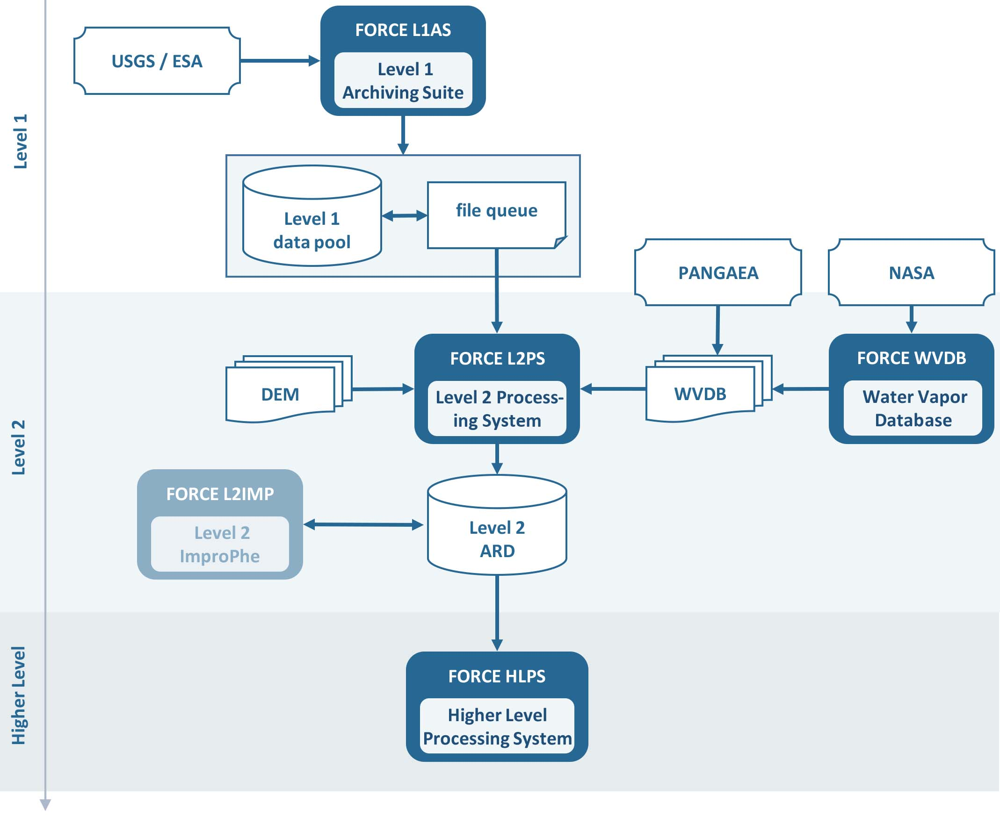

.. _comp_overview:

Overview
========

FORCE is a software framework and consists of several modules and executables, which are organized in components according to processing levels.
"Lower Level" is defined as Levels 1-2, "Higher Level" as Level 3 and above, auxilliary components are helper programs for specific purposes.

+--------------------+---------------------+------------------+
+ :ref:`lower-level` + :ref:`higher-level` + :ref:`aux-level` +
+--------------------+---------------------+------------------+

A typical FORCE workflow consists of following main steps:

  1) Level 1 images are acquired from the space agencies, and are 

  2) converted to Level 2 ARD, which are 

  3) aggregated and/or analyzed in Higher Level processing.

**Figure.** Overview of the Lower Level FORCE components.

*Note, that the L2IMP module produces Level 2 data, too. However, the processing strategy follows the Higher Level, thus this module is described here (add link).*

