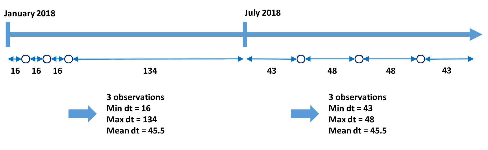
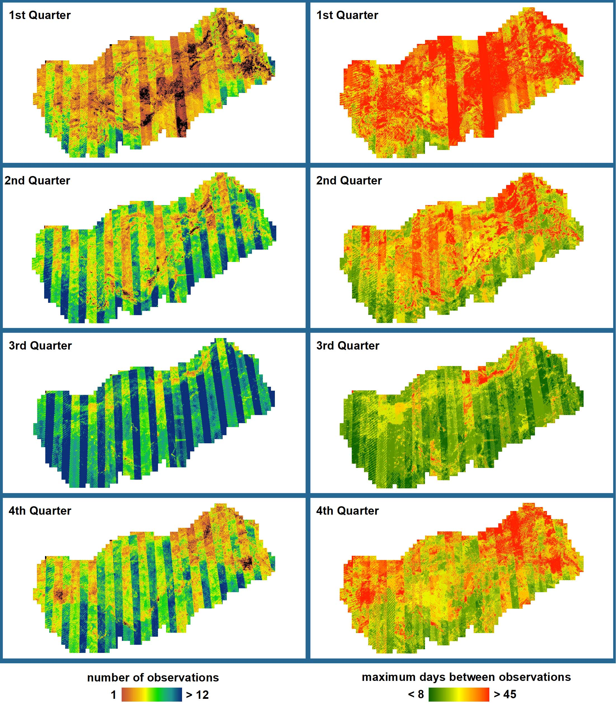

.. _cso:

Clear Sky Observations
======================

FORCE Clear Sky Observations (FORCE CSO) assists in data availability mining. 

The workflow of this submodule is shown in the Figure below. 

The most important setting are the temporal properties. 
A temporal range needs to be specified in terms of years, e.g. 2017–2018. 
Clear Sky Observation statistics are generated for each time step as defined by the ``MONTH_STEP`` parameter (e.g. 6 months). 
Within each interval, the number of Clear Sky Observations are counted. 
In addition, several statistics based on the temporal difference between the observations are calculated, e.g. the maximum time between two observations in each interval. 
Note that the beginning and end of the intervals act as boundaries for this assessment and are also considered.
 
This processing scheme reflects the fact, that a single measure of data availability might not yield representative results – depending on the application. 
A combined look at different statistics, or at a more uncommon metric, may provide more insight into the applicability of a specific method – or might explain uncertainties associated with a specific method. 
As an example, the data availability for the first and second half of 2018 (as depicted below) is equal in terms of the number of observations, and the average time between observations. 
However, there are large differences in the maximum time between observations as the data are clumped in the first half. This may have important implications, e.g. for the detectability of harvesting events.
Happy data mining!

 

**Figure** Processing workflow of the Clear Sky Observations submodule.

**A glimpse of what you get:**
 

**Figure** Quarterly Clear Sky Observation statistics.
The CSO statistics were computed for the 2015 Landsat 7–8 acquisitions over Turkey.

.. toctree::
   :maxdepth: 2

   param.rst
   process.rst
   format.rst

   