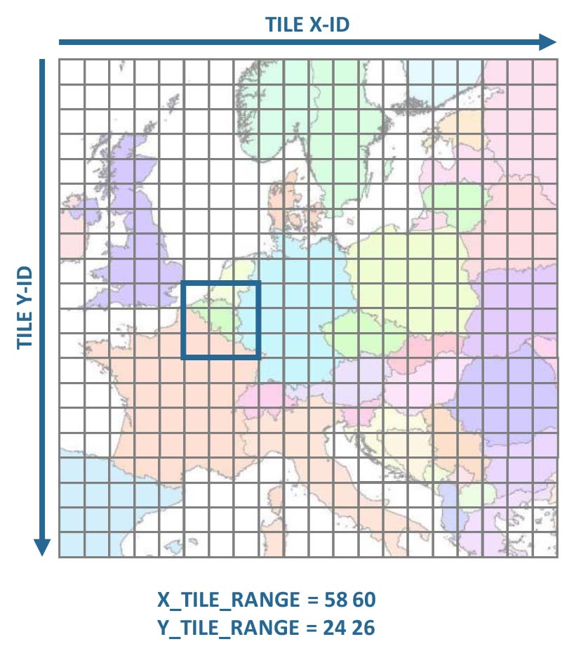
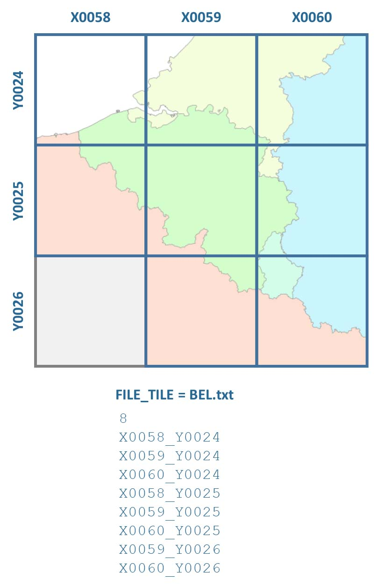
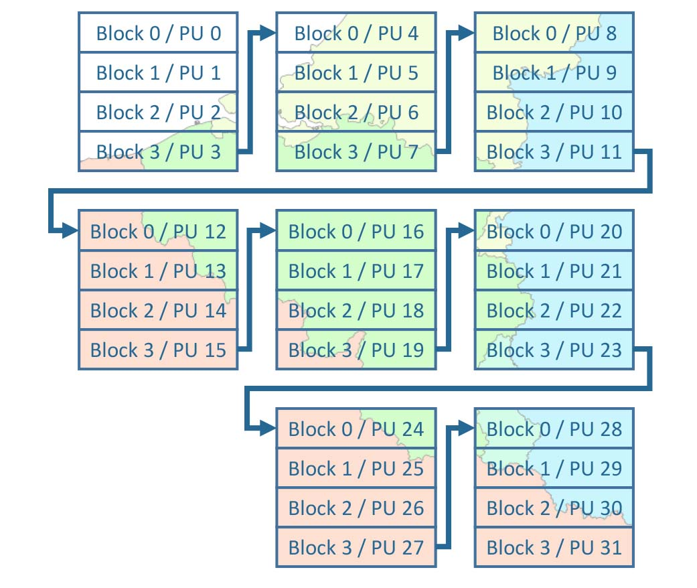
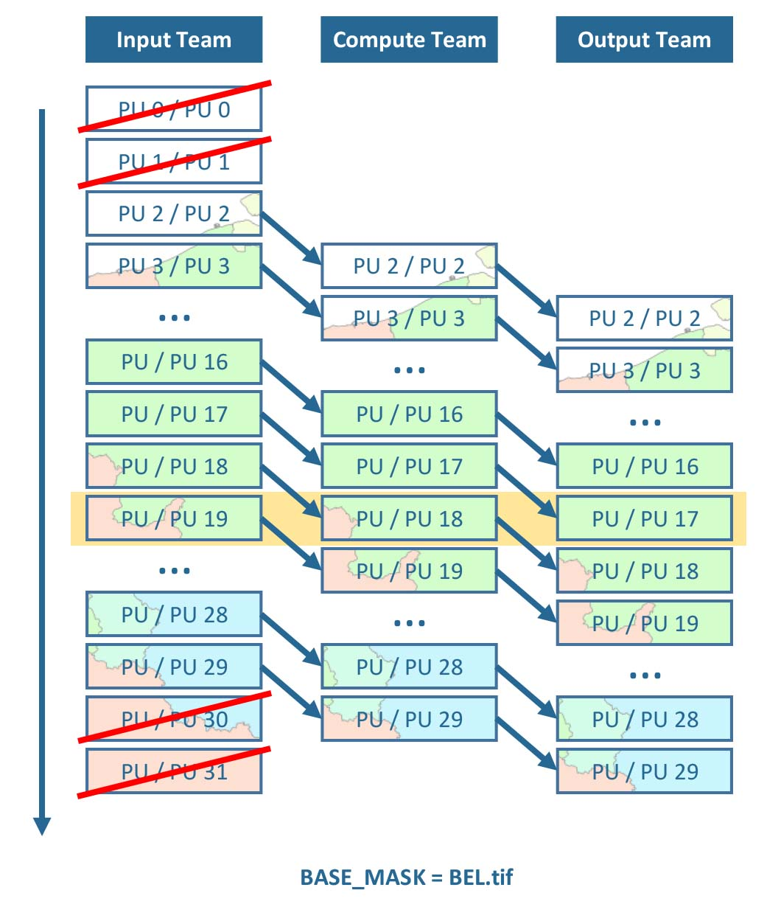

.. _hlps:

Higher Level
============

The FORCE Higher Level Processing System (HLPS) provides functionality for Higher Level Processing.

HLPS consists of one executable only, i.e. :ref:`_higher`.
However, multiple submodules exist (see table below), which either process cubed ARD or feature datasets. 

- ARD are Level 2 Analysis Ready Data. 
  Alternatively, Level 3 Best Available Pixel composites can be input, too.
  They consist of a reflectance product (mostly BOA, but TOA, IMP, BAP are supported, too), and pixel-based quality information (mostly QAI, but INF is supported, too).
  These input data need to follow a strict data format, including number of bands, naming convention with time stamp, sensor etc.
  
  .. seealso:: Check out this `tutorial <https://davidfrantz.github.io/tutorials/force-ard/l2-ard/>`_, which explains what Analysis Ready Data are, and how to use the FORCE :ref:`l2ps` to generate them..

- Feature datasets can be anything from individual ARD datasets to external datasets like precipitation or DEM.
  Most often, features are generated by one HLPS submodule, and then used by another one, e.g. generate Spectral Temporal Metrics with :ref:`tsa`, then use these outputs as features in :ref:`ml`.
  The most important constraint is: HLPS only knows 16bit signed input, thus you need to scale your data accordingly.

The conceptual figures below explain the general concept of the processing strategy, computing model, and nested parallelism. 
The individual sub-figures can be enlarged by clicking on them.

1. The cubed data are stored in a grid system.
   Each tile has a unique tile ID, which consists of an X-ID, and a Y-ID.
   The numbers increase from left ro right, and from top to bottom.
   In a first step, a rectangular extent needs to be specified using the tile X- and Y-IDs.
   In this example, we have selected the extent covering Belgium, i.e. 9 tiles.

2. If you do not want to process all tiles, you can use a :ref:`tilelist`.
   The white list is intersected with the analysis extent, i.e. only tiles included in both the analysis extent AND the white-list will be processed.
   This is optional.

3. The image chips in each tile have an internal block structure for partial image access.
   These blocks are strips that are as wide as the ``TILE_SIZE`` and as high as the ``BLOCK_SIZE``.
   The blocks are the main processing units (PU), and are processed sequentially, i.e. one after another.

4. FORCE uses a streaming strategy, where three teams take care of reading, computing and writing data.
   The teams work simultaneously, e.g. input data for PU 19 is read, pre-loaded data for PU 18 is processed, and processed results for PU 17 are written - at the same time.
   If processing takes longer than I/O, this streaming strategy avoids idle CPUs waiting for delivery of input data.
   Optionally, :ref:`processing-masks` can be used, which restrict processing and analysis to certain pixels of interest.
   Processing units, which do not contain any active pixels, are skipped (in this case, the national territory of Belgium).

5. Each team can use several threads to further parallelize the work.
   In the input team, multiple threads read multiple input images simultaneously, e.g. different dates of ARD.
   In the computing team, the pixels are distributed to different threads (please note that the actual load distribution may differ from the idealized figure due to load balancing etc.).
   In the output team, multiple threads write multiple output products simultaneously, e.g. different Spectral Temporal Metrics.

.. image:: hl-5.jpg
   :width: 19%

**Table 1** Higher Level module.

+--------+-------------------------+-------+-----------------------------------------------------------------------------------------------------+
+ Module + Program                 + Level + Short description                                                                                   +
+========+=========================+=======+=====================================================================================================+
+--------+-------------------------+-------+-----------------------------------------------------------------------------------------------------+
+ HLPS   + The FORCE Higher Level Processing System (HLPS) provides functionality for Higher Level Processing of cubed ARD and feature datasets. +
+        +-------------------------+-------+-----------------------------------------------------------------------------------------------------+
+        + :ref:`higher-level`     + 3-4   + Higher Level processing                                                                             +
+--------+-------------------------+-------+-----------------------------------------------------------------------------------------------------+

**Table 2** Submodules of HLPS.

+---------------+-------+---------+---------------------------------------------------------------------------------------------------------------------------------------------+
+ Submodule     + Level + Input   + Short description                                                                                                                           +
+===============+=======+=========+=============================================================================================================================================+
+ :ref:`level3` + 3     + ARD     + Generate temporal aggregations of Level 2 ARD, i.e. pixel-based composites                                                                  +
+---------------+-------+---------+---------------------------------------------------------------------------------------------------------------------------------------------+
+ :ref:`cso`    + 3     + ARD     + Statistics for Level 2-3 ARD data availability mining                                                                                       +
+---------------+-------+---------+---------------------------------------------------------------------------------------------------------------------------------------------+
+ :ref:`tsa`    + 3-4   + ARD     + Multitemporal analysis and processing based on Level 2-3 ARD                                                                                +
+---------------+-------+---------+---------------------------------------------------------------------------------------------------------------------------------------------+
+ :ref:`ml`     + 4     + feature + Model predictions based on any cubed features                                                                                               +
+---------------+-------+---------+---------------------------------------------------------------------------------------------------------------------------------------------+
+ :ref:`txt`    + 4     + feature + Morphological transformations based on any cubed features                                                                                   +
+---------------+-------+---------+---------------------------------------------------------------------------------------------------------------------------------------------+
+ :ref:`lsm`    + 4     + feature + Quantification of spatial patterns based on any cubed features                                                                              +
+---------------+-------+---------+---------------------------------------------------------------------------------------------------------------------------------------------+
+ :ref:`smp`    + /     + feature + Point-based extraction of features for training/validation purposes                                                                         +
+---------------+-------+---------+---------------------------------------------------------------------------------------------------------------------------------------------+
+ :ref:`cfi`    + 4     + ARD     + Increase the spatial resolution of coarse continuous fields (like Land Surface Phenology) to Level 2 ARD resolution using the ImproPhe code +
+---------------+-------+---------+---------------------------------------------------------------------------------------------------------------------------------------------+
+ :ref:`l2i`    + 2     + ARD     + Increase the spatial resolution of lower resolution Level 2 ARD using higher resolution Level 2 ARD using the ImproPhe code                 +
+---------------+-------+---------+---------------------------------------------------------------------------------------------------------------------------------------------+

 
.. toctree::
   :hidden:
   :maxdepth: 2

   higher-level.rst
   l3/index.rst
   tsa/index.rst
   cso/index.rst
   ml/index.rst
   txt/index.rst
   lsm/index.rst
   smp/index.rst
   l2i/index.rst
   cfi/index.rst

