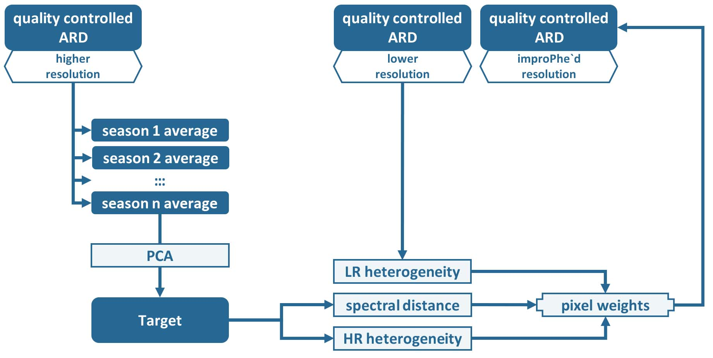
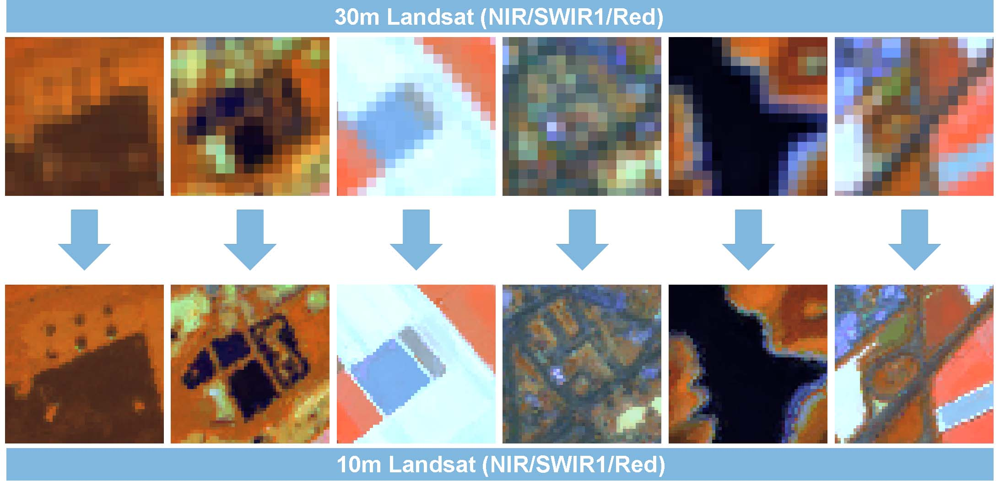

.. _l2i:

Level 2 ImproPhe
================

The Level 2 ImproPhe (L2IMP) submodule increases the spatial resolution of lower resolution Level 2 ARD using higher resolution Level 2 ARD.
As an example, the spatial resolution of 30m Landsat imagery can be "improPhed" to 10m using Sentinel-2 targets. 
This only works for years where both data sources exist. 
The data fusion is performed with the ImproPhe algorithm (`Frantz et al. <https://doi.org/10.1109/TGRS.2016.2537929>`_)

.. note::

  This module is heavy on processing time and RAM.

  

**Figure** Processing workflow of the Level 2 ImproPhe submodule.

Add more detailed description about workflow here. Make workflow image.

The higher-resolution ARD are condensed to seasonal windows, and the ImproPhe code is applied to each lower-resolution ARD dataset. 

**A glimpse of what you get:**
 

**Figure**  30m Landsat ARD, and ImproPhed 10m Landsat ARD.
The figure shows image subsets from North Rhine-Westphalia, Germany. Using the ImproPhe algorithm, the spatial resolution was improved to 10m using multi-temporal Sentinel-2 A/B high-res bands as prediction targets.

.. toctree::
   :maxdepth: 2

   param.rst
   format.rst

   