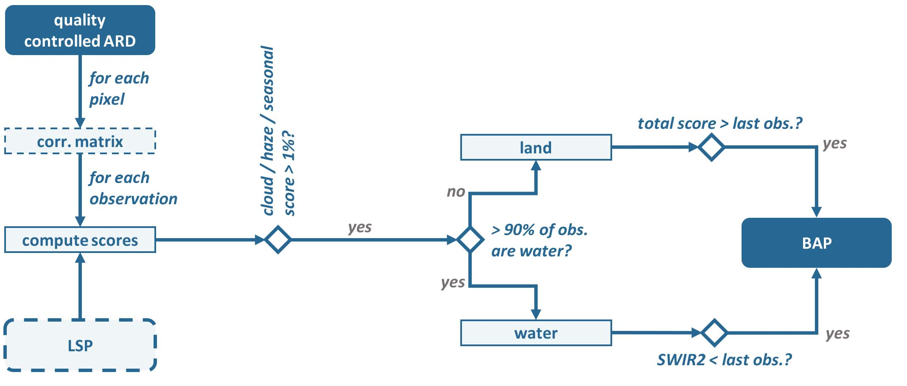
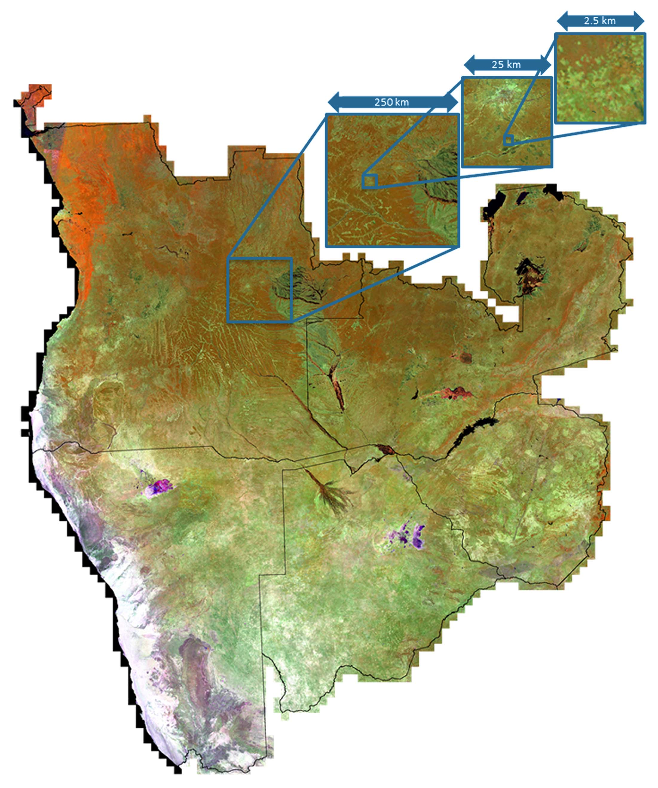

.. _level3:

Level 3 Compositing
===================

The Level 3 Compositing submodule generates temporal aggregations of Level 2 data to provide seamless, gap free, and highly Analysis Ready Data (hARD) over very large areas.
hARD are excellent input for many machine learning algorithms, e.g. for land cover / change classification purposes. 

**Figure** Processing workflow of the Level 3 Compositing submodule.

The aggregation is performed using a parametric weighting scheme based selection algorithm based on `Griffiths et al. <https://doi.org/10.1109/JSTARS.2012.2228167>`_, commonly known as pixel-based compositing.
The selection can either be performed using static target dates or using dynamic target dates as outlined in `Frantz et al. <https://doi.org/10.1016/j.rse.2017.01.002>`_, known as phenology-adaptive compositing.
In the latter case, a Land Surface Phenology (LSP) dataset is required.

Only highest-quality pixels are considered, i.e. observations with very low cloud or haze score are discarded.
Similarly, observations with very low seasonal score are discarded, which ensures that Level 3 products are representative of the season of interest (can be switched off).
Over persistent water, the compositing algorithm is switched to minimum shortwave-infrared (SWIR2 band) compositing, as the parametric weighting selection is often noisy due to the high temporal variability of water reflectance.

**A glimpse of what you get:**
 

**Figure** Phenology Adaptive Composite (PAC) using Landsat 5–7.
The End of Season composite (2018) was computed for Angola, Zambia, Zimbabwe, Botswana and Namibia. 

.. toctree::
   :maxdepth: 2

   param.rst
   lsp.rst
   format.rst

