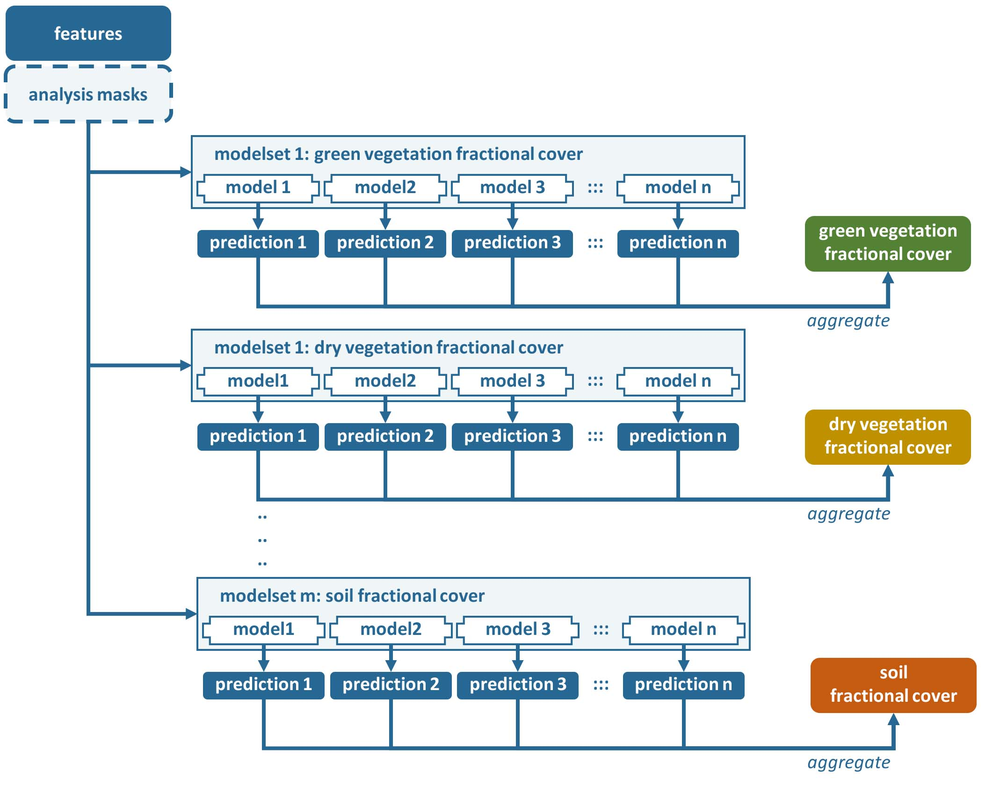
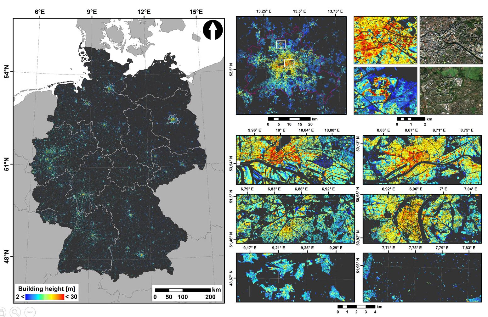

.. _ml:

Machine Learning
================

The Machine Learning submodule generates maps from machine learning predictions. 
The response variable can either be quantitative or qualitative, i.e. regression or classification.
The resulting maps are grouped as highly Analysis Ready Data plus (hARD+), which means they can be directly used to fuel your research questions without any further processing. 
Typically, this submodule is fed with hARD products, i.e. seamless and gap free aggregate products.
hARD products can be generated by the :ref:`tsa`, :ref:`level3`, :ref:`txt`, and :ref:`lsm` submodules - or external hARD can be ingested using :ref:`aux-cube`.
Machine learning models are trained using :ref:`aux-train`.

**Figure** Processing workflow of the Machine Learning submodule.

How does it work? Add some description. Modelsets, models, aggregation etc. 

**A glimpse of what you get:**
 

**Figure**  Building Height prediction for Germany using Support Vector Regression.
The model was trained with 3D building models and multi-temporal Sentinel-1+2 A/B time series.

.. toctree::
   :maxdepth: 2

   prereq.rst
   param.rst
   process.rst
   format.rst

   