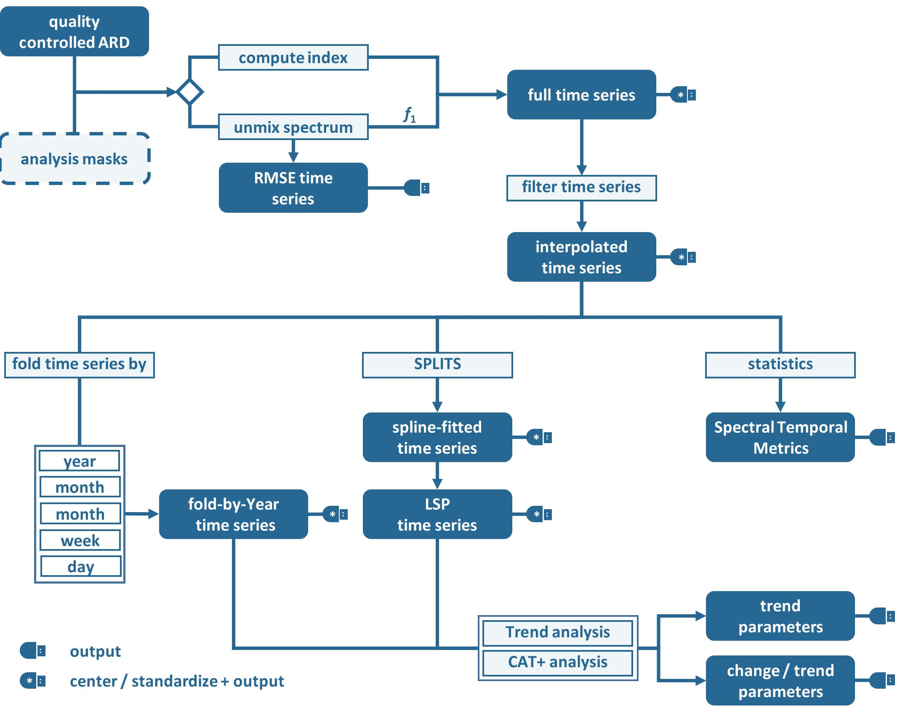
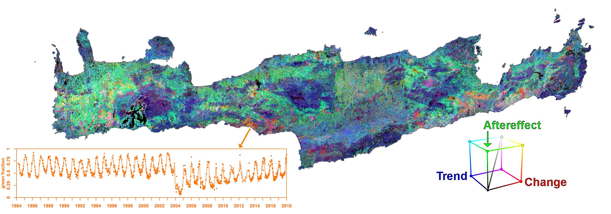

.. _tsa:

Time Series Analysis
====================

The Time Series Analysis submodule provides out-of-the-box time series preparation and analysis functionality. 
The user can select from a number of spectral indices or unmix spectra using custom endmembers. 
The submodule is capable of extracting quality-controlled time series with a number of aggregation and interpolation techniques. 
Annual Land Surface Phenology metrics can be derived, and change and trend analyses can be performed on any of the generated time series. 
Many outputs of FORCE TSA are either considered as highly Analysis Ready Data (hARD), or even as highly Analysis Ready Data plus (hARD+).
hARD products are excellent input for many machine learning algorithms, e.g. for land cover / change classification purposes. 
hARD+ products can be directly used to fuel your research questions without any further processing. 

**Figure** Processing workflow of the Time Series Analysis submodule.

* All output is optional. 
  Each product is only generated if it is output - or needed for another product.
  All products indicated by a USB-plug can be output. 
  All outputs labeled with a ``*`` can be centered / standardized before output.

* The analysis can be performed with observations from all available sensors, or a subset of these.
  If multiple sensors are used, only overlapping bands are considered.
  Note that no spectral adjustment is (currently) made.

* The spatial resolution on which the analysis is performed, needs to be given.
  Image decimation/replication is taken care of using nearest neighbor resampling.
  Alternatively, spatial resolution may be reduced using approximated Point Spread Functions (PSF).
  The PSFs are parameterized with Full Width at Half Maximum (FWHM) corresponding to the size of one pixel at the target resolution.
  
* A temporal subset needs to be specified in terms of a date range.
  In addition, a Day-of-Year (DOY) range is used to further restrict this subset, e.g. to only use summer observations for a 20year period.

* Processing is based on a spectral band, spectral index (e.g. NDVI), or fractional cover using linear spectral mixture analysis (SMA). 
  The program will exit with an error message if the requested index is not available for the chosen sensor set.
  Multiple indices may be given, and all processing will be repeated for each index.
  However, input data is read once only, and only the required bands are input to reduce I/O.
  The full time series is generated, quality-controlled, and potentially output. The time series may be centered and/or standardized to each pixel’s mean and/or standard deviation before output as indication for vegetation under-/over-performance.
  In the case of SMA, a :ref:`tsa-endmember` needs to be provided.
  Only the abundance image related to one endmember is retained.
  The SMA can be constrained (Sum-to-One and/or Non-Negativity), and the fractions can be shade normalized.
  The RMSE time series of the SMA can be output.

* The time series can be interpolated / smoothed at custom time steps.
  Currently available are linear interpolation, moving average filter, and Radial Basis Function (RBF) ensembles.
  The RBF kernel strengths are adapted by weighting with actual data availability within the time period covered by each kernel.
  All further processing is based on the interpolated time series, unless interpolation is switched off.

* Spectral Temporal Metrics can be generated.
  They are produced by a statistical description of all available spectral observations. 
  Spectral temporal metrics are produced bandwise, thus physical interpretability is limited. 
  However, they provide rich information on temporal snapshots, temporal variability and data distribution and are thus ideal predictors for machine-learning techniques that require independent features and spatial completeness. 
  their quality is closely related to data availability as a sufficient number of clear sky observations (in dependence of the statistical moment) are required to produce reliable statistics.

* The time series can be 'folded' by year, quarter, month, week or day.
  The time series can be folded with any available statistics, e.g. mean or median.
  
  * If folded by year, the observations are grouped by year to generate an annual time series.
    This is the most frequently used folding option, and is e.g. suitable to compute long-term trends.
  * If folded by quarter, the observations are grouped by quartes (three-month periods), which gives up to 4 values per pixel.
  * If folded by month, the observations are grouped by months, which gives up to 12 values per pixel.
  * If folded by week, the observations are grouped by week numbers (starting with DOY 1), which gives up to 52 values per pixel; note that the last week contains some more days.
  * If folded by day, the observations are grouped by DOY, which gives up to 365 values per pixel.

* Annual Land Surface Phenology (LSP) metrics a.k.a. phenometrics can be extracted.
  Deriving LSP will only work nicely if data availability throughout the year is high; do not expect good results for sparse data.
  To derive LSP metrics for a given year, some data from the previous and next year need to be included, as the early/late minima may not be found in the year of interest (the data range can be specified by the user).
  The same can be true for the peak. 
  The code will autodetect whether we have a Northern hemisphere (peak assumed in the middle of the year) or Southern hemisphere (peak is assumed around the turn of the year) type of phenology.
  This decision is taken on the pixel-level.
  In total, 26 LSP metrics can be derived for each year (see :ref:`tsa-format`).

* Trend analysis and/or an change/trend analyses can be performed on any of the folded and/or LSP time series.
  Currently implemented analyses are linear trend analysis, and an extended CAT transform (with additional change and trend parameters for the three parts of the time series (see :ref:`tsa-format`).
  CAT = Change, Aftereffect, Trend.

.. warning::

   Multiple indices can be selected at once, and the processing will generate all available output data for each index.
   While this is very handy, please keep in mind that depending on parameterization you can potentially generate an absurd amount of results and quickly fill up disc space.
   Fully parameterized, FORCE TSA can output 5508 products!!! For each tile!
   Each of these products are multi-band images.
   Some of these products, e.g. interpolated time series, can have 1000s of bands.
   **Use with care!**

**A glimpse of what you get:**
 

**Figure** Phenology-based change and trend analysis. 
Change, Aftereffect, Trend transformation (CAT) showing both long-term (30+ years) gradual and abrupt changes over Crete, Greece. 
The CAT transform was applied to the Value of Base Level (VBL) annual time series, which was itself derived by inferring Land Surface Phenology (LSP) metrics from dense time series of green vegetation abundance derived from linear spectral mixture analysis (SMA). 
[All this was done in one step using this submodule]

.. toctree::
   :maxdepth: 2

   param.rst
   indices.rst
   endmember.rst
   format.rst

   