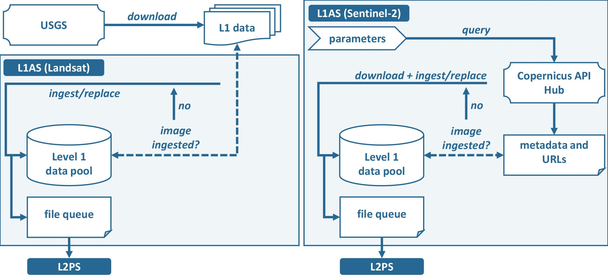

.. _l1as:

Level 1 Archiving Suite
=======================

Add more about information.

The FORCE Level 1 Archiving Suite (FORCE L1AS) assists in organizing and maintaining a clean and consistent Level 1 data pool, as well as downloading of Landsat and Sentinel-2 data.
It is attempted to reduce redundancy and supports versioning, e.g. by removing old data if new processing versions are available.
In addition, FORCE L1AS assists in building and updating the file queues needed for :ref:`l2ps`:

**Figure.** FORCE Level 1 Archiving Suite (L1AS) workflow. 

.. note::
   | We reccomend using :ref:`level1-csd` for fast downloads of Sentinel-2 data from Google Cloud Storage, and :ref:`level1-landsat` for downloading Landsat data from the USGS.
   | As of ``FORCE v. 3.5`` :ref:`level1-sentinel2` is deprecated and will be removed in a future FORCE version.

.. note::
   | :ref:`level1-csd` is still functional, but due to changes on Google's end, the tool won't download data newer than August 28, 2024 (see `this issue <https://github.com/davidfrantz/force/issues/334>`_). For newer data, users are referred to the official APIs of CDSE.

On successful ingestion, the image is appended to a :ref:`queue`, which controls Level 2 processing. 
The file queue is a text file that holds the full path to the image, as well as a processing-state flag. 
This flag is either ``QUEUED`` or ``DONE``, which means that it is enqueued for Level 2 processing or was already processed and will be ignored next time.

+-------------------+-----------------------+-------------------------+--------------+
+ :ref:`level1-csd` + :ref:`level1-landsat` + :ref:`level1-sentinel2` + :ref:`queue` +
+-------------------+-----------------------+-------------------------+--------------+

.. toctree::
   :maxdepth: 1
   :hidden:

   level1-csd.rst
   level1-landsat.rst
   queue.rst

   