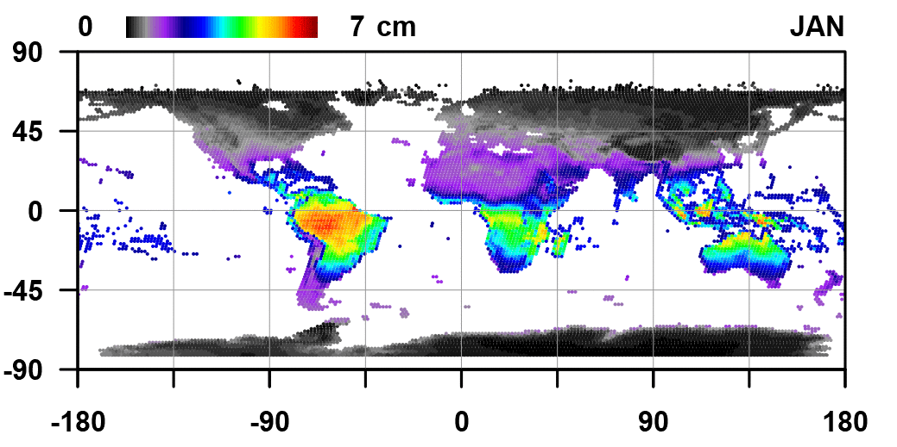

.. _wvdb:

Water Vapor Database
====================

The FORCE Water Vapor Database (FORCE WVDB) component can be used to generate and maintain a water vapor database used for atmospheric correction of **Landsat** data in :ref:`l2ps`.

The water vapor database is *not necessary for Sentinel-2* because water vapor can be estimated from the images themselves.

The database holds water vapor values for the central coordinates of each WRS-2 frame. If available, day-specific values are used. If not, a monthly climatology is used instead.

The uncertainty of using the climatology was assessed in this paper: 
Frantz, D., Stellmes, M., & Hostert, P. (2019). A Global MODIS Water Vapor Database for the Operational Atmospheric Correction of Historic and Recent Landsat Imagery. Remote Sensing, 11, 257. https://doi.org/10.3390/rs11030257

**A glimpse of what you get:**

**Figure 2.** Global, and monthly water vapor climatology for each land-intersecting Landsat WRS-2 scene.

.. toctree::
   :hidden:
   :maxdepth: 2

   lut-modis.rst
   format.rst
