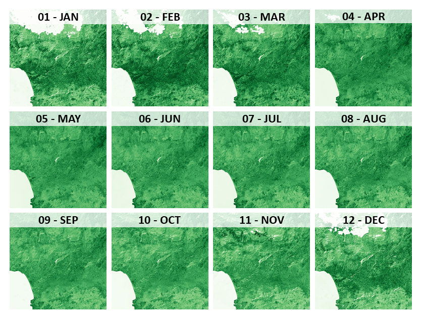
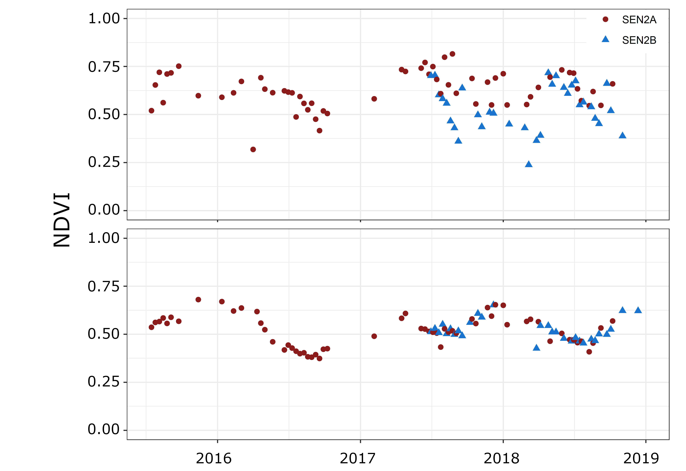
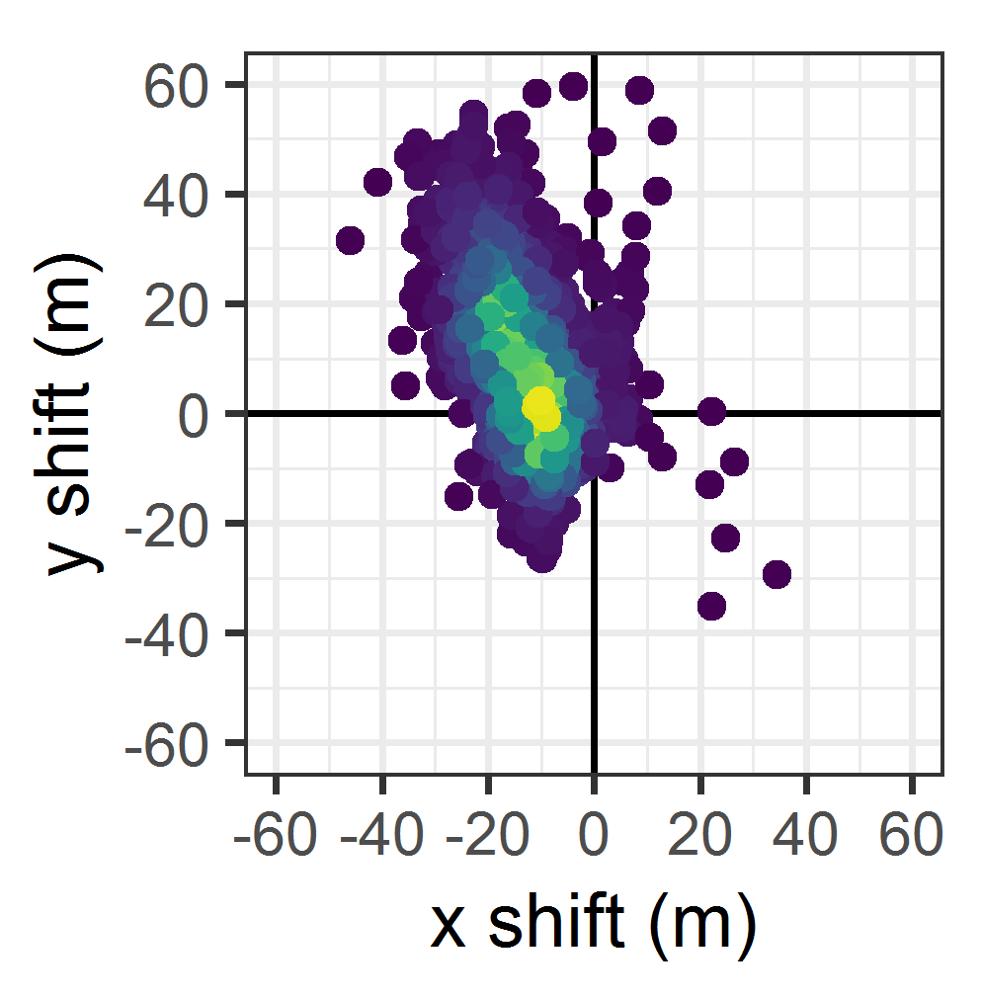

.. _tut-coreg:

.. |copy|   unicode:: U+000A9 .. COPYRIGHT SIGN

Coregistration
==============

**How to coregister Sentinel-2 with Landsat**

This tutorial explains how to generate co-registered Sentinel-2 Analysis Ready Data using the FORCE Level 2 Processing System.

I strongly suggest to read the :ref:`tut-ard` tutorial before.

.. admonition:: Info

   *This tutorial uses FORCE v. 3.5*

What is the problem?
--------------------

**THIS** is the problem:

.. figure:: img/tutorial-coreg-animation.gif

   *Animation of Sentinel-2 images on Crete*

Sentinel-2 images before the usage of the GRI (*Ground Reference Image*) have a nominal geolocation uncertainty of around 12m.
This is already more than one pixel.
In some areas it is worse (e.g. on Crete, Greece), in some areas it is better.
However, it is a general issue that occurs everywhere around the globe (even in our all-flat study areas in Brandenburg, Germany).
This tutorial will guide you through the steps to go from the left to the right animation.

How does it work?
-----------------

For details, see `this paper <https://ieeexplore.ieee.org/abstract/document/9057384>`_.
In a nutshell, FORCE L2PS implements a `coregistration code <https://www.mdpi.com/2072-4292/8/6/520>`_, which aligns each Sentinel-2 image with monthly multi-annual Landsat near-infrared base images.
There need to be 12 base images, one for each month.
They need to be stacked as multi-band files (i.e. *12 bands*).
Each base image is generated by averaging all clear-sky Landsat near-infrared reflectance images from multiple years in the given month, e.g. all August images from 2015 to 2020.
For this, we need to generate Landsat base images first.

30m Landsat to correct 10m Sentinel-2.. Really?
-----------------------------------------------

**Really!** At first, using lower resolution Landsat images as the baseline for fixing the geometric accuracy of Sentinel-2 may seem non-intuitive.
However, see for yourself, it will work! The most important thing is: Sentinel-2 and Landsat 8 are fairly similar in many respects, and Landsat time series are pretty robust.
There currently (Landsat collection 1) is a similar geolocation accuracy of 12m (about one third of a Landsat pixel).
However, by aggregating multiple observations over time, this error even averages out, thus the baseline is highly robust.
With the release of Landsat collection 2 in September 2020, this geolocation accuracy is further expected to drop well below 10m globally!  

Base images
-----------

For this tutorial, we assume that we already have an existing Level 2 ARD datapool, which contains preprocessed Landsat 8 data (see ARD tutorial here).
These need to cover the spatial extent of the to-be-coregistered Sentinel-2 images.
The base images can be readily generated using the Time Series Analysis (TSA) submodule of the FORCE Higher Level Processing system (HLPS).
To familiarize yourself with the TSA submodule, I suggest taking a detour to the Interpolation tutorial (LINK) before advancing.

.. warning::

   The output directory should be clean.
   I strongly advise to not store other FORCE output or other stuff in there (otherwise FORCE L2PS might be using an incorrect *base image*).
   Also, do not output other products than the one specified in this tutorial.

.. code-block:: bash

   DIR_HIGHER = /data/europe/base

You might want to adapt the parallel processing options ``NTHREAD_READ``, ``NTHREAD_COMPUTE``, and ``NTHREAD_WRITE`` to your needs.
Typically, this is an input-bound job.

Adapt the spatial extent. 
``X_TILE_RANGE`` and ``Y_TILE_RANGE`` should be set, such that all Sentinel-2 images are covered (not only the part you are eventually interested in, but the complete image as provided by ESA).

As we are generating Landsat near-infrared base images, use

.. code-block:: bash

   RESOLUTION = 30
   SENSORS = LND08
   INDEX = NIR

For the date range, I recommend using about 5 years of data, but this may be adapted as needed; e.g. if your data availability permits, this might be narrowed down.
In general, do not worry too much if there are some data gaps in the resulting base image of some months; the co-registration is rather robust (but there is a limit of course - look at the logfiles!).

.. code-block:: bash

   DATE_RANGE = 2015-01-01 2020-12-31

It is important to note here that the coregistration routine will look for base images with a timestamp earlier than the to-be-coregistered-image.

As an example: 

- If we have a single set of base images that start with 2015*, each Sentinel-2 image will be aligned to this base.
- If we have a single set of base images that start with 2016*, Sentinel-2 images acquired in 2015 cannot be coregistered.
- If we have multiple sets of base images (e.g. for 2-year periods: 2015*, 2017*, 2019*), a Sentinel-2 acquisition from 2018-07-31 will use the 2017* baseline, an acquisition from 2020-08-14 will use the 2019* baseline.

Interpolation (``INTERPOLATE``) is not necessary, but may be used to mitigate some data availability issues.

Then, we simply *fold* the time series by month using average aggregation.
This will create the 12-band output file, which we will use as baseline.

.. code-block:: bash

   FOLD_TYPE = AVG
   OUTPUT_FBM = TRUE

To generate the base images, run force-higher-level, e.g.

.. code-block:: bash

   force-higher-level /data/europe/base/base-images.prm

After this, we need to generate a virtual mosaic:

.. code-block:: bash

   force-mosaic /data/europe/base

The base images look like this, i.e. 12 NIR images - one for each month:

   *Landsat NIR base images. Stretch: white to green.*

Coregistration
--------------

The usage of the base images in FORCE L2PS is straightforward.
Simply use the ``mosaic`` folder for the base image location:

.. code-block:: bash

   DIR_COREG_BASE = /data/europe/base/mosaic
   COREG_BASE_NODATA = -9999

Then, you can proceed with generating the co-registered Sentinel-2 Analysis Ready Data by running ``force-level2`` (see :ref:`tut-ard` tutorial).

Logfiles
""""""""

As usual, it is very much advised to look into the logfiles.
This is especially true when using the coregistration.
The logfile includes information about the success of the co-registration, and will report the

- number of identified tie points
- the shift in x and y direction 
- the RMSE of the retrived image transformation

.. code-block:: bash

   cat /data/europe/logs/*.log | head

   L1C_T35SKV_A000905_20150825T091004: dc:  99.62%. wc:  68.33%. sc:   0.07%. cc:  18.37%. coreg (#tie, x/y shift, rmse): 5791/-15.74/14.86/0.41 - good, AOD: 0.3765. # of targets: 1984/33. 24 product(s) written. Success! Processing time: 36 mins 06 secs
   L1C_T35SLU_A001477_20151004T091006: dc:  37.49%. wc:  41.82%. sc:   0.00%. cc:   7.28%. coreg (#tie, x/y shift, rmse): 15824/-14.48/1.59/0.40 - good, AOD: 0.1489. # of targets: 30/18.  7 product(s) written. Success! Processing time: 07 mins 36 secs
   L1C_T35SLV_A001434_20151001T090006: dc:  85.64%. wc:  43.49%. sc:   0.09%. cc:  73.87%. coreg (#tie, x/y shift, rmse): 0/0.00/0.00/0.00 coreg failed. Exit.
   L1C_T35SLV_A001334_20150924T091007: dc:  64.48%. wc:  78.86%. sc:   0.09%. cc:  18.12%. coreg (#tie, x/y shift, rmse): 39309/-11.95/16.55/0.48 - good, AOD: 0.1990. # of targets: 248/31. 13 product(s) written. Success! Processing time: 16 mins 00 secs
   L1C_T34SGE_A000905_20150825T091004: dc:  99.60%. wc:  78.14%. sc:   0.07%. cc:  12.97%. coreg (#tie, x/y shift, rmse): 8058/-18.00/17.16/0.42 - good, AOD: 0.3700. # of targets: 1971/32. 22 product(s) written. Success! Processing time: 35 mins 23 secs
   L1C_T35SLU_A000862_20150822T091031: dc: 100.00%. wc:  76.34%. sc:   0.00%. cc:   5.07%. coreg (#tie, x/y shift, rmse): 4482/-13.36/-8.18/0.39 - good, AOD: 0.2660. # of targets: 694/2. 23 product(s) written. Success! Processing time: 43 mins 47 secs
   L1C_T35SKV_A001048_20150904T091005: dc:  99.62%. wc:  72.00%. sc:   0.00%. cc:   0.90%. coreg (#tie, x/y shift, rmse): 3761/-19.41/17.32/0.37 - good, AOD: 0.3330. # of targets: 1455/309. 24 product(s) written. Success! Processing time: 34 mins 56 secs
   L1C_T35SLU_A002192_20151123T091714: dc:  38.42%. wc:  40.77%. sc:   0.11%. cc:  45.38%. coreg (#tie, x/y shift, rmse): 0/0.00/0.00/0.00 coreg failed. Exit.
   L1C_T35SKU_A001048_20150904T091005: dc:  97.22%. wc:  90.64%. sc:   0.00%. cc:   4.78%. coreg (#tie, x/y shift, rmse): 12670/-6.25/2.07/0.37 - good, AOD: 0.4738. # of targets: 2308/4. 21 product(s) written. Success! Processing time: 31 mins 53 secs
   L1C_T35SMU_A001720_20151021T091038: dc:  86.66%. wc:  48.09%. sc:   3.17%. cc:  70.17%. coreg (#tie, x/y shift, rmse): 0/0.00/0.00/0.00 coreg failed. Exit.

You will see that a substantial number of images won’t be processed (probably a third or so, also depends on the maximum cloud cover thresholds).

.. tip:: 

   DO NOT WORRY!

These images are usually images with a lot of cloud cover, which are useless anyway.
By choosing the coregistration option, you trade quantity with quality.
Your time series applications will benefit from this.
Have a look at the plot below.
You see the NDVI time series for one pixel before - and after coregistration.
The left time series is essentially unusable because we are seeing observations from two different land covers.
When fixing the geolocation, the time series plot contains less observations, but is very clean and can be immediately used for any time series analysis.
Always remember: *trash in, trash out!*

   *Exemplary Sentinel-2 time series before (top) and after (bottom) co-registration. |copy| Philippe Rufin*

The logfiles also indicate how good the coregistration performed.
The number of tie points are an important indicator: the more the better.
Note however that this depends on the image content - if there is a high share of water, there will be less tie points than in a landlocked image.
The RMSE reports on the uncertainty of the geolocation transformation.
If the RMSE is low, we have a similar shift for the different tie points; if the RMSE is high, the shift for the tie points is indecisive and may point to a less precise coregistration.
Eventually, the logfiles reports on the original shift in X- and Y-direction between the Sentinel-2 image and the  base, which can e.g. be visualized like this, where we see that we corrected for quite some big shifts that substantially exceeded the 12m nominal geolocation accuracy.

   *Density plot of detected image shifts (~1500 images investigated). |copy| Philippe Rufin*

------------

.. |author-pic| image:: profile/dfrantz.jpg

+--------------+--------------------------------------------------------------------------------+
+ |author-pic| + This tutorial was written by                                                   +
+              + `David Frantz <https://davidfrantz.github.io>`_,                               +
+              + main developer of **FORCE**,                                                   +
+              + postdoc at `EOL <https://www.geographie.hu-berlin.de/en/professorships/eol>`_. +
+              + *Views are his own.*                                                           +
+--------------+--------------------------------------------------------------------------------+
+ **EO**, **ARD**, **Data Science**, **Open Science**                                           +
+--------------+--------------------------------------------------------------------------------+
