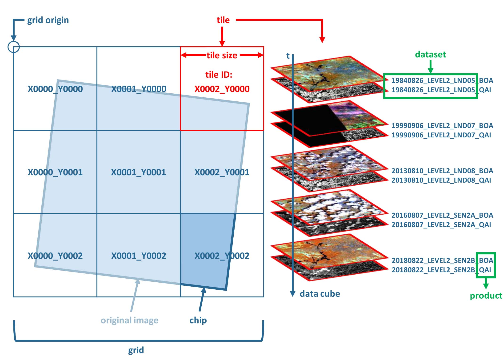
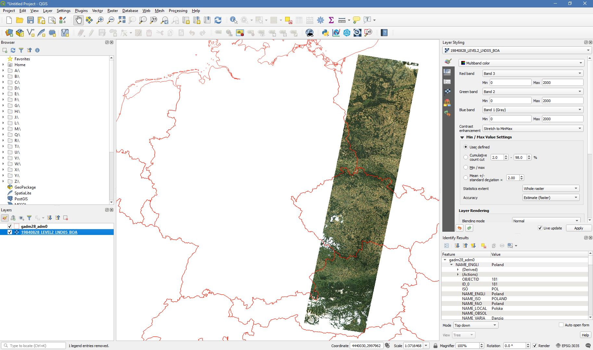

.. _tut-datacube:

The Datacube
============

**THIS HERE IS A TEST TO SEE HOW THE TUTORIALS RENDER ON RTD**

*This tutorial uses FORCE v. 3.0*

Learning Objective
------------------

This tutorial explains what a datacube is, how it is parameterized, how you can find a POI, how to visualize the tiling grid, and how to conveniently display cubed data.

Background
----------

FORCE makes heavy use of the data cube concept. This includes two main points:

1. All data are in the **same coordinate system**, which should be valid for a large regional extent (e.g. a continental projection).
2. The data are organized in regular, non-overlapping **tiles**.

**Figure 1.**   Overview of the datacube concept in FORCE.

   The ‘grid’ is the regular spatial subdivision of the land surface in the target coordinate system.
   
   The ‘grid origin’ is the location, where the tile numbering starts with zero. Tile numbers increase toward the South and East. Although not recommended, negative tile numbers may be present if the tile origin is not North–West of the study area.
   
   The ‘tile’ is one entity of the grid, i.e., a grid cell with a unique tile identifier, e.g., X0003_Y0002. The tile is stationary, i.e., it always covers the same extent on the land surface.
   
   The ‘tile size’ is defined in target coordinate system units (most commonly in meters). Tiles are square.
   
   Each ‘original image’ is partitioned into several ‘chips’, i.e., any original image is intersected with the grid and then tiled into chips.
   
   Chips are grouped in ‘datasets’, which group data, e.g. according to acquisition date and sensor.
   
   The ‘data cube’ groups all datasets within a tile in a time-ordered manner. The data cube may contain data from several sensors and different resolutions. Thus, the pixel size is allowed to vary, but the tile extent stays fixed. The tile size must be a multiple of the resolutions. Other data like features or auxiliary data are also permitted in the data cube (e.g. DEM or climate variables).
   
   The data cube concept allows for non-redundant data storage and efficient data access, as well as simplified extraction of data and information.

How to define the datacube parameters?
--------------------------------------

When generating Level 2 ARD data with FORCE L2PS, you need to define the datacube in the parameter file. Empty parameter files can be generated with ``force-parameter``.

- ``DO_REPROJ`` indicates whether the images should be reprojected to the target coordinate system - or stay in their original UTM projection.
- ``DO_TILE`` indicates whether the images should be tiled to chips that intersect with the grid system - or stay in the original reference system (WRS-2/MGRS).
- ``PROJECTION`` defines the target coordinate system. This projection should ideally be valid for a large geographic extent. The projection needs to given as "WKT" string. You can verify your projection (and convert to WKT from another format) using ``gdalsrsinfo`` (see below). If this fails, you need to fix the projection - otherwise FORCE L2PS will likely fail, too. 
- ``ORIGIN_LAT`` and ``ORIGIN_LON`` are the origin coordinates of the grid system in decimal degree. The upper left corner of tile X0000_Y0000 represents this point. It is a good choice to use a coordinate that is North-West of your study area – to avoid negative tile numbers.
- ``TILE_SIZE`` is the tile size (in target units, commonly in meters). Tiles are square.
- ``BLOCK_SIZE`` is the block size (in target units, commonly in meters) of the image chips. Blocks are stripes, i.e. they are as wide as the tile and as high as specified here. The blocks represent the internal structure of the GeoTiffs, and represent the primary processing unit of the force-higher-level routines.

Two default projection / grid systems are predefined in FORCE. They can be specified via the ``PROJECTION`` parameter instead of giving a WKT string. The predefined options have their own settings for ``ORIGIN_LAT``, ``ORIGIN_LON``, ``TILE_SIZE``, and ``BLOCK_SIZE``, thus the values given in the parameterfile will be ignored. [EQUI7](https://cartography.tuwien.ac.at/eurocarto/wp-content/uploads/2015/09/3_6_ppt.pdf) consists of 7 Equi-Distant, continental projections with a tile size of 100km. [GLANCE7](https://measures-glance.github.io/glance-grids/) consists of 7 Equal-Area, continental projections, with a tile size of 150km. One datacube will be generated for each continent.

.. warning::
   If you are not using the datacube options, i.e. ``DO_REPROJ = FALSE`` or ``DO_TILE = FALSE``, you are running into a **dead end** for FORCE. 
   In this case, the data cannot be further processed or analysed with any higher level FORCE functionality...

How to validate the projection?
-------------------------------

GDAL has a built-in projection conversion/validation tool:

.. code-block:: bash

   gdalsrsinfo -v 'PROJCS["ETRS89 / LAEA Europe",GEOGCS["ETRS89",DATUM["European_Terrestrial_Reference_System_1989",SPHEROID["GRS 1980",6378137,298.257222101,AUTHORITY["EPSG","7019"]],TOWGS84[0,0,0,0,0,0,0],AUTHORITY["EPSG","6258"]],PRIMEM["Greenwich",0,AUTHORITY["EPSG","8901"]],UNIT["degree",0.0174532925199433,AUTHORITY["EPSG","9122"]],AUTHORITY["EPSG","4258"]],PROJECTION["Lambert_Azimuthal_Equal_Area"],PARAMETER["latitude_of_center",52],PARAMETER["longitude_of_center",10],PARAMETER["false_easting",4321000],PARAMETER["false_northing",3210000],UNIT["metre",1,AUTHORITY["EPSG","9001"]],AUTHORITY["EPSG","3035"]]'

   Validate Succeeds
   
   PROJ.4 : '+proj=laea +lat_0=52 +lon_0=10 +x_0=4321000 +y_0=3210000 +ellps=GRS80 +towgs84=0,0,0,0,0,0,0 +units=m +no_defs '
   
   OGC WKT :
   PROJCS["ETRS89 / LAEA Europe",
       GEOGCS["ETRS89",
           DATUM["European_Terrestrial_Reference_System_1989",
               SPHEROID["GRS 1980",6378137,298.257222101,
                   AUTHORITY["EPSG","7019"]],
               TOWGS84[0,0,0,0,0,0,0],
               AUTHORITY["EPSG","6258"]],
           PRIMEM["Greenwich",0,
               AUTHORITY["EPSG","8901"]],
           UNIT["degree",0.0174532925199433,
               AUTHORITY["EPSG","9122"]],
           AUTHORITY["EPSG","4258"]],
       PROJECTION["Lambert_Azimuthal_Equal_Area"],
       PARAMETER["latitude_of_center",52],
       PARAMETER["longitude_of_center",10],
       PARAMETER["false_easting",4321000],
       PARAMETER["false_northing",3210000],
       UNIT["metre",1,
           AUTHORITY["EPSG","9001"]],
       AUTHORITY["EPSG","3035"]]

Where is the datacube definition stored?
----------------------------------------

At the top level of the generated datacube, a text file will be generated (``datacube-definition.prj``). This file is key for all
FORCE higher-level functionality. Each higher-level module will save a copy of this file in the corresponding output directory. If this file is not present, the tools will fail. Therefore, **do not modify, move, or delete this file**. This file contains the datacube definition as defined above. 

1. projection in WKT
2. grid origin, longitude
3. grid origin, latitude
4. grid origin, x-coordinate in projection
5. grid origin, y-coordinate in projection
6. tile size in projection units
7. block size in projection units

.. code-block:: bash

   cat /data/Dagobah/edc/level2/datacube-definition.prj

   PROJCS["ETRS89 / LAEA Europe",GEOGCS["ETRS89",DATUM["European_Terrestrial_Reference_System_1989",SPHEROID["GRS 1980",6378137,298.257222101,AUTHORITY["EPSG","7019"]],TOWGS84[0,0,0,0,0,0,0],AUTHORITY["EPSG","6258"]],PRIMEM["Greenwich",0,AUTHORITY["EPSG","8901"]],UNIT["degree",0.0174532925199433,AUTHORITY["EPSG","9122"]],AUTHORITY["EPSG","4258"]],PROJECTION["Lambert_Azimuthal_Equal_Area"],PARAMETER["latitude_of_center",52],PARAMETER["longitude_of_center",10],PARAMETER["false_easting",4321000],PARAMETER["false_northing",3210000],UNIT["metre",1,AUTHORITY["EPSG","9001"]],AUTHORITY["EPSG","3035"]]
   -25.000000
   60.000000
   2456026.250000
   4574919.500000
   30000.000000
   3000.0000000

.. note::
   In some rare circumstances, you might need to generate this file on your own. 
   However, this only applies if - for any reason - you skip the Level 2 processing (e.g. if you only want to work with external features, or trick FORCE into using external ARD datasets).

How is the datacube organized?
------------------------------

In practice, the tiles are directories in the file system, and each chip represents one file. 

.. code-block:: bash

   ls /data/Dagobah/edc/level2 | tail

   X0134_Y0095
   X0134_Y0096
   X0134_Y0097
   X0134_Y0098
   X0134_Y0099
   X0135_Y0095
   X0135_Y0096
   X0135_Y0097
   X0135_Y0098
   X0135_Y0099

.. code-block:: bash

   ls /data/Dagobah/edc/level2/X0134_Y0097/*.tif | tail

   /data/Dagobah/edc/level2/X0134_Y0097/20181225_LEVEL2_SEN2A_BOA.tif
   /data/Dagobah/edc/level2/X0134_Y0097/20181225_LEVEL2_SEN2A_CLD.tif
   /data/Dagobah/edc/level2/X0134_Y0097/20181225_LEVEL2_SEN2A_HOT.tif
   /data/Dagobah/edc/level2/X0134_Y0097/20181225_LEVEL2_SEN2A_QAI.tif
   /data/Dagobah/edc/level2/X0134_Y0097/20181225_LEVEL2_SEN2A_VZN.tif
   /data/Dagobah/edc/level2/X0134_Y0097/20181230_LEVEL2_SEN2B_BOA.tif
   /data/Dagobah/edc/level2/X0134_Y0097/20181230_LEVEL2_SEN2B_CLD.tif
   /data/Dagobah/edc/level2/X0134_Y0097/20181230_LEVEL2_SEN2B_HOT.tif
   /data/Dagobah/edc/level2/X0134_Y0097/20181230_LEVEL2_SEN2B_QAI.tif
   /data/Dagobah/edc/level2/X0134_Y0097/20181230_LEVEL2_SEN2B_VZN.tif

Within the tile, FORCE semantically groups files into datasets if they have the same sensor and date (e.g. multiple products like Bottom-of-Atmosphere reflectance ``BOA`` and Quality Assurance Information ``QAI``). 

.. code-block:: bash

   ls /data/Dagobah/edc/level2/X0134_Y0097/20181225_LEVEL2_SEN2A_*.tif

   /data/Dagobah/edc/level2/X0134_Y0097/20181225_LEVEL2_SEN2A_BOA.tif
   /data/Dagobah/edc/level2/X0134_Y0097/20181225_LEVEL2_SEN2A_CLD.tif
   /data/Dagobah/edc/level2/X0134_Y0097/20181225_LEVEL2_SEN2A_HOT.tif
   /data/Dagobah/edc/level2/X0134_Y0097/20181225_LEVEL2_SEN2A_QAI.tif
   /data/Dagobah/edc/level2/X0134_Y0097/20181225_LEVEL2_SEN2A_VZN.tif

It is important to note that chips in different tiles have the same filename, thus they can easily be mosaicked. 

.. code-block:: bash

   ls /data/Dagobah/edc/level2/X*/20181225_LEVEL2_SEN2A_BOA.tif | wc -l

   49

.. code-block:: bash

   ls /data/Dagobah/edc/level2/X*/20181225_LEVEL2_SEN2A_BOA.tif | tail

   /data/Dagobah/edc/level2/X0133_Y0100/20181225_LEVEL2_SEN2A_BOA.tif
   /data/Dagobah/edc/level2/X0134_Y0096/20181225_LEVEL2_SEN2A_BOA.tif
   /data/Dagobah/edc/level2/X0134_Y0097/20181225_LEVEL2_SEN2A_BOA.tif
   /data/Dagobah/edc/level2/X0134_Y0098/20181225_LEVEL2_SEN2A_BOA.tif
   /data/Dagobah/edc/level2/X0134_Y0099/20181225_LEVEL2_SEN2A_BOA.tif
   /data/Dagobah/edc/level2/X0135_Y0095/20181225_LEVEL2_SEN2A_BOA.tif
   /data/Dagobah/edc/level2/X0135_Y0096/20181225_LEVEL2_SEN2A_BOA.tif
   /data/Dagobah/edc/level2/X0135_Y0097/20181225_LEVEL2_SEN2A_BOA.tif
   /data/Dagobah/edc/level2/X0135_Y0098/20181225_LEVEL2_SEN2A_BOA.tif
   /data/Dagobah/edc/level2/X0135_Y0099/20181225_LEVEL2_SEN2A_BOA.tif

I processed quite some data. There are many, many tiles. How do I find a POI?
-----------------------------------------------------------------------------

Given any coordinate \\((\lambda,\phi)\\), the computation of the corresponding tile is pretty straightforward.
1. Convert the coordinate \\((\lambda,\phi)\\) to the projected coordinate \\((X,Y)\\)
2. Given the tile size \\(t_s\\) and the grid origin in projected coordinates \\((X_O,Y_O)\\), the tile ID can be computed as \\(Tile_X = floor((X-X_O)/t_s)\\) and \\(Tile_Y = floor((Y_O-Y)/t_s)\\)

With some more math, you can also compute the exact pixel.

However, there is also a FORCE program that relieves you from doing this on your own:

.. code-block:: bash

   force-tile-finder

   usage: force-tile-finder datacube lon lat res

.. code-block:: bash

   force-tile-finder /data/Dagobah/edc/level2 13.404194 52.502889 10

   Point { LON/LAT (13.40,52.50) | X/Y (4552071.50,3271363.25) }
     is in tile X0069_Y0043 at pixel 2604/1355

Another useful FORCE program can generate a vector file (shapefile or kml) for convenient display of the tiles.

.. code-block:: bash

   force-tabulate-grid

   usage: force-tabulate-grid datacube bottom top left right format
                format: shp or kml

.. code-block:: bash

   force-tabulate-grid /data/Dagobah/edc/level2 35 60 0 20 kml

   /data/Dagobah/edc/level2/datacube-grid.kml

The grid can easily be loaded in GoogleEarth or any GIS. The attribute table contains the tile ID.

.. image:: img/tutorial-datacube-google-grid.jpg

**Figure 2.** Exported grid loaded in Google Earth

How to visualize data for a large extent more conveniently?
-----------------------------------------------------------

Whenever you use a FORCE routine, cubed data will be generated. It is a bit cumbersome to display such data for a large extent without some further treatment. The following recipe can be used for any cubed FORCE data - irrespective of processing level.

Lucky us, the [GDAL virtual format](https://gdal.org/drivers/raster/vrt.html) represents an ideal concept for this. With VRTs, mosaicks of cubed data can be generated without physically copying the data. The VRT is basically a text file in xml-Format, which both holds (relative) links to the original data and the rules to assemble the mosaic on-the-fly.
FORCE comes with a tool to generate such mosaics:

.. code-block:: bash

   force-mosaic

   Usage: force-mosaic tiled-archive

.. code-block:: bash

   force-mosaic /data/Dagobah/edc/level2

force-mosaic searches for image files in the datacube, and mosaics all files with the same basename. The mosaics are stored in the ``mosaic`` subdirectory.

.. code-block:: bash

   ls /data/Dagobah/edc/level2/mosaic | head

   19840328_LEVEL2_LND05_BOA.vrt
   19840328_LEVEL2_LND05_CLD.vrt
   19840328_LEVEL2_LND05_HOT.vrt
   19840328_LEVEL2_LND05_QAI.vrt
   19840328_LEVEL2_LND05_VZN.vrt
   19840409_LEVEL2_LND05_BOA.vrt
   19840409_LEVEL2_LND05_CLD.vrt
   19840409_LEVEL2_LND05_HOT.vrt
   19840409_LEVEL2_LND05_QAI.vrt
   19840409_LEVEL2_LND05_VZN.vrt

To speed up visualization, pyramids might be generated for the VRT files. This significantly increases loading and response times for visualization. However, pyramid layers are basically copies of the original data at reduced resolution, and as such, they consume some disc space. Consider from case to case whether fast display merits the excess disc usage. FORCE comes with a tool to generate pyramids:

.. code-block:: bash

   force-pyramid

   Usage: force-pyramid file

Pyramids for one file can be generated with:

.. code-block:: bash

   force-pyramid /data/Dagobah/edc/level2/mosaic/19840828_LEVEL2_LND05_BOA.vrt

   /data/Dagobah/edc/level2/mosaic/19840828_LEVEL2_LND05_BOA.vrt
   computing pyramids for 19840828_LEVEL2_LND05_BOA.vrt

Practically, a DEFLATE compressed overview image will be stored next to the VRT:

.. code-block:: bash

   ls /data/Dagobah/edc/level2/mosaic/19840828_LEVEL2_LND05_BOA*

   /data/Dagobah/edc/level2/mosaic/19840828_LEVEL2_LND05_BOA.vrt
   /data/Dagobah/edc/level2/mosaic/19840828_LEVEL2_LND05_BOA.vrt.ovr

Pyramids for all VRT mosaics can be parallely generated with:

.. code-block:: bash

   ls /data/Dagobah/edc/level2/mosaic/*.vrt | parallel force-pyramid {}

Any modern software based on GDAL (e.g. QGIS) is able to display VRTs, and can also handle the attached pyramid layers. Mosaicking is done on-the-fly, data outside of the display extent are not loaded.

**Figure 3.** VRT mosaick loaded in QGIS
