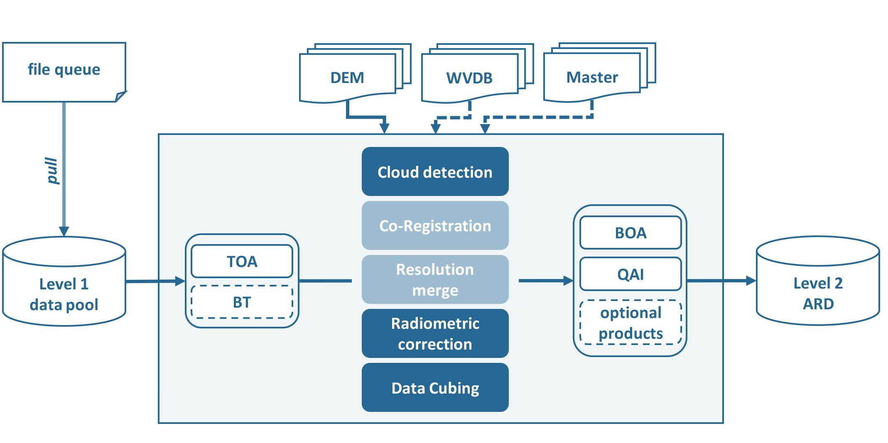
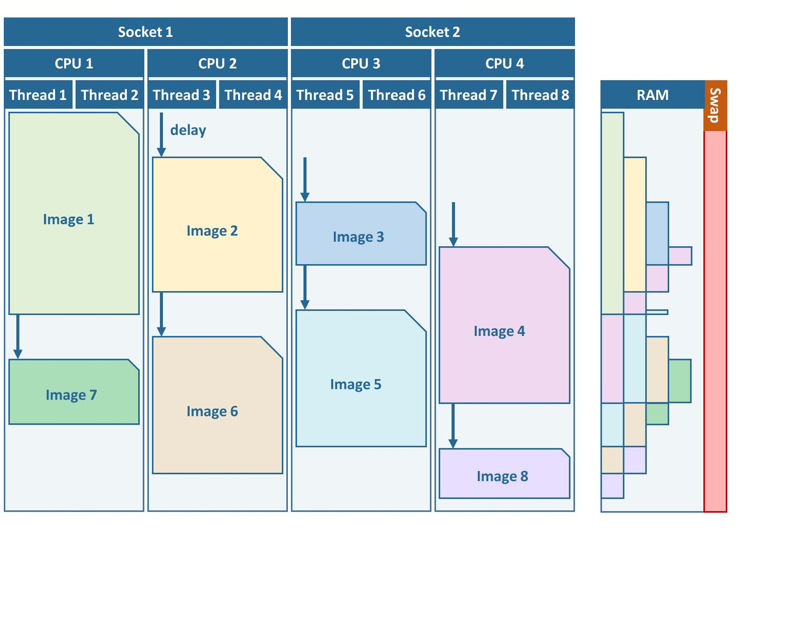
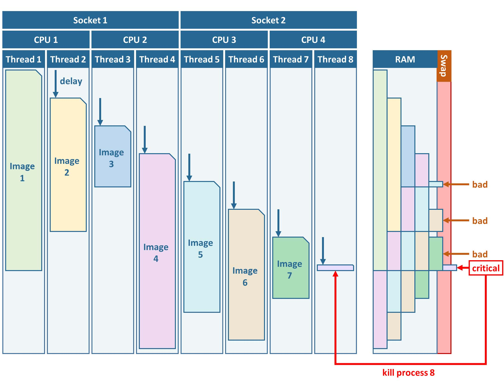
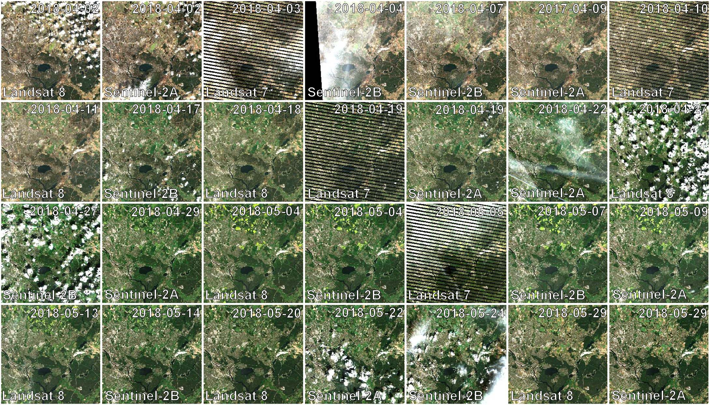

.. _tut-ard:

Level 2 ARD
===========

**How to generate Analysis Ready Data**

This tutorial explains what Analysis Ready Data are, and how to use the FORCE Level 2 Processing System to generate them.

.. admonition:: Info

   *This tutorial uses FORCE v. 3.2*

What are Levels?
----------------

Remote sensing products are grouped in a hierarchical classification scheme.

- Level 0 data are the measurements taken onboard the satellite - they are not available to users.
- Level 1 data are radiometrically calibrated and georectified.
- Level 2 data most notably include some sort of atmospheric correction and probably other corrections like topographic correction.
- Level 3 data are temporal Level 2 aggregates, e.g. pixel based composites or statistical aggregations like multitemporal averages.
- Level 4 products are model output (classifications etc.), often derived from multi-temporal or multi-sensor measurements.

I am defining Levels 1 and 2 as lower-level products and Levels 3 and above as higher-level products.

What are Analysis Ready Data?
-----------------------------

.. admonition:: CEOS description

   Analysis Ready Data are satellite data that have been processed to a minimum set of requirements and organized into a form that allows immediate analysis with a minimum of additional user effort and interoperability both through time and with other datasets (`CEOS <http://ceos.org/ard>`_).

Simply put, ARD are readily usable for any application without much further processing.
In my opinion, such data need to be well corrected for atmospheric and other effects, have undergone a very good and aggressive cloud screening, are accompanied by pixel-based quality indicators (cloud masks but also other criteria), and are provided in a regular non-overlapping grid system without any redundancy in a single coordinate system (at least on the continental scale) in the form of data cubes.

Just as a note: Although ARD are a huge step forward for increasing scientific and operational uptake from broader user groups, ARD do not represent the ultimate state of Analysis-Readiness.
Thus, FORCE additionally provides means to generate highly Analysis Ready Data (hARD) and even highly Analysis Ready Data plus (hARD+), of which the latter can be directly ingested, analyzed, and interpreted in a GIS without ANY further processing.
However, the scope of this tutorial is on plain ARD (don't get me wrong, ARD are great!).

FORCE Level 2 Processing System
-------------------------------

The FORCE Level 2 Processing System is capable of generating such ARD.

In principle, the same algorithm is applied to all supported sensors, although specific processing options are triggered or are only available for some sensors.
Essentially, L2PS converts each Level 1 image to ARD specification.
This includes three main processing steps:

1. cloud and cloud shadow detection
2. radiometric correction
3. data cubing

For Sentinel-2, two additional options are implemented:

1. resolution merging, i.e. increase the spatial resolution of the 20m bands to 10m
2. co-registration with Landsat time series

Note that most options and corrections can be switched off (e.g. atmospheric correction or data cubing) - this tutorial will however focus on our default parameterization for generating ARD.

   *FORCE Level 2 Processing System Workflow*

Getting started
---------------

This tutorial walks you through the main parts, for more details, please refer to the :ref:`l2ps`.

Make sure to have enough horsepower
"""""""""""""""""""""""""""""""""""

Generating ARD is compute-heavy.
Input and output need quite some disc space.
And processes need sufficient RAM.
Please do not expect this to work on a weak laptop or similar.
It is mainly intended to run on sufficiently powerful servers or virtual machines.
There are some ways to make most out of rigs where RAM is an issue (see parallel processing section below), but there is a limit.
At least, you will need to have 8-8.5GB of RAM for processing a Sentinel-2 image.

Recommended folder structure
""""""""""""""""""""""""""""

Although not strictly required, I strongly suggest to use separate directories for Level 1 input data, Level 2 output data, parametrization, log files, temporary directory (if input are zip/tar.gz containers) and any other auxiliary data.
So, let’s start by creating some directories, e.g. 

.. code-block:: bash

   mkdir /data/force/level1
   mkdir /data/force/level2
   mkdir /data/force/param
   mkdir /data/force/log
   mkdir /data/force/misc
   mkdir /data/force/temp

The parameter file
""""""""""""""""""

The core element of L2PS is the parameter file.
An empty Level 2 parameter file can be generated with 

.. code-block:: bash

   force-parameter /data/force/param LEVEL2 1

   LEVEL2
   An empty parameter file skeleton was written to
     /data/force/param/LEVEL2-skeleton.prm
   Note that all parameters need to be given, even though some may not be used
   with your specific parameterization.
   You should rename the file, e.g. my-first-LEVEL2.prm.
   Parameterize according to your needs and run with
   force-level2 /data/force/param/my-first-LEVEL2.prm
    or for a single image:
   force-l2ps image /data/force/param/my-first-LEVEL2.prm

The trailing ``1`` means that descriptions for every parameter will be included.
If you prefer a shorter parameter file, give a ``0`` instead.
The descriptions can also be found here: :ref:`l2-param`.

Let’s rename the file, and have a look:

.. code-block:: bash

   mv /data/force/param/LEVEL2-skeleton.prm /data/force/param/l2ps.prm
   head /data/force/param/l2ps.prm

   ++PARAM_LEVEL2_START++
   
   # INPUT/OUTPUT DIRECTORIES
   # ------------------------------------------------------------------------
   # The file queue specifies, which images are to be processed. The full path
   # to the file needs to be given. Do  not  paste  the content of the file queue
   # into the parameter file. The file queue is mandatory for force-level2, but
   # may be NULL for force-l2ps.
   # Type: full file path
   FILE_QUEUE = NULL

It is a simple text file.
Lines beginning with ``#`` are comments.
All parameters are given in tag and value notation (``TAG = VALUE``).
The file can be edited with any text editor.
However, make sure that you are using Unix End-of-Line ``\n``.
**MOST** errors are because of parameter files with Windows End-of-Line ``\r\n``.

Parameterization
----------------

Let's start to parameterize L2PS.
Open the file in the text editor of your choice, e.g. 

.. code-block:: bash

   vi /data/force/param/l2ps.prm

1) Input / Output
"""""""""""""""""

The main input is a file queue that holds the full filepaths to all ingested images.
All images that are enqueued (processing flag is ``QUEUED``) will be processed, all other are ignored.
After processing, the flag will be set to ``DONE``.
The :ref:`tut-s2l1c` tutorial explains how to use the FORCE Level 1 Archiving Suite (FORCE L1AS) to download, organize, and maintain a clean and consistent Sentinel-2 Level 1 data pool, as well as corresponding data queues needed for the Level 2 processing.
There isn't a tutorial for Landsat yet, but it works similarly.
Let's assume, we already have downloaded some images, the file queue is set like this:

.. code-block:: bash

   FILE_QUEUE = /data/force/level1/queue.txt

Next, we set the directories for output, logfiles and temporary data.
The temp directory is mostly used for temporarily unpacking zip/tar.gz containers.

.. code-block:: bash

   DIR_LEVEL2 = /data/force/level2
   DIR_LOG = /data/force/log
   DIR_TEMP = /data/force/temp

2) Digital Elevation Model
""""""""""""""""""""""""""

A Digital Elevation model is used to improve cloud and cloud shadow detection, atmospheric correction and to perform the topographic correction.
The :ref:`tut-dem`  tutorial explains how to properly prepare a Digital Elevation Model (DEM).
Let's assume, we already have prepared the DEM, it is set like this.
Make sure to set the nodata value correctly:

.. code-block:: bash

   FILE_DEM = /data/force/misc/dem/srtm.vrt
   DEM_NODATA = -32767

3) Datacube parameters
""""""""""""""""""""""

The datacube parameters, e.g. resolution, projection, tile size, block size, grid origin etc.
are under full user control.
As data cubing is an essential concept of FORCE, I highly recommend to read the :ref:`tut-datacube`, which explains what a datacube is, how it is parameterized, how you can find a POI, how to visualize the tiling grid, and how to conveniently display cubed data.

Our parameter file already has some working defaults.
You likely want to adjust them to your needs, but for starters, let's take the default values.

4) Radiometric correction
"""""""""""""""""""""""""

The default parameter file already has all radiometric corrections enabled, and this is the setup I commonly use for generating ARD.
This includes atmospheric correction with multiple scattering effects, image-based AOD estimation, topographic correction, adjacency effect correction, and nadir BRDF correction.
The only thing that needs to be changed (and only if processing Landsat data) is the parameterization of the water vapor correction.
Please see the :ref:`tut-wvdb` tutorial for instructions on how to prepare/download the Water Vapor Database.
The directory that contains this database needs to be like this:

.. code-block:: bash

   DIR_WVPLUT = /data/force/misc/wvdb

5) Cloud detection
""""""""""""""""""

The default parameter file already has meaningful values for the cloud correction.
I usually don't tweak the Fmask parameters.
You can probably change the maximum cloud cover parameters to your liking.
The ``MAX_CLOUD_COVER_FRAME`` parameter cancels the processing of images that exceed the given threshold.
The processing will be canceled right after cloud detection and thus saves quite some processing time.
In my opinion, heavily clouded images are most often of little use, and even if cloud detection flags some pixels as "clear", they are usually somewhat contaminated, e.g. in transition zones from clear-sky to cloud.. Therefore, I commonly do not go up to 100%.
The ``MAX_CLOUD_COVER_TILE`` parameter is similar, but it works on a per tile basis.
It suppresses the output for chips (tiled image) that exceed the given threshold.

6) Resolution merge
"""""""""""""""""""

This parameter defines the method used for improving the spatial resolution of Sentinel-2’s 20m bands to 10m.
It defaults to the `ImproPhe code <https://ieeexplore.ieee.org/document/7452606>`_, which is a data fusion option with both decent performance and quality.
Let's keep this method, but feel free to try the other options.

7) Co-Registration
""""""""""""""""""

Since v. 3.0, FORCE is able to perform a co-registration of Sentinel-2 images with Landsat time series.
For starters, we will not use this option, but see the :ref:`tut-coreg` tutorial.

8) Parallel Processing
""""""""""""""""""""""

FORCE L2PS uses a nested parallelization strategy.
The main parallelization level is multiprocessing: individual images are processed simultaneously (the box in the workflow figure).
Each process can additionally use multithreading, which means that each image can be additionally processed parallely.
The multiplication of both shouldn't exceed the number of threads your system supports.

I recommend to use as many processes, and as few threads as possible.
However, a mild mix may be beneficial, e.g. 2 threads per process.
If processing only a few (or one) image, increase the multithreading ratio accordingly.
This can speed up the work significantly.
If RAM is too small, inncrease the multithreading ratio accordingly.
If there isn't enough RAM to support all processes, some images will fail due to insufficient memory.

To prevent an I/O jam at startup (by reading / extracting a lot of data simultaneously), a delay (in seconds) might be necessary: a new process waits for some seconds before starting.
The necessary delay (or none) is dependent on your system’s architecture (I/O speed etc), on sensor to be processed, and whether packed archives or uncompressed images are given as input.

Please note that I cannot recommend useful default settings.
This is extremely dependent on your rig's setup (# of CPUs, RAM, I/O speed, parallel disc access etc.) and on what exactly you are doing (e.g. Sentinel-2 has higher ressource requirements compared to Landsat, are the input images extracted or still packed in zip/tar.gz containers, enabling/disabling certain processing options have an effect, too).

Please have a look at these two setups (click to enlarge).
The plots illustrate how the work (of processing the same 8 images) is being spread to CPUs and threads, how the delay works, and how the processes consume RAM (highly idealized - actually, the memory footprint varies across runtime).

.. |ard-good-text1| replace:: 4 processes with 2 threads each
.. |ard-good-text2| replace:: RAM is large enough to support this many processes

.. |ard-bad-text1|  replace:: 8 processes with 1 thread each
.. |ard-bad-text2|  replace:: RAM is not large enough to support this many processes

+------------------+-----------------+
+ Good setup       + Bad setup       +
+==================+=================+
+ |ard-good-text1| + |ard-bad-text1| +
+------------------+-----------------+
+ |ard-good-text2| + |ard-bad-text2| +
+------------------+-----------------+
+ |ard-good-fig|   + |ard-bad-fig|   +
+------------------+-----------------+

In my case, I am running on a bare-metal Ubuntu server with 32 CPUs / 64 threads, 500GB RAM (way more than needed), and a RAID6 HDD file system that is directly attached to the server.
Both my Landsat and Sentinel-2 input images are still packed.
I am using these parameters:

.. code-block:: bash

   NPROC = 32
   NTHREAD = 2
   DELAY = 5

9) Output options
"""""""""""""""""

The default output options are already my usual setup for ARD generation.
The output files will be stored as compressed GeoTiff images with internal blocks for partial access.
Note that metadata are written to the FORCE domain, thus they only show up if you look into all metadata domains, e.g. 
The Bottom-of-Atmosphere reflectance product and the Quality Assurance Information are written by default - and they can't be disabled.
I typically generate additional quicklooks (``OUTPUT_OVV``).
If you want to generate pixel based composites in the next step, you should additionally output the ``OUTPUT_DST``, ``OUTPUT_VZN``, and ``OUTPUT_HOT`` products.
The ``OUTPUT_AOD`` and ``OUTPUT_WVP`` products are not used by any higher level submodule - they are only useful for validation purposes.

Processing
----------

Once the parameter file is finished, processing is pretty straight forward.
Simply feed the parameter file to ``force-level2``.
A progress bar keeps you updated about the ETA, the number of completed, running and waiting processes.

.. code-block:: bash

   force-level2 /data/force/param/l2ps.prm

   47 images enqueued. Start processing with 32 CPUs
   
   Computers / CPU cores / Max jobs to run
   1:local / 64 / 32
   
   Computer:jobs running/jobs completed/%of started jobs/Average seconds to complete
   ETA: 12046s Left: 45 AVG: 280.00s  local:32/2/100%/596.5s 

Logfile
-------

After processing, I recommend to check the logfiles, which we have written to ``/data/force/log``

.. code-block:: bash

   ls /data/force/log | tail

   S2A_OPER_MSI_L1C_TL_SGS__20160310T160000_A003736_T33JYG_N02.01
   S2A_OPER_MSI_L1C_TL_SGS__20160409T141153_A004165_T33JYG_N02.01
   S2A_OPER_MSI_L1C_TL_SGS__20160827T135818_A006167_T33JYG_N02.04
   S2A_OPER_MSI_L1C_TL_SGS__20160916T135429_A006453_T33JYG_N02.04

The logfiles report the percentage of data cover (how many pixels are not no-data), water cover, snow cover and cloud cover.
Then, aerosol optical depth @ 550 nm (scene average), and the number of dark targets for retrieving aerosol optical depth (over water/vegetation) are printed.
Then, the number of products written (number of tiles), and a supportive success indication is printed.
In the case the overall cloud coverage is higher than allowed, the image is skipped.
The processing time (real time) is appended at the end.

.. code-block:: bash

   cat /data/force/log/* | tail

   S2A_OPER_MSI_L1C_TL_SGS__20160310T160000_A003736_T33JYG_N02.01: dc:  99.95%. wc:  18.04%. sc:   0.07%. cc:   7.13%. AOD: 0.1129. # of targets: 240/42. 25 product(s) written. Success! Processing time: 14 mins 35 secs
   S2A_OPER_MSI_L1C_TL_SGS__20160409T141153_A004165_T33JYG_N02.01: dc: 100.00%. wc:  18.39%. sc:   0.07%. cc:   0.08%. AOD: 0.1455. # of targets: 25/43. 25 product(s) written. Success! Processing time: 15 mins 19 secs
   S2A_OPER_MSI_L1C_TL_SGS__20160827T135818_A006167_T33JYG_N02.04: dc: 100.00%. wc:  18.43%. sc:   0.10%. cc:   0.11%. AOD: 0.1208. # of targets: 74/0. 25 product(s) written. Success! Processing time: 13 mins 50 secs
   S2A_OPER_MSI_L1C_TL_SGS__20160916T135429_A006453_T33JYG_N02.04: dc: 100.00%. wc:   1.78%. sc:   2.85%. cc: 100.00%. Skip. Processing time: 12 mins 17 secs

Output format
-------------

For more details, see the :ref:`level2-format`.

The output data are organized in data cubes.
The tiles manifest as directories in the file system, and the images are stored within.
This is decribed in more detail in the :ref:`tut-datacube`.

Basically, for each tile, you get a time series of square image chips that always show the same extent:

   *Data Cube of Landsat 7/8 and Sentinel-2 A/B Level 2 ARD*

A two-month period of atmospherically corrected imagery acquired over South-East Berlin, Germany, is shown here.*

Each dataset consists of a *BOA* and *QAI* product, which are Bottom-of-Atmosphere reflectance and Quality Assurance Information.
Depending on parameterization ,there are more products, e.g. *OVV* for image overviews (quicklooks).

The reflectance products are multi-band images and consist of 6 bands for Landsat (Landsat legacy bands), and 10 bands for Sentinel-2 (land surface bands).
All bands are provided at the same spatial resolution, typically 30m for Landsat and 10m for Sentinel-2.

QAI are provided bit-wise for each pixel.
QAI are essential for making your analyses a success, therefore, please have a look at the :ref:`tut-qai` tutorial.

Metadata are written to all output products.
Note that FORCE-specific metadata will be written to the FORCE domain, and thus are probably not visible unless the FORCE domain (or all domains) are specifically requested:

.. code-block:: bash

   gdalinfo -mdd all /data/force/level2/X0007_Y0007/20170424_LEVEL2_SEN2A_BOA.tif

   Driver: GTiff/GeoTIFF
   Files: /data/force/level2/X0007_Y0007/20170424_LEVEL2_SEN2A_BOA.tif
   Size is 3000, 3000
   Coordinate System is:
   PROJCS["WGS 84 / UTM zone 33S",
       GEOGCS["WGS 84",
           DATUM["WGS_1984",
           
   ...     
   Band 10 Block=3000x300 Type=Int16, ColorInterp=Undefined
     Description = SWIR2
     NoData Value=-9999
     Metadata (FORCE):
       Date=2017-04-24T08:26:01.0Z
       Domain=SWIR2
       Scale=10000.000
       Sensor=SEN2A
       Wavelength=2.202
       Wavelength_unit=micrometers

ARD, now what?
--------------

FORCE provides a lot of functionality to further process the generated ARD into hARD or hARD+ products, e.g. using pixel-based compositing or time series analyses.

Please see the :ref:'hlps' in the documentation.
Some more tutorials are planned, which deal with all these options.

------------

.. |author-pic| image:: profile/dfrantz.jpg

+--------------+--------------------------------------------------------------------------------+
+ |author-pic| + This tutorial was written by                                                   +
+              + `David Frantz <https://davidfrantz.github.io>`_,                               +
+              + main developer of **FORCE**,                                                   +
+              + postdoc at `EOL <https://www.geographie.hu-berlin.de/en/professorships/eol>`_. +
+              + *Views are his own.*                                                           +
+--------------+--------------------------------------------------------------------------------+
+ **EO**, **ARD**, **Data Science**, **Open Science**                                           +
+--------------+--------------------------------------------------------------------------------+
