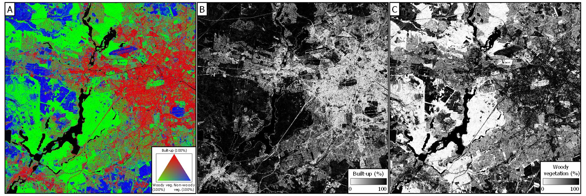
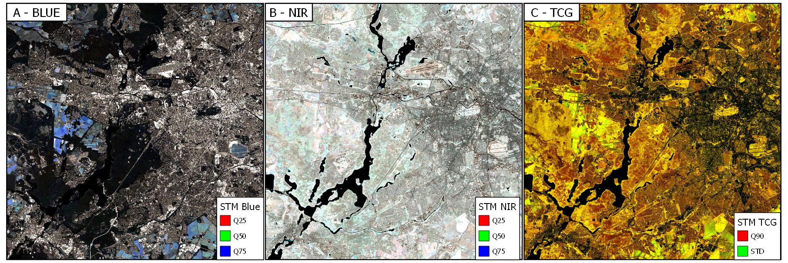

.. _tut-lcf:

Land Cover Fraction Mapping
=========================

.. |copy|   unicode:: U+000A9 .. COPYRIGHT SIGN

**How to map land cover fractions with synthetically mixed training data**

This tutorial demonstrates a workflow that uses a series of submodules of the FORCE Higher Level Processing system (HLPS) to map sub-pixel fractions of land cover with Sentinel-2 imagery.

While spectral unmixing has been used for decades in different contexts, with different sensor types and different methods, this tutorial walks through a regression-based approach using synthetically mixed training data as presented in `Okujeni et al. (2013) <https://doi.org/10.1016/j.rse.2013.06.007>`_.

.. admonition:: Info

   *This tutorial uses FORCE v. 3.7.9*

The Workflow
-----------------------------------

The workflow in this tutorial uses a series of submodules of the FORCE Higher Level Processing system (HLPS) to map sub-pixel fractions of land cover with Sentinel-2 imagery and synthetically mixed training data. 

   
	*Land cover fraction maps. A: Built-up surfaces, woody and non-woody vegetation in an RGB representation. B: Fraction of built-up surfaces. C: Fraction of woody vegetation.* |copy| *Franz Schug*

Some of these submodules have been described in other places of the FORCE documentation, and entire tutorials have been dedicated to others (respective links will be given where applicable).

This tutorial illustrates the potential of FORCE to be used along the complete image processing chain, from downloading and pre-processing image acquisitions to producing meaningful spatial data. Its chapters correspond to the seven steps (and two optional steps) of the following workflow.

This workflow is reproducible, as all commands, parameter files and intermediate data will be provided. Parameter files will be directly available for download throughout the workflow, while intermediate data will only be available in a data repository due to file size (`Download data from Zenodo <https://doi.org/10.5281/zenodo.7529763>`_, doi: 10.5281/zenodo.7529763)

This workflow can be used for image classification applications as well as regression-based mapping with any other kind of suitable training data making a few adaptations to the example parameter files. You might be able to skip chapters on data aggregation, sampling, or synthethic training data genereation depending on your desired input data and processing method.

.. figure:: img/tutorial-lcf-workflow.png
   :height: 160

   *FORCE HLPS workflow for land cover fraction mapping with regression-based unmixing and syhnthetically mixed training data* |copy| *Franz Schug*

Note

Please note that FORCE parameter files require absolute file paths. This is why path names in the provided parameter files are placeholders and should be adapted according to your folder structure when you would like to replicate the workflow yourself. Also note that most parameter files have parameters for the number of threads to be used for parallel processing. Please adapt the number of threads according to the maximum number of threads available in your machine.

Data Acquisition
-----------------------------------

This workflow requires spatially explicit Earth Observation raster data to start with. It will technically work with any multi- or hyperspectral image data. This tutorial has been created with spectral-temporal metrics aggregated from all clear-sky Sentinel-2 observations in 2018 over Berlin, Germany (MGRS Tile 33UUU).

We first download all image acquisitions with less than 70% cloud cover according to the metadata catalogue using FORCE Level 1 Cloud Storage Downloader:

.. code-block:: bash

   force-level1-csd -s S2A,S2B -d 20180101,20181231 -c 0,70 /path/to/metadata/directory/ /path/to/datapool / /path/to/datapool/pool.txt T33UUU

We do not provide these data in the downloadable data because of file size, and as they can be downloaded again anytime using the above command.

Tip
  
Please refer to the Level 1 Cloud Storage Downloader `Documentation <https://force-eo.readthedocs.io/en/latest/components/lower-level/level1/level1-csd.html>`_ and `Tutorial <https://force-eo.readthedocs.io/en/latest/howto/level1-csd.html>`_ to know more about Sentinel-2 data downloads and about retrieving and updating the metadata catalogue required to download raw image data.

Data Pre-Processing
-----------------------------------

FORCE provides all functionalities to convert all downloaded Level 1 data (i.e., radiometrically calibrated and georectified) into Analysis-Ready Data (ARD), or Level 2 data. ARD are data that are readily usable for any application without much further processing. In FORCE, this includes 

- cloud and cloud shadow detection,
- radiometric, atmospheric, and topographic correction,
- BRDF correction,
- resolution merging (from 20m bands to 10m, Sentinel-2 only).

For processing, we use

.. code-block:: bash

   force-level2 /path/to/parametertile/directory/10_lcf_level_2.prm

You can access the parameter file `here <../_static/parameter-files/tutorials/lcf/10_lcf_level_2.prm>`_ or use the one provided in the data repository. 	

It is highly recommended to use a Digital Elevation Model (DEM) for topographic correction purposes. We here use a global SRTM/ASTER composite that we cannot provide for download due to file sizes. However, you can use any DEM of your choice here, for example the one provided for Europe by the `Copernicus Land Monitoring Service <https://www.eea.europa.eu/data-and-maps/data/copernicus-land-monitoring-service-eu-dem>`_, or the `global Copernicu DEM <https://portal.opentopography.org/raster?opentopoID=OTSDEM.032021.4326.3>`_. The use of a DEM is, however, not required to continue data processing, and as our example region is rather flat, the impact of missing topographic correction might be acceptable. Please refer to `this tutorial <https://force-eo.readthedocs.io/en/latest/howto/dem.html>`_ for more information about making use of a DEM in FORCE.

.. code-block:: bash

   FILE_DEM = /path/to/dem/dem.vrt

As we want to subsequently use the ARD generated here in different higher-level submodules, we organize data in a data cube and in image tiles. We defined tiles to be 30x30km in size, so considerably smaller than MGRS tiles. The data cube parameters can be defined in the Level 2 parameter file. We use ETRS89-extended/LAEA Europe projection (EPSG: 3035). The following aspects of the workflow will be limited to a single image tile for reasons of simplicity.

.. code-block:: bash

	DO_REPROJ = TRUE
	…
	DO_TILE = TRUE
	…
	ORIGIN_LON = -25
	ORIGIN_LAT = 60
	…
	PROJECTION = PROJCS["ETRS89 / LAEA Europe",GEOGCS["ETRS89",DATUM["European_Terrestrial_Reference_System_1989",SPHEROID["GRS 1980",6378137,298.257222101,AUTHORITY["EPSG","7019"]],TOWGS84[0,0,0,0,0,0,0],AUTHORITY["EPSG","6258"]],PRIMEM["Greenwich",0,AUTHORITY["EPSG","8901"]],UNIT["degree",0.0174532925199433,AUTHORITY["EPSG","9122"]],AUTHORITY["EPSG","4258"]],PROJECTION["Lambert_Azimuthal_Equal_Area"],PARAMETER["latitude_of_center",52],PARAMETER["longitude_of_center",10],PARAMETER["false_easting",4321000],PARAMETER["false_northing",3210000],UNIT["metre",1,AUTHORITY["EPSG","9001"]],AUTHORITY["EPSG","3035"]]

Tip

Please refer to the Level 2 ARD `tutorial <https://force-eo.readthedocs.io/en/latest/howto/l2-ard.html>`_ for further information about generating ARD in FORCE, and to the Digital Elevation Model `tutorial <https://force-eo.readthedocs.io/en/latest/howto/dem.html>_ for information on how to prepare a DEM for the FORCE processing system.

Info

FORCE is also able to co-register Sentinel-2 data with Landsat time series data (`Tutorial <https://force-eo.readthedocs.io/en/latest/howto/coreg.html>`_). However, this workflow does not make use of this because it uniquely relies on Sentinel-2 data.

Clear-Sky Observations (optional)
-----------------------------------

At this point of the workflow, we can optionally check clear-sky observation (CSO) statistics for our data. Data availability in our study area and period will have a great impact on the quality of derived aggregated data, i.e., spectral-temporal metrics, and, ultimately, on land cover fraction mapping results. CSO statistics can be derived using the FORCE HLPS:

.. code-block:: bash

	force-higher-level parameterfiles/11_lcf_cso.prm

We compute two CSO statistics, the number of observations and the maximum temporal difference between observations, for the complete study period, as both are good, but simple indicators for data quantity and distribution.

.. code-block:: bash

	CSO = NUM AVG MAX
	
You can access the parameter file `here <../_static/parameter-files/tutorials/lcf/11_lcf_cso.prm>`_ or use the one provided in the data repository.

.. figure:: img/tutorial-lcf-cso.jpg
   :height: 330

   *Number of observations (A), average (B) and maximum (C) temporal distance in days between observations for our study period 01 Mar. 2018 and 30 Oct. 2018. Scale represents 96% of values.* |copy| *Franz Schug*

Based on CSO statistics, we assume that in most places of our study area, the number of observations (range from 10 to 42) and their temporal distance seems sufficient for generating robust spectral-temporal metrics.

Data Aggregation / Spectral-Temporal Metrics
-----------------------------------

Previous research showed that sub-pixel fraction mapping of land cover with synthetically mixed training data can be performed using spectral-temporal metrics (STM) as input data.
 
Spectral-temporal metrics are band-wise descriptive statistics, which summarize image reflectance (or an index derived thereof) of all valid observations within a defined time period, such as mean reflectance. They can be computed using the FORCE TSA submodule (`Tutorial <https://force-eo.readthedocs.io/en/latest/howto/tsi.html>`_). 

Compared to single observations, spectral-temporal metrics are able to increase model robustness across large areas as differences in acquisition dates across orbits has lower effects on the data. Spectral-temporal metrics are, in addition, able to represent phenological variation.

In this tutorial, we use the first, second, and third quartile of reflectance of all clear-sky Sentinel-2 observations within our study period, as well as the 90th quantile and the standard deviation of two indicators of vegetation, Tasseled Cap Greenness and Normalized Difference Vegetation Index (NDVI).

*Spectral-temporal metrics of reflectance and vegetation indices (34 features) used in this example workflow.*
+--------------------+------------------------------------------------+
+Band                + Spectral-Temporal Metrics                      +
+====================+================================================+
+ Blue               + Q25, Q50, Q75                                  +
+--------------------+------------------------------------------------+
+ Green              + Q25, Q50, Q75                                  +
+--------------------+------------------------------------------------+
+ Red                + Q25, Q50, Q75                                  +
+--------------------+------------------------------------------------+
+ Red Edge 1         + Q25, Q50, Q75                                  +
+--------------------+------------------------------------------------+
+ Red Edge 2         + Q25, Q50, Q75                                  +
+--------------------+------------------------------------------------+
+ Red Edge 3         + Q25, Q50, Q75                                  +
+--------------------+------------------------------------------------+
+ Broad NIR          + Q25, Q50, Q75                                  +
+--------------------+------------------------------------------------+
+ NIR                + Q25, Q50, Q75                                  +
+--------------------+------------------------------------------------+
+ SWIR 1             + Q25, Q50, Q75                                  +
+--------------------+------------------------------------------------+
+ SWIR 2             + Q25, Q50, Q75                                  +
+--------------------+------------------------------------------------+
+ Tass. Cap Green.   + Q90, STD                                       +
+--------------------+------------------------------------------------+
+ NDVI               + Q90, STD                                       +
+--------------------+------------------------------------------------+

The selection of these features was shown to result in accurate land cover fraction maps in previous studies (e.g., `Schug et al. (2020) <https://doi.org/10.1016/j.rse.2020.111810>`_). It is, however, possible that mapping land cover fractions in world regions with different phenological regimes or land cover characteristics might require different feature combinations.

We use 

.. code-block:: bash

	force-higher-level parameterfiles/20_lcf_stm_reflectance.prm
	force-higher-level parameterfiles/20_lcf_stm_vegetation.prm

to compute spectral-temporal metrics of reflectance and vegetation components.

You can access the parameter files `here <../_static/parameter-files/tutorials/lcf/20_lcf_stm_reflectance.prm>`_ and `here <../_static/parameter-files/tutorials/lcf/20_lcf_stm_vegetation.prm>`_ or use the ones provided in the data repository.

	*First, second, and third quartile of reflectance of all blue (A) and near infrared (B) observations. 90th Quantile and standard deviation (STD) of Tasseled Cap Grenness (TCG) of all observations (C). All stretches contain 96% of the values (2% - 98%).* |copy| *Franz Schug*

Tip

Please refer to the Spectral Temporal Metrics `tutorial <https://force-eo.readthedocs.io/en/latest/howto/stm.html>`_ for further information about generating spectral-temporal metrics using the Time Series Analysis (TSA) submodule of the FORCE Higher Level Processing system (HLPS). Here, the concept of spectral-temporal metrics is explained and illustrated.

Sampling
-----------------------------------

Land cover fraction mapping with synthetically mixed training data requires spectral information from pure land cover surfaces to begin with, i.e., spectral reference data that can eventually be used to train a model that understands inter- and intra-class spectral variability. 

Here, we are using reference information directly from the imagery (as opposed to, e.g., data from external spectral libraries or ground sampling). We identified 388 reference surfaces, i.e., pixels of 10x10 m that cover only a single land cover type, for five classes: Built-up surfaces (182 reference points), woody vegetation (70), non-woody vegetation (98), bare soil (15), and water (23).

The number of reference points per class varies based on spectral intra-class variability (which is, e.g., higher for non-woody vegetation than for woody vegetation) and surface availability (e.g., few available reference points for bare soil).

Info

In this tutorial we focus on a single 30x30km image tile. However, we also want the example to be reproducible, which means that all reference points were sampled within that tile. There is a chance that this will produce a highly local model not well transferable to other (even closer) regions. This is fine for illustration purposes, but using this approach for larger area mapping, make sure that reference data is representative of the whole area.

You can download these reference points as a text file `here <../_static/files/tutorials/lcf/samples.txt>`_, or as a shape file from this dataset on Zenodo. The data come in a WGS84 projection (EPSG: 4326) and are resampled on-the-fly when used with data from the data cube.   

We use

.. code-block:: bash

	force-higher-level parameterfiles/30_lcf_sampling.prm

to extract spectral information from spectral-temporal metrics at the locations given. You can access the parameter file `here <../_static/parameter-files/tutorials/lcf/30_lcf_sampling.prm>`_ or use the one provided in the data repository.

In the parameter file, we will need to provide a list of features that the spectral information will be drawn from. These files and bands correspond to the spectral-temporal metrics previously created: 

.. code-block:: bash

	INPUT_FEATURE = 2018-2018_001-365_HL_TSA_SEN2L_BLU_STM.tif 1 2 3 
	INPUT_FEATURE = 2018-2018_001-365_HL_TSA_SEN2L_GRN_STM.tif 1 2 3 
	INPUT_FEATURE = 2018-2018_001-365_HL_TSA_SEN2L_RED_STM.tif 1 2 3 
	INPUT_FEATURE = 2018-2018_001-365_HL_TSA_SEN2L_RE1_STM.tif 1 2 3 
	INPUT_FEATURE = 2018-2018_001-365_HL_TSA_SEN2L_RE2_STM.tif 1 2 3 
	INPUT_FEATURE = 2018-2018_001-365_HL_TSA_SEN2L_RE3_STM.tif 1 2 3 
	INPUT_FEATURE = 2018-2018_001-365_HL_TSA_SEN2L_BNR_STM.tif 1 2 3 
	INPUT_FEATURE = 2018-2018_001-365_HL_TSA_SEN2L_NIR_STM.tif 1 2 3 
	INPUT_FEATURE = 2018-2018_001-365_HL_TSA_SEN2L_SW1_STM.tif 1 2 3 
	INPUT_FEATURE = 2018-2018_001-365_HL_TSA_SEN2L_SW2_STM.tif 1 2 3 
	INPUT_FEATURE = 2018-2018_001-365_HL_TSA_SEN2L_TCG_STM.tif 1 2
	INPUT_FEATURE = 2018-2018_001-365_HL_TSA_SEN2L_NDV_STM.tif 1 2

The Sampling submodule will produce four individual text files that contain feature and response information as well as a list of coordinates of the reference points.

.. figure:: img/tutorial-lcf-smp.jpg
   :height: 260
   
	*Spectral information for all reference points of pure built-up surfaces (A), woody vegetation (B) and non-woody vegetation (C). The features correspond to the features in the above table, in that order.* |copy| *Franz Schug*
   
Tip

Please refer to the Sampling `documentation <https://force-eo.readthedocs.io/en/latest/components/higher-level/smp/index.html#smp>`_ for further information about parametrizing the FORCE Sampling submodule.

Synthetically Mixed Training Data
-----------------------------------

The approach used in this tutorial is described in `Okujeni et al. 2013 <https://www.sciencedirect.com/science/article/pii/S0034425713002009>`_, who compared it to results generated with multiple endmember spectral mixture analysis (MESMA). Please refer to the literature (e.g., `Quintano et al. 2012 <https://www.tandfonline.com/doi/abs/10.1080/01431161.2012.661095>`_) for a more encompassing overview over spectral unmixing techniques, as they will not be a subject of this tutorial.

Regression-based spectral unmixing for land cover fraction mapping requires reference information about fractional land cover. This can be achieved, for example, by digitizing surface area types within a given pixel and use resulting fractional reference cover as input to regression model training. While this approach is very accurate, it is also time and labour intensive.

We here use synthetically generated fractional reference data for regression model training. These synthetically mixed data are based on known spectral information that represent pure surface types. For example, when we know what both a tree-covered surface and a road-covered surface spectrally look like in a Sentinel-2 image , we theoretically know what any kind of linear mixture between both surface look like, e.g., a pixel with 80% tree cover and 20% road cover, or a pixel with 30% tree cover and 70% road cover.

 .. figure:: img/tutorial-lcf-mix-s2.png
   :height: 360
   
	*Spectral information of a pure tree-covered (green) and road-covered (red) pixel, as well as two different synthetic linear mixtures of both, for 10 `Sentinel-2 spectral bands <https://sentinels.copernicus.eu/web/sentinel/user-guides/sentinel-2-msi/resolutions/spatial>`_ as well as Tasseled Cap Greenness and NDVI. Dashed and dotted lines repreent linear mixtures.* |copy| *Franz Schug*

This concept is, of course, transferable to our case, where we use spectral-temporal metrics instead of single observations. Please not that the number of features increases from 12 to 34, while the idea is the same. In this following case, the synthetic mixtures produce training data for 80% and 30% tree-covered surfaces, as well as 100% and 0% tree-covered surfaces.

 .. figure:: img/tutorial-lcf-mix-stm.png
   :height: 360
   
	*Spectral-temporal metrics of a pure tree-covered (green) and road-covered (red) pixel (1st, 2nd, 3rd quartile) as well as 90th quantile and standard deviation of Tasseled Cap Greenness (TCG) and NDVI. Dashed and dotted lines repreent linear mixtures.* |copy| *Franz Schug*

This idea can be expanded to further combinations of three or more surface types, as well as to different surfaces of the same surface type when intra-class spectral variability is high. In this following case, we produce training data for 80% and 30% tree-covered surfaces (left), as well as 80% and 30% built-up area (right). In the second case, we mix spectral-temporal metrics from two pure surface types of the same target class (built-up), but from spectrally different surfaces, i.e., a road and a rooftop.

  .. figure:: img/tutorial-lcf-mix-stm-complexity.png
   :height: 360
   
	*Left: Spectral-temporal metrics of a pure tree-covered (green), road-covered (red) and crop-covered (yellow) pixel as well as the respective Tasseled Cap Greenness and NDVI. Dashed and dotted lines repreent linear mixtures. Right: Spectral-temporal metrics of two pure surface types (road and rooftop/building) from the same target class. Dashed and dotted lines repreent linear mixtures.* |copy| *Franz Schug*

In principle, an indefinite number of training data can be synthetically created this way. However, note that the sampled pure reference surfaces still need to represent the variety of surface types and characteristics of the respective target classes. Also, the more training data we want to create, the more pure reference spectra we need in order to not repeat known synthetic mixtures

We call the synthetic training data generation using

.. code-block:: bash

	force-synthmix parameterfiles/40_lcf_synthmix.prm

You can access the parameter file `here <../_static/parameter-files/tutorials/lcf/60_lcf_ml_predict.prm>`_ or use the one provided in the data repository. 	

The parameter file offers some customization of the synthetic mixing procedure. The default settings have been refined over the years, but feel free to experiment with some of them, as they might each affect model outcomes. A more detailed description of the mixing process can be found in `Cooper et al. (2020) <https://www.sciencedirect.com/science/article/pii/S0034425720302261>`_

Here, we generate a total number of 1,000 synthetic mixtures per target class at random mixing ratios. Additionally, all feature sets from pure surfaces are included as a 100%/0% reference. We use a maximum mixing complexity of three classes with most mixtures being two-class mixtures (50%). We also allow within-class mixing as described above.

.. code-block:: bash

	SYNTHETIC_MIXTURES = 1000
	INCLUDE_ORIGINAL = TRUE
	MIXING_COMPLEXITY = 1 2 3
	MIXING_LIKELIHOOD = 0.2 0.5 0.3
	WITHIN_CLASS_MIXING = TRUE

We use three target classes: Built-up surfaces, woody vegetation and non-woody vegetation. Water and bare soil are uniquely used as background classes. This means that their spectral information is used as a counterpart during synthetic mixing, but no training data will be generated for them. Hence, no fraction models will be trained and no land cover fraction will be predicted for them. This is because the number of reference points for pure water and bare soil surfaces in our study area is rather low (23 and 15) compared to other classes (see Sampling section).

.. code-block:: bash

	TARGET_CLASS = 1 2 3

We generate five separate synthetically mixed training datasets for each of the three target classes (i.e., 15 training datasets). This means that for each target class, we can train up to five regression models, and use up to five predicitions per pixel and target class. This approach is referred to as an ensemble approach in `Okujeni et al. (2017) <https://ieeexplore.ieee.org/abstract/document/7792573>`_ and has been shown to provide higher prediction robustness. Continue reading through the following sections to know how this workflow deals with multiple target class models throughout the process.

.. code-block:: bash

	ITERATIONS = 5

Tip

Take a look at `this tutorial <https://enmap-box.readthedocs.io/en/latest/usr_section/application_tutorials/urban_unmixing/tutorial.html>`_, where concepts of regression-based unmixing of urban land cover were described and illustrated using the EnMAP Box and hyperspectral imagery.

Library Completeness (optional)
-----------------------------------

At this point, we can optionally assess the completeness of our library compared to our image data. 

We use 

.. code-block:: bash

	force-higher-level parameterfiles/41_lcf_lib_complete.prm

to compare every set of synthetically mixed training data to every pixel in the image data (access the parameter file `here <../_static/parameter-files/tutorials/lcf/41_lcf_lib_complete.prm>`_). The image features given in the parameter file have to correspond to the features used during sampling and have to be in the same order.

Library completeness is measured using the Mean Absolute Error (MAE) across all features. The submodule provides the lowest MAE between each training feature set (here: 1,000) and each pixel, both per target class and overall.

.. figure:: img/tutorial-lcf-lib.jpg
   :height: 330
   
	*Minimum Mean Absolute Error between each training feature set of the synthetically mixed data and every image pixel across all three target classes.* |copy| *Franz Schug*

Library completeness is not an established way to assess the quality of our training data library. However, it is a rough, but good indicator to show what surface types in the image might be under-represented in our training data, and, thus, in our reference points. In our example, we see that our training data represents forests really well (low values, dark areas). It seems like our training data does not as well represent some agricultural areas in the western part of our scene (higher values, brighter areas). Still, the maximum of our minimum MAE values in the image is ca. 150, which we consider low knowing that reflectance values can range from 0 to 10,000. Based on this, we do not see the necessity to identify further reference points.

Info

Note that low MAE values do not necessarily mean that the image pixels are correctly represented in the library. For example, in the case of spectral similarity of two different surface types, this algorithm cannot distinguish between correct and incorrect but similar spectral class representation.

Model Training
-----------------------------------

We use *force-train* with synthetically created training data to train regression-based machine learning models of land cover fraction.

For each set of synthetically mixed training data and for each class, we will need to train one model, which means that we need to create one individual training parameter file for each case. This sums up to 15 parameter files, as we use three target classes and five iterations.

As we do not want to manually create 15 parameter files, force-magic-parameter will help with this. We create one reference parameter file that contains all the information that is identical in each individual parameter file, as well as two vectors holding replacement values for classes (SET) and iterations (IT) at the very beginning of the file:

.. code-block:: bash

	%SET%: 001 002 003
	%IT%: 001 002 003 004 005

In the following, we use SET and IT as a placeholder for classes and iterations:

.. code-block:: bash

	FILE_FEATURES = /data/40_lcf_synthmix/SYNTHMIX_FEATURES_CLASS-_ITERATION-.txt
	FILE_RESPONSE = /data/40_lcf_synthmix/SYNTHMIX_RESPONSE_CLASS-_ITERATION-.txt

Now use
 
.. code-block:: bash
	
	force-magic-parameters -o /train parameterfiles/50_lcf_training.prm
	
to conveniently generate 15 parameter files (five per target class) representing all possible value combinations of the two replacement variables.

We use a Support Vector Regression approach with a random 70/30 data split for training and internal model validation.

.. code-block:: bash

	PERCENT_TRAIN = 70
	RANDOM_SPLIT = TRUE
	ML_METHOD = SVR

We now need to train 15 models by calling all 15 parameter files, which we can do using a simple command line loop:

.. code-block:: bash

	for f in /train/*.prm; do dforce force-train $f; done 

In this case, it is important that no other parameter file is in the given folder.

After model training, validation information (performed with 30% of the data) can be found in the corresponding log file next to the generated model.

The base parameter file before applying replacement variables can be accessed the parameter file `here <../_static/parameter-files/tutorials/lcf/50_lcf_training.prm>`_.

Tip

Please refer to the OpenCV `Support Vecor Machine documentation <https://docs.opencv.org/3.4/d1/d73/tutorial_introduction_to_svm.html>`_ to learn more about model parametrization, or refer to the parameter file descriptions.

Model Prediction
-----------------------------------

We apply all previously trained models using

.. code-block:: bash

	force-higher-level parameterfiles/60_lcf_ml_predict.prm

You can access the parameter file `here <../_static/parameter-files/tutorials/lcf/60_lcf_ml_predict.prm>`_ or use the one provided in the data repository. 	

In the parameter file, it is important that the features to be used for prediction are in the same order as they were during sampling:

.. code-block:: bash

	INPUT_FEATURE = 2018-2018_001-365_HL_TSA_SEN2L_BLU_STM.tif 1 2 3 
	INPUT_FEATURE = 2018-2018_001-365_HL_TSA_SEN2L_GRN_STM.tif 1 2 3 
	INPUT_FEATURE = 2018-2018_001-365_HL_TSA_SEN2L_RED_STM.tif 1 2 3 
	INPUT_FEATURE = 2018-2018_001-365_HL_TSA_SEN2L_RE1_STM.tif 1 2 3 
	INPUT_FEATURE = 2018-2018_001-365_HL_TSA_SEN2L_RE2_STM.tif 1 2 3 
	INPUT_FEATURE = 2018-2018_001-365_HL_TSA_SEN2L_RE3_STM.tif 1 2 3 
	INPUT_FEATURE = 2018-2018_001-365_HL_TSA_SEN2L_BNR_STM.tif 1 2 3 
	INPUT_FEATURE = 2018-2018_001-365_HL_TSA_SEN2L_NIR_STM.tif 1 2 3 
	INPUT_FEATURE = 2018-2018_001-365_HL_TSA_SEN2L_SW1_STM.tif 1 2 3 
	INPUT_FEATURE = 2018-2018_001-365_HL_TSA_SEN2L_SW2_STM.tif 1 2 3 
	INPUT_FEATURE = 2018-2018_001-365_HL_TSA_SEN2L_TCG_STM.tif 1 2
	INPUT_FEATURE = 2018-2018_001-365_HL_TSA_SEN2L_NDV_STM.tif 1 2

The machine learning submodule of FORCE allows us to provide multiple models per class to generate a single land cover fraction prediction. Remember that in previous steps, we generated five sets of synthetically mixed training data, and euqally created five models per target class.

In the parameter file, models can be referred to in lines and columns. One line corresponds to one target class (i.e., one band in the model output file). Per line, an undefined number of models can be provided. For each model, this submodule will create one prediction. When using regression-based prediction, the results of all predictions will be averaged to generate the final land cover fraction output.

.. code-block:: bash

	FILE_MODEL = MODEL_CLASS_001_ITERATION_001.xml MODEL_CLASS_001_ITERATION_002.xml MODEL_CLASS_001_ITERATION_003.xml MODEL_CLASS_001_ITERATION_004.xml MODEL_CLASS_001_ITERATION_005.xml
	FILE_MODEL = MODEL_CLASS_002_ITERATION_001.xml MODEL_CLASS_002_ITERATION_002.xml MODEL_CLASS_002_ITERATION_003.xml MODEL_CLASS_002_ITERATION_004.xml MODEL_CLASS_002_ITERATION_005.xml
	FILE_MODEL = MODEL_CLASS_003_ITERATION_001.xml MODEL_CLASS_003_ITERATION_002.xml MODEL_CLASS_003_ITERATION_003.xml MODEL_CLASS_003_ITERATION_004.xml MODEL_CLASS_003_ITERATION_005.xml

Please be aware that more models per target class go along with higher computing time. By setting

.. code-block:: bash

	ML_CONVERGENCE = 0.025

in the parameter file, FORCE, however, helps us to reduce computing time as far as possible. This parameter only applies if multiple models are given for a modelset, and if the machine learning method is regression. This parameter sets a convergence threshold, knowing that with an increasing number of models, the averaged predicted values will converge. If the predictions differ less than this value after adding another model, no more model will be predicted (tested on a pixel level). The threshold should be adapted based on the application.

Be aware that training response values for fractions after synthetic mixing range from 0 to 1. As FORCE will not save floating-point numbers, we set a scaling factor of 10,000 in order toobtain values between 0 and 10,000 in 16bit signed integer files.

.. code-block:: bash

	ML_SCALE = 10000

We can optionally set

.. code-block:: bash

	OUTPUT_MLI = TRUE
	OUTPUT_MLU = TRUE

which outputs the number of models used when applying a convergence threshold (as we did) and the uncertainty of the averaged prediction, i.e., the standard deviation of all predictions blended into the final output file.
	

   
	*Land cover fraction predictions. A: Built-up surfaces, woody and non-woody vegetation in an RGB representation. B: Fraction of built-up surfaces. C: Fraction of woody vegetation.* |copy| *Franz Schug*

Tip

Please refer to the Machine Learning `documentation <https://force-eo.readthedocs.io/en/latest/components/higher-level/ml/index.html#ml>`_ for further information about generating maps with regression-based machine learning models. 

------------

+--------------+------------------------------------------------------------------------------------------+
+ |author-pic| + This tutorial was written by                                                             +
+              + Franz Schug,                                                                             +
+              + postdoc researcher at `SILVIS Lab <https://silvis.forest.wisc.edu/>`_.                   +
+              + *Views are his own.*                                                                     +
+--------------+------------------------------------------------------------------------------------------+
+ **Earth Observation**, **Urban remote sensing**, **Data Science**, **Open Science**                                                     +
+--------------+------------------------------------------------------------------------------------------+