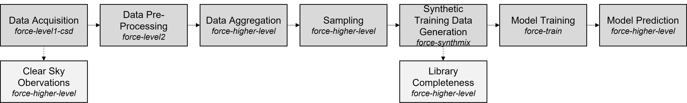

.. _tut-lcf:

Land Cover Fraction Mapping
=========================

.. |copy|   unicode:: U+000A9 .. COPYRIGHT SIGN

**How to use FORCE submodules in a workflow to map sub-pixel fractions of land cover with synthetically mixed training data**

This tutorial demonstrates a workflow that uses a series of submodules of the FORCE Higher Level Processing system (HLPS) to map sub-pixel fractions of land cover with Sentinel-2 imagery.

While spectral unmixing has been used for decades in different contexts, with different sensor types and different methods, this tutorial walks through a regression-based approach using synthetically mixed training data as presented in `Okujeni et al. (2013) <https://doi.org/10.1016/j.rse.2013.06.007>`_.

.. admonition:: Info

   *This tutorial uses FORCE v. 3.7.9*

The Workflow
-----------------------------------

The workflow in this tutorial uses a series of submodules of the FORCE Higher Level Processing system (HLPS) to map sub-pixel fractions of land cover with Sentinel-2 imagery and synthetically mixed training data. 

Some of these submodules have been described in other places of the FORCE documentation, and entire tutorials have been dedicated to others (respective links will be given where applicable).

This tutorial illustrates the potential of FORCE to be used along the complete image processing chain, from downloading and pre-processing image acquisitions to producing meaningful spatial data. Its chapters correspond to the seven steps (and two optional steps) of the following workflow.

This workflow is reproducible, as all commands, parameter files and intermediate data will be provided. Parameter files will be directly available for download throughout the workflow, while intermediate data will only be available in a data repository due to file size (Download data from Zenodo, doi: xxxxx)

   *FORCE HLPS workflow for land cover fraction mapping with regression-based unmixing and syhnthetically mixed training data* |copy| *Franz Schug*

Note

Please note that FORCE parameter files require absolute file paths. This is why path names in the provided parameter files are placeholders and should be adapted according to your folder structure when you would like to replicate the workflow yourself.

Data Acquisition
-----------------------------------

This workflow requires spatially explicit Earth Observation raster data to start with. It will technically work with any multi- or hyperspectral image data. This tutorial has been created with spectral-temporal metrics aggregated from all clear-sky Sentinel-2 observations in 2018 over Berlin, Germany (MGRS Tile 33UUU).

We first download all image acquisitions with less than 70% cloud cover according to the metadata catalogue using FORCE Level 1 Cloud Storage Downloader:

.. code-block:: bash

   force-level1-csd -s S2A,S2B -d 20180101,20181231 -c 0,70 /path/to/metadata/directory/ /path/to/datapool / /path/to/datapool/pool.txt T33UUU

We do not provide these data in the downloadable data because of file size, and as they can be downloaded again anytime.

Tip
  
Please refer to the Level 1 Cloud Storage Downloader `Documentation <https://force-eo.readthedocs.io/en/latest/components/lower-level/level1/level1-csd.html>`_ and `Tutorial <https://force-eo.readthedocs.io/en/latest/howto/level1-csd.html>`_ to know more about Sentinel-2 data downloads and about retrieving and updating the metadata catalogue required to download raw image data.

Data Pre-Processing
-----------------------------------

FORCE provides all functionalities to convert all downloaded Level 1 data (i.e., radiometrically calibrated and georectified) into Analysis-Ready Data (ARD), or Level 2 data. ARD are data that are readily usable for any application without much further processing. In FORCE, this includes 

- cloud and cloud shadow detection,
- radiometric, atmospheric, and topographic correction,
- BRDF correction,
- resolution merging (from 20m bands to 10m, Sentinel-2 only).

For processing, we use

.. code-block:: bash

   force-level2 /path/to/parametertile/directory/10_lcf_level_2.prm

You can access the parameter file `here <./_static/parameter-files/tutorials/10_lcf_level_2.prm>`_ or use the one provided in the data repository. 	

It is highly recommended to use a Digital Elevation Model (DEM) for topographic correction purposes. We here use a global SRTM/ASTER composite that we cannot provide for download. However, you can use any DEM of your choice here, for example the one provided by the `Copernicus Land Monitoring Service <https://www.eea.europa.eu/data-and-maps/data/copernicus-land-monitoring-service-eu-dem>`_. The use of a DEM is, however, not required to continue data processing, and as our example region is rather flat, the impact of missing topographic correction might be acceptable.

.. code-block:: bash

   FILE_DEM = /path/to/dem/global_srtm-aster.vrt

As we want to subsequently use the ARD generated here in different higher-level submodules, we organize data in a data cube and in image tiles. The data cube parameters can be defined in the Level 2 parameter file. We use ETRS89-extended/LAEA Europe projection (EPSG: 3035). The following aspects of the workflow will be limited to a single image tile for reasons of simplicity.

.. code-block:: bash

	DO_REPROJ = TRUE
	…
	DO_TILE = TRUE
	…
	ORIGIN_LON = -25
	ORIGIN_LAT = 60
	…
	PROJECTION = PROJCS["ETRS89 / LAEA Europe",GEOGCS["ETRS89",DATUM["European_Terrestrial_Reference_System_1989",SPHEROID["GRS 1980",6378137,298.257222101,AUTHORITY["EPSG","7019"]],TOWGS84[0,0,0,0,0,0,0],AUTHORITY["EPSG","6258"]],PRIMEM["Greenwich",0,AUTHORITY["EPSG","8901"]],UNIT["degree",0.0174532925199433,AUTHORITY["EPSG","9122"]],AUTHORITY["EPSG","4258"]],PROJECTION["Lambert_Azimuthal_Equal_Area"],PARAMETER["latitude_of_center",52],PARAMETER["longitude_of_center",10],PARAMETER["false_easting",4321000],PARAMETER["false_northing",3210000],UNIT["metre",1,AUTHORITY["EPSG","9001"]],AUTHORITY["EPSG","3035"]]

Tip

Please refer to the Level 2 ARD `tutorial <https://force-eo.readthedocs.io/en/latest/howto/l2-ard.html>`_ for further information about generating ARD in FORCE, and to the Digital Elevation Model `tutorial <https://force-eo.readthedocs.io/en/latest/howto/dem.html>_ for information on how to prepare a DEM for the FORCE processing system.

Info

--FORCE is also able to co-register Sentinel-2 data with Landsat time series data (`Tutorial <https://force-eo.readthedocs.io/en/latest/howto/coreg.html>`_. However, this workflow does not make use of this because it uniquely relies on Sentinel-2 data.

Clear-Sky Observations
-----------------------------------

At this point of the workflow, we can optionally check clear-sky observation (CSO) statistics for our data. Data availability in our study area and period will have a great impact on the quality of derived aggregated data, i.e., spectral-temporal metrics, and, ultimately, on land cover fraction mapping results. CSO statistics can be derived using the FORCE HLPS:

.. code-block:: bash

	force-higher-level /data/FS_spatial_model_generalization/090_scripts/parameterfiles/ 11_lcf_cso.prm

We compute two CSO statistics, the number of observations and the maximum temporal difference between observations, for the complete study period, as both are good, but simple indicators for data quantity and distribution.

.. code-block:: bash

	CSO = NUM MAX
	
You can access the parameter file `here <../_static/parameter-files/tutorials/11_lcf_cso.prm>`_ or use the one provided in the data repository.

Data Aggregation / Spectral-Temporal Metrics
-----------------------------------

Sampling
-----------------------------------

Synthetically Mixed Training Data
-----------------------------------

Library Completeness
-----------------------------------

Model Training
-----------------------------------

Model Prediction
-----------------------------------