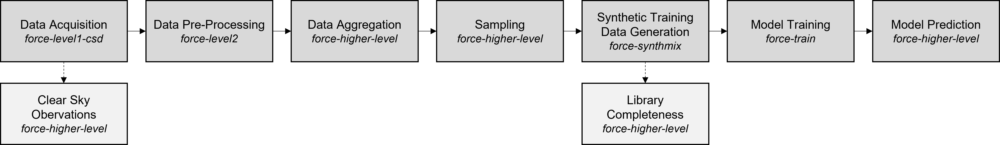
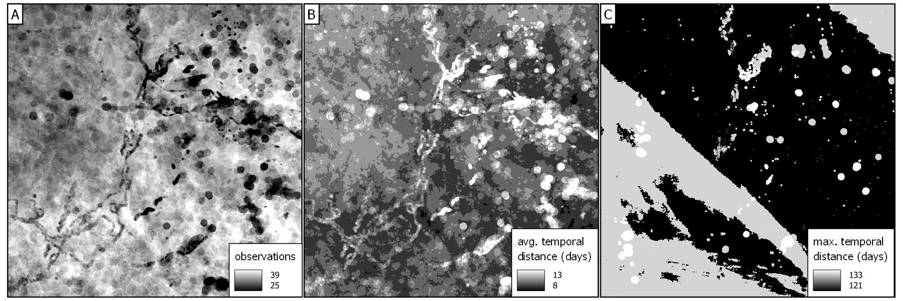
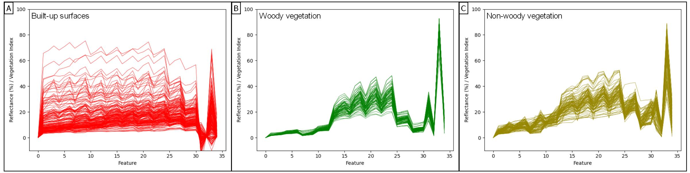
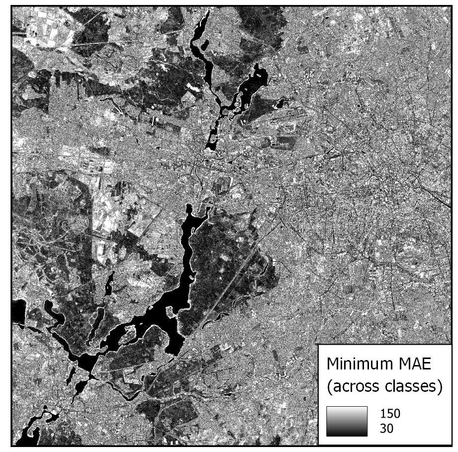

.. _tut-lcf:

Land Cover Fraction Mapping
=========================

.. |copy|   unicode:: U+000A9 .. COPYRIGHT SIGN

**How to use FORCE submodules in a workflow to map sub-pixel fractions of land cover with synthetically mixed training data**

This tutorial demonstrates a workflow that uses a series of submodules of the FORCE Higher Level Processing system (HLPS) to map sub-pixel fractions of land cover with Sentinel-2 imagery.

While spectral unmixing has been used for decades in different contexts, with different sensor types and different methods, this tutorial walks through a regression-based approach using synthetically mixed training data as presented in `Okujeni et al. (2013) <https://doi.org/10.1016/j.rse.2013.06.007>`_.

.. admonition:: Info

   *This tutorial uses FORCE v. 3.7.9*

The Workflow
-----------------------------------

The workflow in this tutorial uses a series of submodules of the FORCE Higher Level Processing system (HLPS) to map sub-pixel fractions of land cover with Sentinel-2 imagery and synthetically mixed training data. 

Some of these submodules have been described in other places of the FORCE documentation, and entire tutorials have been dedicated to others (respective links will be given where applicable).

This tutorial illustrates the potential of FORCE to be used along the complete image processing chain, from downloading and pre-processing image acquisitions to producing meaningful spatial data. Its chapters correspond to the seven steps (and two optional steps) of the following workflow.

This workflow is reproducible, as all commands, parameter files and intermediate data will be provided. Parameter files will be directly available for download throughout the workflow, while intermediate data will only be available in a data repository due to file size (Download data from Zenodo, doi: xxxxx)

   *FORCE HLPS workflow for land cover fraction mapping with regression-based unmixing and syhnthetically mixed training data* |copy| *Franz Schug*

Note

Please note that FORCE parameter files require absolute file paths. This is why path names in the provided parameter files are placeholders and should be adapted according to your folder structure when you would like to replicate the workflow yourself.

Data Acquisition
-----------------------------------

This workflow requires spatially explicit Earth Observation raster data to start with. It will technically work with any multi- or hyperspectral image data. This tutorial has been created with spectral-temporal metrics aggregated from all clear-sky Sentinel-2 observations in 2018 over Berlin, Germany (MGRS Tile 33UUU).

We first download all image acquisitions with less than 70% cloud cover according to the metadata catalogue using FORCE Level 1 Cloud Storage Downloader:

.. code-block:: bash

   force-level1-csd -s S2A,S2B -d 20180101,20181231 -c 0,70 /path/to/metadata/directory/ /path/to/datapool / /path/to/datapool/pool.txt T33UUU

We do not provide these data in the downloadable data because of file size, and as they can be downloaded again anytime using the above command.

Tip
  
Please refer to the Level 1 Cloud Storage Downloader `Documentation <https://force-eo.readthedocs.io/en/latest/components/lower-level/level1/level1-csd.html>`_ and `Tutorial <https://force-eo.readthedocs.io/en/latest/howto/level1-csd.html>`_ to know more about Sentinel-2 data downloads and about retrieving and updating the metadata catalogue required to download raw image data.

Data Pre-Processing
-----------------------------------

FORCE provides all functionalities to convert all downloaded Level 1 data (i.e., radiometrically calibrated and georectified) into Analysis-Ready Data (ARD), or Level 2 data. ARD are data that are readily usable for any application without much further processing. In FORCE, this includes 

- cloud and cloud shadow detection,
- radiometric, atmospheric, and topographic correction,
- BRDF correction,
- resolution merging (from 20m bands to 10m, Sentinel-2 only).

For processing, we use

.. code-block:: bash

   force-level2 /path/to/parametertile/directory/10_lcf_level_2.prm

You can access the parameter file `here <../_static/parameter-files/tutorials/lcf/10_lcf_level_2.prm>`_ or use the one provided in the data repository. 	

It is highly recommended to use a Digital Elevation Model (DEM) for topographic correction purposes. We here use a global SRTM/ASTER composite that we cannot provide for download. However, you can use any DEM of your choice here, for example the one provided by the `Copernicus Land Monitoring Service <https://www.eea.europa.eu/data-and-maps/data/copernicus-land-monitoring-service-eu-dem>`_. The use of a DEM is, however, not required to continue data processing, and as our example region is rather flat, the impact of missing topographic correction might be acceptable.

.. code-block:: bash

   FILE_DEM = /path/to/dem/global_srtm-aster.vrt

As we want to subsequently use the ARD generated here in different higher-level submodules, we organize data in a data cube and in image tiles. We defined tiles to be 30x30km in size, so considerably smaller than MGRS tiles. The data cube parameters can be defined in the Level 2 parameter file. We use ETRS89-extended/LAEA Europe projection (EPSG: 3035). The following aspects of the workflow will be limited to a single image tile for reasons of simplicity.

.. code-block:: bash

	DO_REPROJ = TRUE
	…
	DO_TILE = TRUE
	…
	ORIGIN_LON = -25
	ORIGIN_LAT = 60
	…
	PROJECTION = PROJCS["ETRS89 / LAEA Europe",GEOGCS["ETRS89",DATUM["European_Terrestrial_Reference_System_1989",SPHEROID["GRS 1980",6378137,298.257222101,AUTHORITY["EPSG","7019"]],TOWGS84[0,0,0,0,0,0,0],AUTHORITY["EPSG","6258"]],PRIMEM["Greenwich",0,AUTHORITY["EPSG","8901"]],UNIT["degree",0.0174532925199433,AUTHORITY["EPSG","9122"]],AUTHORITY["EPSG","4258"]],PROJECTION["Lambert_Azimuthal_Equal_Area"],PARAMETER["latitude_of_center",52],PARAMETER["longitude_of_center",10],PARAMETER["false_easting",4321000],PARAMETER["false_northing",3210000],UNIT["metre",1,AUTHORITY["EPSG","9001"]],AUTHORITY["EPSG","3035"]]

Tip

Please refer to the Level 2 ARD `tutorial <https://force-eo.readthedocs.io/en/latest/howto/l2-ard.html>`_ for further information about generating ARD in FORCE, and to the Digital Elevation Model `tutorial <https://force-eo.readthedocs.io/en/latest/howto/dem.html>_ for information on how to prepare a DEM for the FORCE processing system.

Info

--FORCE is also able to co-register Sentinel-2 data with Landsat time series data (`Tutorial <https://force-eo.readthedocs.io/en/latest/howto/coreg.html>`_. However, this workflow does not make use of this because it uniquely relies on Sentinel-2 data.

Clear-Sky Observations (optional)
-----------------------------------

At this point of the workflow, we can optionally check clear-sky observation (CSO) statistics for our data. Data availability in our study area and period will have a great impact on the quality of derived aggregated data, i.e., spectral-temporal metrics, and, ultimately, on land cover fraction mapping results. CSO statistics can be derived using the FORCE HLPS:

.. code-block:: bash

	force-higher-level /data/FS_spatial_model_generalization/090_scripts/parameterfiles/11_lcf_cso.prm

We compute two CSO statistics, the number of observations and the maximum temporal difference between observations, for the complete study period, as both are good, but simple indicators for data quantity and distribution.

.. code-block:: bash

	CSO = NUM MAX
	
You can access the parameter file `here <../_static/parameter-files/tutorials/lcf/11_lcf_cso.prm>`_ or use the one provided in the data repository.

   *Number of observations (A), average (B) and maximum (C) temporal distance in days between observations for our study period 01 Mar. 2018 and 30 Oct. 2018. Scale represents 96% of values.* |copy| *Franz Schug*

Based on CSO statistics, we assume that in most places of our study area, the number of observations (range from 10 to 42) and their temporal distance seems sufficient for generating robust spectral-temporal metrics.

Data Aggregation / Spectral-Temporal Metrics
-----------------------------------

TODO TODO TODO TODO TODO TODO TODO TODO TODO TODO TODO TODO TODO TODO TODO TODO TODO TODO TODO TODO TODO TODO TODO TODO TODO TODO TODO TODO TODO TODO TODO TODO TODO TODO TODO TODO TODO TODO TODO TODO TODO TODO TODO TODO TODO TODO TODO TODO TODO TODO TODO TODO TODO TODO TODO TODO TODO TODO TODO TODO TODO TODO TODO TODO TODO TODO TODO TODO TODO TODO TODO TODO TODO TODO TODO TODO TODO TODO TODO TODO TODO TODO TODO TODO TODO TODO TODO TODO TODO TODO TODO TODO TODO TODO TODO TODO TODO TODO TODO TODO TODO TODO TODO TODO TODO TODO TODO TODO TODO TODO TODO TODO TODO TODO TODO TODO TODO TODO TODO TODO TODO TODO TODO TODO TODO TODO TODO TODO TODO TODO TODO TODO 

.. code-block:: bash

	force-higher-level /data/FS_spatial_model_generalization/090_scripts/parameterfiles/11_lcf_cso.prm

20_lcf_stm_reflectance.prm
20_lcf_stm_vegetation.prm
You can access the parameter file `here <../_static/parameter-files/tutorials/lcf/11_lcf_cso.prm>`_ or use the one provided in the data repository.

+--------------------+------------------------------------------------+
+Band                + Spectral-Temporal Metrics                      +
+====================+================================================+
+ Blue               + Q25, Q50, Q75                                  +
+--------------------+------------------------------------------------+
+ Green              + Q25, Q50, Q75                                  +
+--------------------+------------------------------------------------+
+ Red                + Q25, Q50, Q75                                  +
+--------------------+------------------------------------------------+
+ Red Edge 1         + Q25, Q50, Q75                                  +
+--------------------+------------------------------------------------+
+ Red Edge 2         + Q25, Q50, Q75                                  +
+--------------------+------------------------------------------------+
+ Red Edge 3         + Q25, Q50, Q75                                  +
+--------------------+------------------------------------------------+
+ Broad NIR          + Q25, Q50, Q75                                  +
+--------------------+------------------------------------------------+
+ NIR                + Q25, Q50, Q75                                  +
+--------------------+------------------------------------------------+
+ SWIR 1             + Q25, Q50, Q75                                  +
+--------------------+------------------------------------------------+
+ SWIR 2             + Q25, Q50, Q75                                  +
+--------------------+------------------------------------------------+
+ Tass. Cap Green.   + Q90, STD                                       +
+--------------------+------------------------------------------------+
+ NDVI               + Q90, STD                                       +
+--------------------+------------------------------------------------+

Tip

Please refer to the Spectral Temporal Metrics `tutorial <https://force-eo.readthedocs.io/en/latest/howto/stm.html>`_ for further information about generating spectral-temporal metrics using the Time Series Analysis (TSA) submodule of the FORCE Higher Level Processing system (HLPS).

Sampling
-----------------------------------

Land cover fraction mapping with synthetically mixed training data requires spectral information from pure land cover surfaces to begin with, i.e., spectral reference data that can eventually be used to train a model that understands inter- and intra-class spectral variability. 

Here, we are using reference information directly from the imagery (as opposed to, e.g., data from external spectral libraries or ground sampling). We identified 388 reference surfaces, i.e., pixels of 10x10 m that cover only a single land cover type, for five classes: Built-up surfaces (182 reference points), woody vegetation (70), non-woody vegetation (98), soil (15), and water (23).

The number of reference points per class varies based on spectral intra-class variability (which is, e.g., higher for non-woody vegetation than for vegetation) and surface availability (e.g., few available reference points for bare soil).

Info

In this tutorial we focus on a single 30x30km image tile. However, we also want the example to be reproducible, which means that all reference points were sampled within that tile. There is a chance that this will produce a highly local model not well transferable to other (even closer) regions. This is fine for illustration purposes, but using this approach for larger area mapping, make sure that reference data is representative of the whole area.

You can download these reference points as a text file `here <../_static/files/tutorials/lcf/samples.txt>`_, or as a shape file from this dataset on Zenodo. The data come in a WGS84 projection (EPSG: 4326) and are resampled on-the-fly when used with data from the data cube.   

We use

.. code-block:: bash

	force-higher-level /data/FS_spatial_model_generalization/090_scripts/parameterfiles/30_lcf_sampling.prm

to extract spectral information from spectral-temporal metrics at the locations given. You can access the parameter file `here <../_static/parameter-files/tutorials/lcf/30_lcf_sampling.prm>`_ or use the one provided in the data repository.

In the parameter file, we will need to provide a list of features that the spectral information will be drawn from. These files and bands correspond to the spectral-temporal metrics previously created: 

.. code-block:: bash

	INPUT_FEATURE = 2018-2018_001-365_HL_TSA_SEN2L_BLU_STM.tif 1 2 3 
	INPUT_FEATURE = 2018-2018_001-365_HL_TSA_SEN2L_GRN_STM.tif 1 2 3 
	INPUT_FEATURE = 2018-2018_001-365_HL_TSA_SEN2L_RED_STM.tif 1 2 3 
	INPUT_FEATURE = 2018-2018_001-365_HL_TSA_SEN2L_RE1_STM.tif 1 2 3 
	INPUT_FEATURE = 2018-2018_001-365_HL_TSA_SEN2L_RE2_STM.tif 1 2 3 
	INPUT_FEATURE = 2018-2018_001-365_HL_TSA_SEN2L_RE3_STM.tif 1 2 3 
	INPUT_FEATURE = 2018-2018_001-365_HL_TSA_SEN2L_BNR_STM.tif 1 2 3 
	INPUT_FEATURE = 2018-2018_001-365_HL_TSA_SEN2L_NIR_STM.tif 1 2 3 
	INPUT_FEATURE = 2018-2018_001-365_HL_TSA_SEN2L_SW1_STM.tif 1 2 3 
	INPUT_FEATURE = 2018-2018_001-365_HL_TSA_SEN2L_SW2_STM.tif 1 2 3 
	INPUT_FEATURE = 2018-2018_001-365_HL_TSA_SEN2L_TCG_STM.tif 1 2
	INPUT_FEATURE = 2018-2018_001-365_HL_TSA_SEN2L_NDV_STM.tif 1 2

The Sampling submodule will produce four individual text files that contain feature and response information as well as a list of coordinates of the reference points.

   
*Spectral information for all reference points of pure built-up surfaces (A), woody vegetation (B) and non-woody vegetation (C). The features correspond to the features in the above table, in that order.* |copy| *Franz Schug*

   
Tip

Please refer to the Sampling `documentation <https://force-eo.readthedocs.io/en/latest/components/higher-level/smp/index.html#smp>`_ for further information about parametrizing the FORCE Sampling submodule.

Synthetically Mixed Training Data
-----------------------------------

TODO TODO TODO TODO TODO TODO TODO TODO TODO TODO TODO TODO TODO TODO TODO TODO TODO TODO TODO TODO TODO TODO TODO TODO TODO TODO TODO TODO TODO TODO TODO TODO TODO TODO TODO TODO TODO TODO TODO TODO TODO TODO TODO TODO TODO TODO TODO TODO TODO TODO TODO TODO TODO TODO TODO TODO TODO TODO TODO TODO TODO TODO TODO TODO TODO TODO TODO TODO TODO TODO TODO TODO TODO TODO TODO TODO TODO TODO TODO TODO TODO TODO TODO TODO TODO TODO TODO TODO TODO TODO TODO TODO TODO TODO TODO TODO TODO TODO TODO TODO TODO TODO TODO TODO TODO TODO TODO TODO TODO TODO TODO TODO TODO TODO TODO TODO TODO TODO TODO TODO TODO TODO TODO TODO TODO TODO TODO TODO TODO TODO TODO TODO 

Illustration: concept of synth mix

Library Completeness (optional)
-----------------------------------

TODO TODO TODO TODO TODO TODO TODO TODO TODO TODO TODO TODO TODO TODO TODO TODO TODO TODO TODO TODO TODO TODO TODO TODO TODO TODO TODO TODO TODO TODO TODO TODO TODO TODO TODO TODO TODO TODO TODO TODO TODO TODO TODO TODO TODO TODO TODO TODO TODO TODO TODO TODO TODO TODO TODO TODO TODO TODO TODO TODO TODO TODO TODO TODO TODO TODO TODO TODO TODO TODO TODO TODO TODO TODO TODO TODO TODO TODO TODO TODO TODO TODO TODO TODO TODO TODO TODO TODO TODO TODO TODO TODO TODO TODO TODO TODO TODO TODO TODO TODO TODO TODO TODO TODO TODO TODO TODO TODO TODO TODO TODO TODO TODO TODO TODO TODO TODO TODO TODO TODO TODO TODO TODO TODO TODO TODO TODO TODO TODO TODO TODO TODO 

   
*Minimum Mean Absolute Error between each training feature set of the synthetically mixed data and every image pixel across all three target classes.* |copy| *Franz Schug*

   
   
   Minimum Mean Absolute Error between each training feature set of the synthetically mixed data and every image pixel across all three target classes.

Model Training
-----------------------------------

We use *force-train* with synthetically created training data to train regression-based machine learning models of land cover fraction.

For each set of synthetically mixed training data and for each class, we will need to train one model, which means that we need to create one individual training parameter file for each case. This sums up to 15 parameter files, as we use three target classes and five iterations.

As we do not want to manually create 15 parameter files, force-magic-parameter will help with this. We create one reference parameter file that contains all the information that is identical in each individual parameter file, as well as two vectors holding replacement values for classes (SET) and iterations (IT) at the very beginning of the file:

.. code-block:: bash

	%SET%: 001 002 003
	%IT%: 001 002 003 004 005

In the following, we use SET and IT as a placeholder for classes and iterations:

.. code-block:: bash

	FILE_FEATURES = /data/FS_spatial_model_generalization/011_data/sentinel/mixes/SYNTHMIX_FEATURES_CLASS-_ITERATION-.txt
	FILE_RESPONSE = /data/FS_spatial_model_generalization/011_data/sentinel/mixes/SYNTHMIX_RESPONSE_CLASS-_ITERATION-.txt

Now use
 
.. code-block:: bash
	
	force-magic-parameters -o /train /data/FS_spatial_model_generalization/090_scripts/parameterfiles/50_lcf_training.prm
	
to conveniently generate 15 parameter files (five per target class) representing all possible value combinations of the two replacement variables.

We use a Support Vector Regression approach with a random 70/30 data split for training and internal model validation.

.. code-block:: bash

	PERCENT_TRAIN = 70
	RANDOM_SPLIT = TRUE
	ML_METHOD = SVR

We now need to train 15 models by calling all 15 parameter files, which we can do using a simple command line loop:

.. code-block:: bash

	for f in /train/*.prm; do dforce force-train $f; done 

In this case, it is important that no other parameter file is in the given folder.

Tip

Please refer to the OpenCV `Support Vecor Machine documentation <https://docs.opencv.org/3.4/d1/d73/tutorial_introduction_to_svm.html>`_ to learn more about model parametrization, or refer to the parameter file descriptions.

Model Prediction
-----------------------------------

TODO TODO TODO TODO TODO TODO TODO TODO TODO TODO TODO TODO TODO TODO TODO TODO TODO TODO TODO TODO TODO TODO TODO TODO TODO TODO TODO TODO TODO TODO TODO TODO TODO TODO TODO TODO TODO TODO TODO TODO TODO TODO TODO TODO TODO TODO TODO TODO TODO TODO TODO TODO TODO TODO TODO TODO TODO TODO TODO TODO TODO TODO TODO TODO TODO TODO TODO TODO TODO TODO TODO TODO TODO TODO TODO TODO TODO TODO TODO TODO TODO TODO TODO TODO TODO TODO TODO TODO TODO TODO TODO TODO TODO TODO TODO TODO TODO TODO TODO TODO TODO TODO TODO TODO TODO TODO TODO TODO TODO TODO TODO TODO TODO TODO TODO TODO TODO TODO TODO TODO TODO TODO TODO TODO TODO TODO TODO TODO TODO TODO TODO TODO 

Tip

Please refer to the Machine Learning `documentation <https://force-eo.readthedocs.io/en/latest/components/higher-level/ml/index.html#ml>`_ for further information about generating maps with regression-based machine learning models.