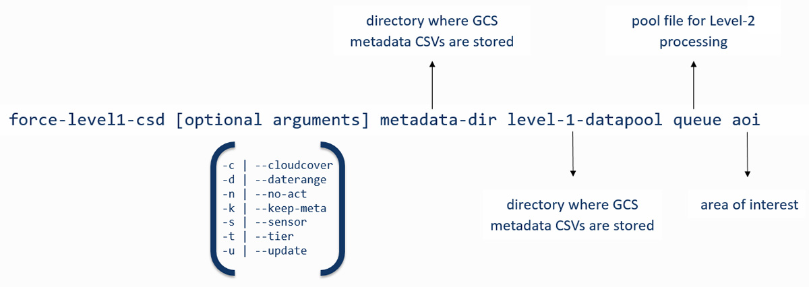
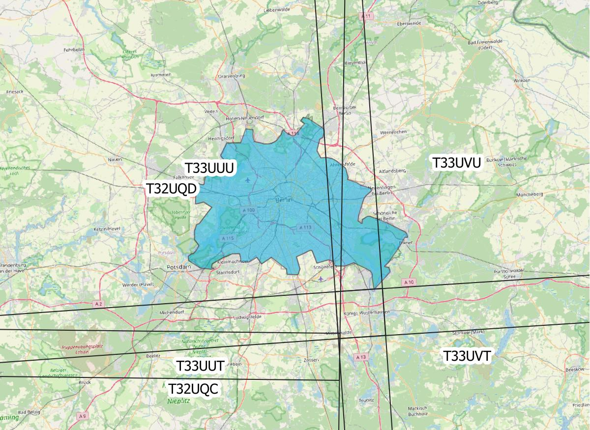

.. _tut-l1csd:

Level 1 Cloud Storage Downloader
================================

**How to download Landsat and Sentinel-2 Level-1 data from cloud services**

This tutorial covers the process of querying and downloading Landsat and Sentinel-2 Level 1 data from cloud services (currently Google Cloud Storage).
FORCE Level 1 CSD offers a high level of detail in requesting data and creates a consistent Level 1 data pool, as well as queue files that can be used for Level 2 processing.

.. admonition:: Info

   *This tutorial uses FORCE v. 3.5*

FORCE Level 1 CSD makes use of the Landsat and Sentinel-2 metadata catalogues from Google Cloud Storage to find scenes matching the user's requirements and downloads them through `gsutil <https://cloud.google.com/storage/docs/gsutil>`_.
A check for scenes already existing locally is performed and only new scenes are downloaded.

Getting started
---------------

gsutil configuration
""""""""""""""""""""

Currently, Landsat data can be downloaded without a login (this will change at some point), but downloading Sentinel-2 data requires authentication.
This is done through gsutil and only needs to be done once before the first run.
The credentials will be stored in a file called ``.boto`` in the user's home directory (make sure to check the notes at the end of this document if you're running FORCE in Docker).

Type the following command to start the authorization process

.. code-block:: none

    gsutil config

Follow the on-screen instructions to authorize access to the Google Cloud Platform APIs.
When asked for a project name, just type in any name. It is not necessary to create a project first.

Downloading the metadata catalogues
"""""""""""""""""""""""""""""""""""

The metadata catalogues contain metadata for **all** scenes stored on Google Cloud Storage.
The ``-u | --update`` option will download the latest (compressed) catalogues and extract them to the metadata directory specified by the user.
As the catalogues are fairly large (curently ~2.8 GB for Landsat and 5.9 GB for Sentinel-2), it is a good idea to place them in a shared location that can be accessed by several users.

.. code-block:: none

    force-level1-csd -u /data/Jakku/edc/level1/

    Downloading Landsat metadata catalogue...
    Extracting compressed Landsat metadata catalogue...

    Downloading Sentinel-2 metadata catalogue...
    Extracting compressed Sentinel-2 metadata catalogue...

    Done. You can run this script without option -u to download data now.

The ``-s | --sensor`` option may be used if only one of the two catalogues need to be downloaded / updated.
Specifying one of the sensors of either family is sufficient (i.e., LT05 for Landsat or S2B for Sentinel-2).

Parameterization
----------------

Basic syntax
""""""""""""

FORCE Level-1 CSD is parameterized with four mandatory arguments.
These make up the core of the request and always need to be provided, while all remaining arguments are optional. The basic structure is visualized in the image below.

Mandatory arguments
"""""""""""""""""""

.. code-block:: none

  metadata-dir
  Directory where the metadata catalogues (csv file) are stored

  level-1-datapool
  An existing directory, your files will be stored here

  queue
  Downloaded files are appended to a file queue, which is needed for the
  Level 2 processing. The file doesn't need to exist. If it does exist,
  new lines will be appended on successful ingestion

  area of interest
  (1) user-supplied coordinates of your study area:
      The polygon must be closed (first X/Y = last X/Y). X/Y must be given as
      decimal degrees with negative values for West and South coordinates.
      Either specify the path to a file, or the coordinates on the command line.
      If in a file, provide one coordinate per line.
      If on the command line, provide a comma separated list.
  (2) a shapefile (point/polygon/line). On-the-fly reprojection is provided,
      but using EPSG4326 is recommended.
  (3) scene identifier:
      Landsat: Path/Row as "PPPRRR". Make sure to keep leading zeros:
        correct: 181034, incorrect: 18134
      Sentinel-2: MGRS tile as "TXXXXX". Make sure to keep the leading T before
        the MGRS tile number.
      You can either give the path to a file, or give the IDs on the command line.
      If in a file, provide one ID per line.
      If on the command line, provide a comma separated list.

The first three arguments specify the local directories for the metadata catalogues, the level 1 datapool (download directory), and the processing queue.
We define our area of interest with the fourth argument.
FORCE Level 1 CSD offers quite some flexibility in how the aoi can be specified.
Options ``(1)`` and ``(2)`` will intersect the provided geometries with the reference systems of Landsat and/or Sentinel-2.
Option ``(3)`` can be used if we already know which Landsat path/row or Sentinel-2 tiles we need.

.. caution::
    If you would like to specify coordinates or a list of scene identifiers on the command line, keep in mind that the maximum length of command line calls is limited and varies by system!
    The lists may just be cut off and in the worst case you won't notice before it's too late.
    You may be better off storing them in a text file.
    Make sure this file uses UNIX end of line characters and provide one coordinate pair or grid identifier per line.

Optional arguments
""""""""""""""""""

Four of the optional arguments can be used to narrow down our search results:

.. code-block:: none

  -c | --cloudcover
  minimum,maximum
  The cloud cover range must be specified in %
  Default: 0,100

  -d | --daterange
  starttime,endtime
  Dates must be given in the following format: YYYYMMDD,YYYYMMDD
  Default: 19700101,today

  -s | --sensor
  Sensors to include in the query, comma-separated.
  Valid sensors:
  Landsat                             Sentinel
  LT04 - Landsat 4 TM                 S2A - Sentinel-2A MSI
  LT05 - Landsat 5 TM                 S2B - Sentinel-2B MSI
  LE07 - Landsat 7 ETM+
  LC08 - Landsat 8 OLI
  Default: LT04,LT05,LE07,LC08,S2A,S2B

  -t | --tier
  Landsat collection tier level. Valid tiers: T1,T2,RT
  Default: T1

We can filter by cloud cover estimate, date range, sensor, and tier (Landsat only).
If these parameters aren't set, they will default to the values above.

.. caution::

  Note that the default search is a very broad one. It will basically return all Landsat **and** Sentinel-2 scenes ever acquired for the area of interest.
  The only exception is the Tier level for Landsat - only Tier 1 scenes will be included, as Tier 2 and Real Time scenes are not desirable for most applications.

There are two further optional arguments that don't affect the search parameters, but change the behavior of FORCE Level 1 CSD:

.. code-block:: none

  -n | --no-act
  Will trigger a dry run that will only return the number of images
  and their total data volume

  -k | --keep-meta
  Will write the results of the query to the level 1 datapool directory.
  Two files will be created if Landsat and Sentinel-2 data is queried
  at the same time. Filename: csd_metadata_YYYY-MM-DDTHH-MM-SS

.. note::

    The mandatory arguments are positional!
    They need to be provided in this exact order.
    The optional arguments can be placed anywhere and may also be combined.
    For example, ``-n -k -c 0,70`` could also be written as ``-nkc 0,70``.
    When values are passed to the optional arguments (cloud cover, date range, sensor, or tier), these must be separated by commas ``,`` and must not contain whitespace.

Querying and downloading data
-----------------------------

Basic search
""""""""""""

Now that the FORCE Level 1 CSD is set up and we got the basic syntax straight, we can start looking for scenes that match our needs.
Let's start with a very broad search using a geopackage file defining our area of interest (the city-state of Berlin, Germany) as polygon feature.

To get a first overview of the data volume, we will use the ``-n | --no-act`` option.
This will print information about the results of our search without actually downloading the data.

.. code-block:: none

    force-level1-csd -n meta gcs_berlin/level1 gcs_berlin/level1/l1_pool.txt gcs_berlin/berlin_aoi.gpkg

    Landsat and Sentinel-2 data requested.
    Landsat data will be queried and downloaded first.

    Searching for footprints / tiles intersecting with geometries of AOI shapefile...

    Querying the metadata catalogue for Landsat data
    Sensor(s): LT04,LT05,LE07,LC08
    Tier(s): T1
    Tile(s): 192023,192024,193023,193024
    Daterange: 19700101 to 20201013
    Cloud cover minimum: 0%, maximum: 100%

    2510 Landsat Level 1 scenes matching criteria found
    827.38GB data volume found.

    Searching for footprints / tiles intersecting with geometries of AOI shapefile...

    Querying the metadata catalogue for Sentinel2 data
    Sensor(s): S2A,S2B
    Tile(s): T32UQD,T33UUT,T33UUU,T33UVT,T33UVU
    Daterange: 19700101 to 20201013
    Cloud cover minimum: 0%, maximum: 100%

    4152 Sentinel2 Level 1 scenes matching criteria found
    1.78TB data volume found.

    Done.

FORCE Level 1 CSD will print all details about the query parameters, as well as number of scenes found and total data volume for Landsat and Sentinel-2 data.

Refining the search parameters
""""""""""""""""""""""""""""""

Even though our area of interest is small, the data volume is substantial.
Let's say we're only interested in Sentinel-2B data from the year 2019 with cloud cover less than 70%.
We can use the ``-c | --cloud-cover`` to define the cloud cover threshold, ``-d | --daterange`` to only retrieve scenes between Jan 1, 2019 and Dec 31, 2019, and ``-s | --sensor`` to specify S2B as target sensor.

.. code-block:: none

    force-level1-csd -n -c 0,70 -d 20190101,20190430 -s S2B meta gcs_berlin/level1 gcs_berlin/level1/l1_pool.txt gcs_berlin/berlin_aoi.gpkg

    Searching for footprints / tiles intersecting with geometries of AOI shapefile...

    Querying the metadata catalogue for Sentinel2 data
    Sensor(s): S2B
    Tile(s): T32UQD,T33UUT,T33UUU,T33UVT,T33UVU
    Daterange: 20190101 to 20190430
    Cloud cover minimum: 0%, maximum: 70%

    97 Sentinel2 Level 1 scenes matching criteria found
    49.44GB data volume found.

    Done.

That makes a huge difference - we're down from 1.78TB to 49.44GB of data.
However, considering the Sentinel-2 reference system, there still may be some redundancy in the data.
We can see that FORCE Level 1 CSD found five MGRS tiles intersecting with the AOI.
That's quite a lot of tiles if we consider that Berlin covers less than 900km², while each S2 tile is 12.100km² large.
Let's take a look at how our area of interest is located in relation to the Sentinel-2 MGRS reference system:

    AOI (blue polygon) in relation to the Sentinel-2 reference system (black lines).

As we can see, the two northern tiles are probably sufficient to get all the data we need.
The north/south overlap of T33UUU/T33UUT and T33UVU/T33UVT does not provide additional data, neither does the overlap of T33UUU and T33UQD.
We can directly specify the desired tiles (comma-separated) as aoi:

.. code-block:: none

    force-level1-csd -n -c 0,70 -d 20190101,20191231 -s S2B meta gcs_berlin/level1 gcs_berlin/level1/l1_pool.txt T33UUU,T33UVU

    Querying the metadata catalogue for Sentinel2 data
    Sensor(s): S2B
    Tile(s): T33UUU,T33UVU
    Daterange: 20190101 to 20190430
    Cloud cover minimum: 0%, maximum: 70%

    44 Sentinel2 Level 1 scenes matching criteria found
    21.06GB data volume found.

    Done.

Download
""""""""

When we're happy with the results, we can remove the ``-n | --no-act`` option to start downloading

.. code-block:: none

    force-level1-csd -c 0,70 -d 20190101,20191231 -s S2B meta gcs_berlin/level1 gcs_berlin/level1/l1_pool.txt T33UUU,T33UVU

    Querying the metadata catalogue for Sentinel2 data
    Sensor(s): S2B
    Tile(s): T33UUU,T33UVU
    Daterange: 20190101 to 20190430
    Cloud cover minimum: 0%, maximum: 70%

    44 Sentinel2 Level 1 scenes matching criteria found
    21.06GB data volume found.

    Starting to download 44 Sentinel2 Level 1 scenes

    Downloading S2B_MSIL1C_20190119T101339_N0207_R022_T33UVU_20190119T121912(5 of 44)...

    |===========                                                                            |  13 %

General notes
-------------

Scenes are stored in folders named after their corresponding path/row (Landsat) or MGRS tile (Sentinel-2).
The status bar will update after every scene that has successfully been downloaded.
Any scenes that have already been downloaded will be skipped and a notification will be printed.
If the download was canceled at some point and a scene wasn't fully downloaded, FORCE Level 1 CSD will delete that scene and redownload it.

Sentinel-2 scenes
"""""""""""""""""

The processing baseline for Landsat data is standardized by the Collection format.
For Sentinel-2 we found that there were duplicate scenes with different processing baselines or processing dates.
FORCE Level 1 CSD will check for duplicates and only download the version with the highest processing baseline or latest processing date if the processing baseline is the same.

Saving metadata
---------------

FORCE Level 1 CSD offers the possibility to save the metadata of the scenes that matched the specified requirements.
Having easy access to this kind of information can be very helpful when creating statistics and visualizations about data availability over time, cloud cover distribution over time, data volume (e.g., per sensor or year), etc.
Using the ``-k | --keep-meta`` option will save the results of the current query to the Level 1 datapool folder under the file name

.. code-block:: none

    csd_metadata_[platform]_YYYY-MM-DDTHH-MM-SS.txt

The timestamp refers to the time when the request was made.
``[platform]`` refers to the satellite platform (Landsat or Sentinel-2).

The ``-k | --keep-meta`` option can be combined with the ``-n | --no-act`` option to acquire the metadata without downloading any data.
If Landsat and Sentinel-2 data is queried at the same time, two separate files will be created.

.. code-block:: none

    ls gcs_berlin/level1

    csd_metadata_2020-10-01T19-48-16.txt
    csd_metadata_2020-10-01T19-48-21.txt
    l1_pool.txt
    T33UUU
    T33UVU

.. note::

    When analyzing metadata, keep in mind that Google's catalogues use different column names for Landsat and Sentinel-2.

    .. code-block:: none

        head -n 1 edc/level1/metadata_landsat.csv
        SCENE_ID,PRODUCT_ID,SPACECRAFT_ID,SENSOR_ID,DATE_ACQUIRED,COLLECTION_NUMBER,COLLECTION_CATEGORY,SENSING_TIME,DATA_TYPE,WRS_PATH,WRS_ROW,CLOUD_COVER,NORTH_LAT,SOUTH_LAT,WEST_LON,EAST_LON,TOTAL_SIZE,BASE_URL

        head -n 1 edc/level1/metadata_sentinel2.csv
        GRANULE_ID,PRODUCT_ID,DATATAKE_IDENTIFIER,MGRS_TILE,SENSING_TIME,TOTAL_SIZE,CLOUD_COVER,GEOMETRIC_QUALITY_FLAG,GENERATION_TIME,NORTH_LAT,SOUTH_LAT,WEST_LON,EAST_LON,BASE_URL

Information for Docker users
----------------------------

If you are running FORCE in Docker, there won't be user folder in the home directory.
This is a problem for gsutil as the config file is stored there by default.
You can work around this by mounting the folder where your ``.boto`` file is located and set an environment variable that points gsutil there.

.. code-block:: none

    # this will run an interactive docker session
    # -v mounts a folder in docker, --env sets an environment variable in docker
    docker run -it -v /home/yourusername/:/credentials --env BOTO_CONFIG=/credentials/.boto

------------

+--------------+------------------------------------------------------------------------------------------------------------+
+ |author-pic| + This tutorial was written by                                                                               +
+              + `Stefan Ernst <https://www.geographie.hu-berlin.de/en/professorships/eol/people/labmembers/stefan-ernst>`_,+
+              + contributor to **FORCE**,                                                                                  +
+              + researcher at `EOL <https://www.geographie.hu-berlin.de/en/professorships/eol>`_.                          +
+              + *Views are his own.*                                                                                       +
+--------------+------------------------------------------------------------------------------------------------------------+
+ **EO**, **ARD**, **Data Science**, **Open Science**                                                                       +
+--------------+------------------------------------------------------------------------------------------------------------+
