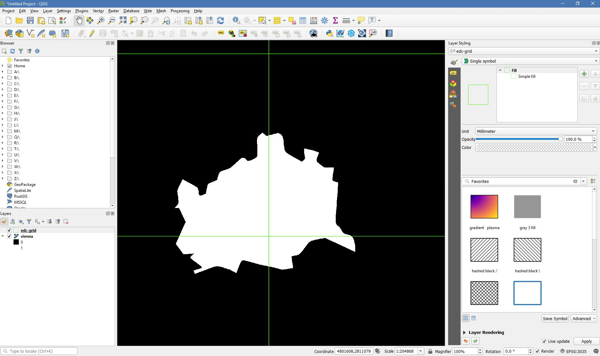
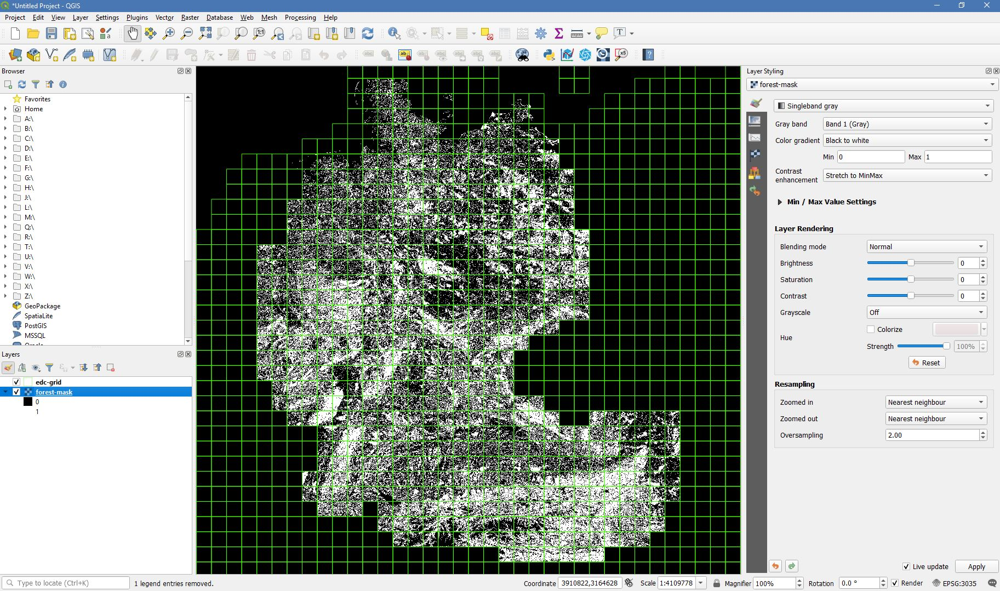

.. _tut-mask:

Processing Masks
================

**Speed up Higher Level Processing using masks**

This tutorial explains how to generate and use processing masks in the FORCE Higher Level Processing System.

.. info::

   *This tutorial uses FORCE v. 3.0*

.. important::

   EDIT: Part of this tutorial needs updating: Option 2.

What are processing masks?
--------------------------

In the FORCE Higher Level Processing System, processing masks can be used to restrict processing and analysis to certain pixels of interest.
The masks need to be in datacube format, i.e. they need to be raster images in the same grid as all the other data.
The masks can - but don’t need to - be in the same directory as the other data.
The masks should be binary images.
The pixels that have a mask value of 0 will be skipped.

What is the advantage of using processing masks?
------------------------------------------------

- Processing masks speed up processing.
  - For each processing unit (block within the tile), the analysis mask is read first.
    If no valid pixel is in there, all the other data are not input, and the block is skipped.
    As an example, when processing a country like Japan, and provide a land mask, you can speed up processing significantly as many blocks are skipped entirely.
  - On the pixel level, invalid pixels are skipped, too.
    This is especially beneficial for CPU-heavy tasks, e.g. machine learning predictions.
    As an example, when computing a tree species classification, you can speed up processing substantially if you provide a forest masks.
- Processing masks decrease data volume substantially.
  - In the processed products, the pixels of no interest have a nodata value.
    As all FORCE output is compressed (unless you choose to output in ENVI format; I don’t recommend to do this), the compression kicks in nicely if you have used processing masks.
    You can easily decrease data volume by several factors.
- Processing masks facilitate analyzing the processed data.
  - In the processed products, the pixels of no interest have a nodata value.
    Thus, you don’t need to sort the pixels on your own, e.g. computing confusion matrices and classification accuracy is more straightforward to implement.

Generate processing masks
-------------------------

Option 1: from shapefile to mask
""""""""""""""""""""""""""""""""

FORCE comes with a program to generate processing masks from a shapefile: 

.. code-block:: bash

   force-cube

   Usage: force-cube input-file output-dir resample resolution
          input-file: the file you want to cube
          output-dir: the directory you want to store the cubes;
                      datacube-definition.prj needs to exist in there
          resample:   resampling method
                      (1) any GDAL resampling method for raster data, e.g. cubic
                      (2) rasterize for vector data
          resolution: the resolution of the cubed data

``force-cube`` imports raster or vector data into the datacube format needed by FORCE.
The output directory needs to contain a copy of the datacube definition (see datacube tutorial).

The ``rasterize`` resampling option rasterizes polygon vector geometries.
It burns the occurence of the geometry into a raster image, i.e. it assigns the value *1* to all cells that are covered by a geometry, *0* if not.
The resulting masks are compressed GeoTiff images.
Do not worry about data volume when converting from vector to raster data, because the compression rate is extremely high.

In the following example, we generate a processing mask for the administrative area of Vienna, Austria.

.. code-block:: bash

   force-cube vienna.shp /data/Dagobah/edc/misc/mask rasterize 10

   0...10...20...30...40...50...60...70...80...90...100 - done.
   0...10...20...30...40...50...60...70...80...90...100 - done.
   0...10...20...30...40...50...60...70...80...90...100 - done.
   0...10...20...30...40...50...60...70...80...90...100 - done.

In this example, Vienna is covered by four tiles, a cubed GeoTiff was generated in each tile:

.. code-block:: bash

   ls /data/Dagobah/edc/misc/mask/X*/vienna.tif

   /data/Dagobah/edc/misc/mask/X0077_Y0058/vienna.tif
   /data/Dagobah/edc/misc/mask/X0077_Y0059/vienna.tif
   /data/Dagobah/edc/misc/mask/X0078_Y0058/vienna.tif
   /data/Dagobah/edc/misc/mask/X0078_Y0059/vienna.tif

For speedy visuailzation, build overviews and pyramids:

.. code-block:: bash

   force-mosaic /data/Dagobah/edc/misc/mask
   force-pyramid /data/Dagobah/edc/misc/mask/mosaic/vienna.vrt

   mosaicking vienna.tif
   4 chips found.

   computing pyramids for vienna.vrt
   0...10...20...30...40...50...60...70...80...90...100 - done.

   *Mask of Vienna generated from a shapefile. Overlayed with the processing grid in green*

Option 2: from raster to mask
"""""""""""""""""""""""""""""

As of now, FORCE does not come with a handy tool to generate masks from a raster image with continuous values (this is on my to-do list though).
However, you can follow this recipe to accomplish this.

.. important::

   EDIT: This tool already exists for a while, ``force-procmask``. This part of the tutorial needs updating.

In the example given below, our input image is a multiband continuous fields dataset, which gives the percentages of built-up land (urban), high vegetation (trees), and low vegetation (grass, agriculture).
Point 1) may be skipped if the data are already in datacube format, which is the case in this example.

1. If the data are not already in the datacube format, use ``force-cube`` to import the data (see the usage above).
   Use a raster resampling option to trigger the raster import, e.g. ``cubic`` (bc it's all about cubes, eh?).

2. Go to the parent directory of the cubed images (this is important for the next point), and generate a list with the filenames:

.. code-block:: bash

   cd /data/Jakku/germany-LC/pred
   ls X*/CONFIELD_MLP.tif > files.txt

In this example, the image covers 597 tiles:

.. code-block:: bash

   wc -l files.txt

   597 files.txt

.. code-block:: bash

   head files.txt

   X0052_Y0045/CONFIELD_MLP.tif
   X0052_Y0046/CONFIELD_MLP.tif
   X0052_Y0047/CONFIELD_MLP.tif
   X0052_Y0048/CONFIELD_MLP.tif
   X0052_Y0049/CONFIELD_MLP.tif
   X0052_Y0050/CONFIELD_MLP.tif
   X0052_Y0051/CONFIELD_MLP.tif
   X0052_Y0052/CONFIELD_MLP.tif
   X0052_Y0053/CONFIELD_MLP.tif
   X0053_Y0045/CONFIELD_MLP.tif

3. Generate the masks using a command similar to the example below.
   The 1st part of the command uses the list from point 2), and parallely calls the command in parentheses ``"..."``.
   The curly braces ``{//}`` replace the input image with its dirname, i.e. with the tile ID.
   A directory for the tile is generated if it is not already existing.
   The ``gdal_calc.py`` command handles simple raster algebra.
   The ``-A`` and ``--A_band`` options specify the image and band on which to operate the calculation specified by ``--calc`` (in our input image, the tree percentage is in band 2).
   A binary image (= mask) will be generated, wherein all pixels larger than 3000 (i.e. 30%) are set to *1*.
   The ``--creation-option`` parameters are options that specify compression etc.
   The blocksize parameters should best reflect the blocksize used for the datacube (see datacube tutorial).
   *As said before, a tool for this will likely be implemented in a not-so-far future version of FORCE.*

.. code-block:: bash

   parallel -a files.txt "mkdir -p /data/Dagobah/edc/misc/mask/{//}; gdal_calc.py -A {} --A_band=2 --outfile=/data/Dagobah/edc/misc/mask/{//}/forest-mask.tif --calc='(A>3000)' --NoDataValue=255 --type=Byte --format=GTiff --creation-option='COMPRESS=LZW' --creation-option='PREDICTOR=2' --creation-option='NUM_THREADS=ALL_CPUS' --creation-option='BIGTIFF=YES' --creation-option='BLOCKXSIZE=3000' --creation-option='BLOCKYSIZE=300'"

   0 .. 10 .. 20 .. 30 .. 40 .. 50 .. 60 .. 70 .. 80 .. 90 .. 100 - Done
   0 .. 10 .. 20 .. 30 .. 40 .. 50 .. 60 .. 70 .. 80 .. 90 .. 100 - Done
   0 .. 10 .. 20 .. 30 .. 40 .. 50 .. 60 .. 70 .. 80 .. 90 .. 100 - Done
   0 .. 10 .. 20 .. 30 .. 40 .. 50 .. 60 .. 70 .. 80 .. 90 .. 100 - Done
   0 .. 10 .. 20 .. 30 .. 40 .. 50 .. 60 .. 70 .. 80 .. 90 .. 100 - Done
   0 .. 10 .. 20 .. 30 .. 40 .. 50 .. 60 .. 70 .. 80 .. 90 .. 100 - Done
   0 .. 10 .. 20 .. 30 .. 40 .. 50 .. 60 .. 70 .. 80 .. 90 .. 100 - Done
   0 .. 10 .. 20 .. 30 .. 40 .. 50 .. 60 .. 70 .. 80 .. 90 .. 100 - Done
   0 .. 10 .. 20 .. 30 .. 40 .. 50 .. 60 .. 70 .. 80 .. 90 .. 100 - Done
   0 .. 10 .. 20 .. 30 .. 40 .. 50 .. 60 .. 70 .. 80 .. 90 .. 100 - Done
   0 .. 10 .. 20 .. 30 .. 40 .. 50 .. 60 .. 70 .. 80 .. 90 .. 100 - Done
   0 .. 10 .. 20 .. 30 .. 40 .. 50 .. 60 .. 70 .. 80 .. 90 .. 100 - Done
   0 .. 10 .. 20 .. 30 .. 40 .. 50 .. 60 .. 70 .. 80 .. 90 .. 100 - Done
   0 .. 10 .. 20 .. 30 .. 40 .. 50 .. 60 .. 70 .. 80 .. 90 .. 100 - Done
   0 .. 10 .. 20 .. 30 .. 40 .. 50 .. 60 .. 70 .. 80 .. 90 .. 100 - Done
   ... 

We now have one cubed mask for each input image in the mask directory:

.. code-block:: bash

   ls /data/Dagobah/edc/misc/mask/X*/forest-mask.tif | wc -l

   597

For speedy visuailzation, build overviews and pyramids:

.. code-block:: bash

   force-mosaic /data/Dagobah/edc/misc/mask
   force-pyramid /data/Dagobah/edc/misc/mask/mosaic/forest-mask.vrt

   mosaicking forest-mask.tif
   597 chips found.
   
   computing pyramids for forest-mask.vrt
   0...10...20...30...40...50...60...70...80...90...100 - done.

   *Forest mask generated from continuous raster input. Overlayed with the processing grid in green*

Use processing masks
--------------------

Processing masks can easily be used in ``force-higher-level`` by setting the ``DIR_MASK`` and ``BASE_MASK`` parameters in the parameter file.
They are the parent directory of the cubed masks, and the basename of the masks, respectively.
To use the Vienna mask from above:

.. code-block:: bash

   DIR_MASK = /data/Dagobah/edc/misc/mask
   BASE_MASK = vienna.tif
