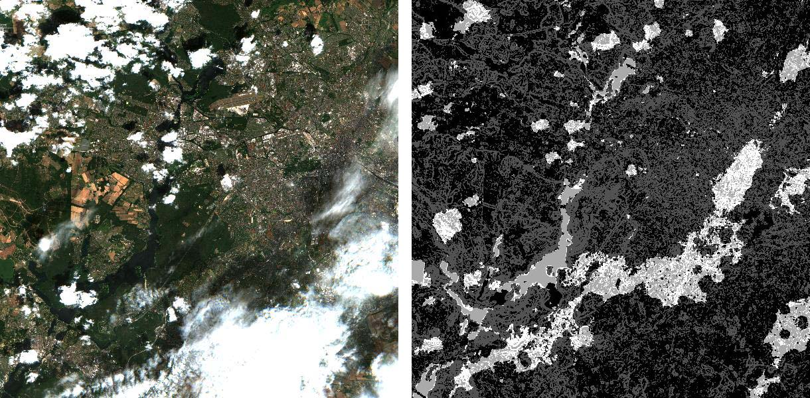
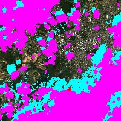
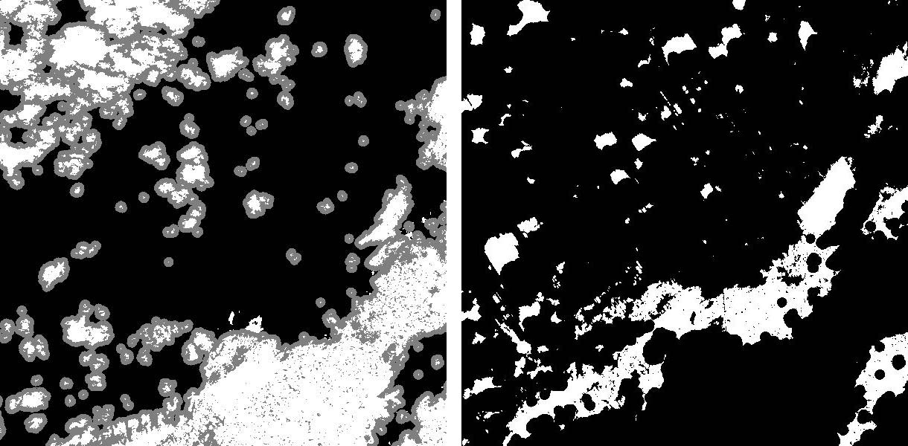
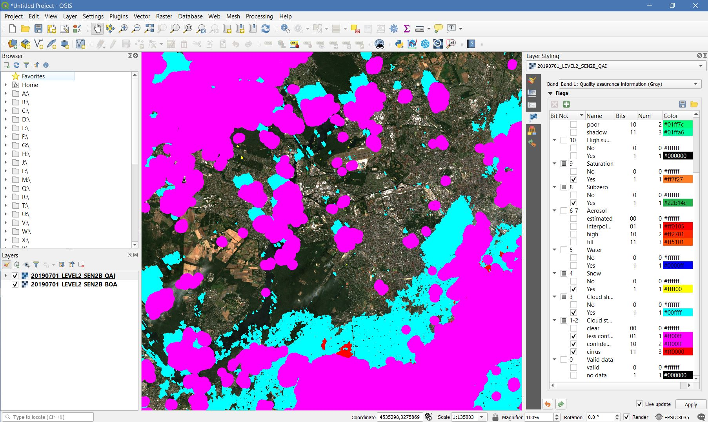

.. _tut-qai:

Quality Assurance Information!
==============================

**How to deal with the Level 2 quality masks**

This tutorial explains what quality bits are, how quality bits are implemented in FORCE, how to visualize them, and how to deal with them in Higher Level Processing.

.. admonition:: Info

   *This tutorial uses FORCE v. 3.0*

What are quality bits?
----------------------

FORCE L2PS provides a description of the quality of each pixel in the form of quality bits.
This bit-packed information allows users to apply per pixel filters to all Level 2 products.
The bits represent combinations of surface, atmospheric, and processing-related conditions that can affect the overall usefulness of a given pixel for a particular application.
The success of any follow-up analysis depends on the rigorous usage of these information!
A good explanation of quality bits is given by the [USGS](https://www.usgs.gov/land-resources/nli/landsat/landsat-collection-1-level-1-quality-assessment-band?qt-science_support_page_related_con=0#qt-science_support_page_related_con): 

.. admonition:: USGS description

   The bit-packed information in the QA bands is a translation of binary strings.
   For example, the integer value “1” translates to the binary value “0001”. The binary value “0001” has 4 bits, written right to left as bits 0 (“1”), 1 (“0”), 2 (“0”), and 3 (“0”).
   Each of the bits 0-3 represents a condition that can affect the calculation of a physical value.
   [...] 
   If the condition is true, the bit is set to “1,” or “0” if false.

Sounds complicated… Why not use a scene classification?
-------------------------------------------------------

Although interpretation of quality bits is not immediate to humans, they do possess quite some advantages.
As opposed to a scene classification, quality bits allow the flagging of multiple conditions, e.g. ice clouds, cloud shadows on top of clouds or snow, high aerosol load and cloud, etc.
If a 16bit Integer is used for storing the quality bits, up to 16 different conditions can co-exist in any possible combination.
In a scene classification, only one condition can be stored, and the algorithm developer needs to make assumptions on the priority of the conditions; however these may differ from application to application.
Quality bits allow to store all these information in a single  image.
From a technical perspective, quality bits save disc space, and reduce the I/O load for follow-up analyses.

Quality bits in FORCE
---------------------

In FORCE, the quality bits are found in the Quality Assurance Information *QAI* product, which is an integral part of each Level 2 dataset, and is alway present next to the reflectance images (``BOA`` or ``TOA``).

When generating Best Available Pixel *BAP* composites (Level 3), the bit flags of the selected observation are stored in the first band of the composite information (``INF``) product.
Currently FORCE implements a 16bit QAI layer with 12 quality bits, some of them as double-bit words:

+---------+----------------------+-----------+---------+--------------------------------------------------------------------+
+ Bit No. + Parameter name       + Bit comb. + Integer + State                                                              +
+=========+======================+===========+=========+====================================================================+
+ 0       + Valid data           + 0         + 0       + valid                                                              +
+         +                      +-----------+---------+--------------------------------------------------------------------+
+         +                      + 1         + 1       + no data                                                            +
+---------+----------------------+-----------+---------+--------------------------------------------------------------------+
+ 1–2     + Cloud state          + 00        + 0       + clear                                                              +
+         +                      +-----------+---------+--------------------------------------------------------------------+
+         +                      + 01        + 1       + less confident cloud (i.e., buffered cloud 300 m)                  +
+         +                      +-----------+---------+--------------------------------------------------------------------+
+         +                      + 10        + 2       + confident, opaque cloud                                            +
+         +                      +-----------+---------+--------------------------------------------------------------------+
+         +                      + 11        + 3       + cirrus                                                             +
+---------+----------------------+-----------+---------+--------------------------------------------------------------------+
+ 3       + Cloud shadow flag    + 0         + 0       + no                                                                 +
+         +                      +-----------+---------+--------------------------------------------------------------------+
+         +                      + 1         + 1       + yes                                                                +
+---------+----------------------+-----------+---------+--------------------------------------------------------------------+
+ 4       + Snow flag            + 0         + 0       + no                                                                 +
+         +                      +-----------+---------+--------------------------------------------------------------------+
+         +                      + 1         + 1       + yes                                                                +
+---------+----------------------+-----------+---------+--------------------------------------------------------------------+
+ 5       + Water flag           + 0         + 0       + no                                                                 +
+         +                      +-----------+---------+--------------------------------------------------------------------+
+         +                      + 1         + 1       + yes                                                                +
+---------+----------------------+-----------+---------+--------------------------------------------------------------------+
+ 6–7     + Aerosol state        + 00        + 0       + estimated (best quality)                                           +
+         +                      +-----------+---------+--------------------------------------------------------------------+
+         +                      + 01        + 1       + interpolated (mid quality)                                         +
+         +                      +-----------+---------+--------------------------------------------------------------------+
+         +                      + 10        + 2       + high (aerosol optical depth > 0.6, use with caution)               +
+         +                      +-----------+---------+--------------------------------------------------------------------+
+         +                      + 11        + 3       + fill (global fallback, low quality)                                +
+---------+----------------------+-----------+---------+--------------------------------------------------------------------+
+ 8       + Subzero flag         + 0         + 0       + no                                                                 +
+         +                      +-----------+---------+--------------------------------------------------------------------+
+         +                      + 1         + 1       + yes (use with caution)                                             +
+---------+----------------------+-----------+---------+--------------------------------------------------------------------+
+ 9       + Saturation flag      + 0         + 0       + no                                                                 +
+         +                      +-----------+---------+--------------------------------------------------------------------+
+         +                      + 1         + 1       + yes (use with caution)                                             +
+---------+----------------------+-----------+---------+--------------------------------------------------------------------+
+ 10      + High sun zenith flag + 0         + 0       + no                                                                 +
+         +                      +-----------+---------+--------------------------------------------------------------------+
+         +                      + 1         + 1       + yes (sun elevation < 15°, use with caution)                        +
+---------+----------------------+-----------+---------+--------------------------------------------------------------------+
+ 11–12   + Illumination state   + 00        + 0       + good (incidence angle < 55°, best quality for top. correction)     +
+         +                      +-----------+---------+--------------------------------------------------------------------+
+         +                      + 01        + 1       + medium (incidence angle 55°–80°, good quality for top. correction) +
+         +                      +-----------+---------+--------------------------------------------------------------------+
+         +                      + 10        + 2       + poor (incidence angle > 80°, low quality for top. correction)      +
+         +                      +-----------+---------+--------------------------------------------------------------------+
+         +                      + 11        + 3       + shadow (incidence angle > 90°, no top. correction applied)         +
+---------+----------------------+-----------+---------+--------------------------------------------------------------------+
+ 13      + Slope flag           + 0         + 0       + no (cosine correction applied)                                     +
+         +                      +-----------+---------+--------------------------------------------------------------------+
+         +                      + 1         + 1       + yes (enhanced C-correction applied)                                +
+---------+----------------------+-----------+---------+--------------------------------------------------------------------+
+ 14      + Water vapor flag     + 0         + 0       + measured (best quality, only Sentinel-2)                           +
+         +                      +-----------+---------+--------------------------------------------------------------------+
+         +                      + 1         + 1       + fill (scene average, only Sentinel-2)                              +
+---------+----------------------+-----------+---------+--------------------------------------------------------------------+
+ 15      + Empty                + 0         + 0       + TBD                                                                +
+---------+----------------------+-----------+---------+--------------------------------------------------------------------+

- Nodata values are values where nothing was observed, where auxiliary data was not given (e.g. nodata in DEM), or where data is substantially corrupt (e.g. impulse noise, or when the surface reflectance estimate is > 2.0 or < -1.0)
- Clouds are given in three categories, i.e. opaque clouds (confident cloud), buffered clouds (300m; less confident cloud), and cirrus clouds.
- Cloud shadows are detected on the basis of the cloud layer.
  If a cloud is missed, the cloud shadow is missed, too.
  If a false positive cloud is detected, false positive cloud shadows follow.
- Aerosol Optical Depth is estimated for fairly coarse grid cells.
  If there is no valid AOD estimation in any cell, values are interpolated.
  If there is no valid AOD estimation for the complete image, a fill value is assigned (AOD is guessed).
  If AOD @550nm is higher than 0.6, it is flagged as high aerosol; this is not necessarily critical, but should be used with caution (see subzero flag).
- If the surface reflectance estimate in any band is < 0, the subzero flag is set.
  This can point to overestimation of AOD.
- If DNs were saturated, or if the surface reflectance estimate in any band is > 1, the saturation flag is set.
- If sun elevation is smaller than 15°, the high sun zenith flag is set.
  Use this data with caution, radiative transfer computations might be out of specification.
- The illumination state is related to the quality of the topographic correction.
  If the incidence angle is smaller than 55°, quality is best.
  If the incidence angle is larger than 80°, the quality of the topographic correction is low, and data artefacts are possible.
  If the area is not illuminated at all, no topographic correction is done (values are the same as without topographic correction).
- The slope flag indicates whether a simple cosine correction (slope ≤ 2°) was used for topographic correction, or if the enhanced C-correction was used (slope > 2°).
- The water vapor flag indicates whether water vapor was estimated, or if the scene average was used to fill.
  Water vapor is not estimated over water and cloud shadow pixels.
  This flag only applies to Sentinel-2 images.

Visualization
-------------

Visualizing the raw QAI image is pretty meaningless.
Don’t be surprised that the integers do not resemble any of the patterns you would expect (e.g. cloud distribution).

   *Sentinel-2B image over Berlin, 01.07.2019; left: RGB image; right: quality bits*

Quicklooks
""""""""""

Since v. 3.0, FORCE L2PS can output quicklook images for each Level 2 dataset (``OVV`` = overview product).
These thumbnails serve as first impression of image quality.
Some of the quality conditions are superimposed on the RGB images.
Opaque clouds are shown in pink, cirrus clouds in red, cloud shadows in cyan, snow in yellow, saturated pixels in orange, and sub-zero reflectance values in a greenish tone.
The overview for the QAI image from above is shown here: 

   *Quicklook image generated by FORCE L2PS; pink: opaque clouds; cyan: cloud shadows*

Inflate quality bits
""""""""""""""""""""

A full deciphering of all quality bits to individual quality masks can be generated with FORCE:

.. code-block:: bash

   force-qai-inflate

   Usage: force-qai-inflate QAI dir format

.. code-block:: bash

   force-qai-inflate /data/level2/X0069_Y0043/20190701_LEVEL2_SEN2B_QAI.tif ~/temp GTiff

This program generates a 12-band image, where each of the flags (see table above) is written to a separate band.
However, force-qai-inflate was not designed to generate inflated masks for each and every Level 2 product in a routine manner due to the computational and disc-space related overhead.
We strongly recommend to make use of  the bits directly (see remaining part of the tutorial).

   *Quality bits; left: cloud state; right: cloud shadow flag*

Quality bit rendering in QGIS
"""""""""""""""""""""""""""""

There is a nice QGIS plugin from my colleague [Benjamin Jakimow](https://www.geographie.hu-berlin.de/en/professorships/eol/people/labmembers/benjamin_jakimow), which can visualize quality bits in QGIS *on the fly*.
Quality bit inflating is not necessary anymore!
The [Bit Flag Renderer plugin](http://plugins.qgis.org/plugins/BitFlagRenderer/) provides a new renderer for QGIS, with which any quality bit product can flexibly be visualized.
The plugin includes predefined bit visualization rules for the FORCE QAI bits.
The default visualization matches the information and colors from the quicklook images described above):

   *Bit Flag Renderer in QGIS displaying a quality bit layer on-the-fly with the pre-defined FORCE settings*

Quality masking in Higher Level Processing
------------------------------------------

For follow-up processing and analyses, the usage of the QAI information is key, e.g. to exclude clouds.
In all FORCE Higher Level routines, quality masking is done on the fly, and the user has full control about what condition(s) to filter.
The parameter ``SCREEN_QAI`` provides a simple mechanism to mask out any combination of conditions using any of the following keywords: *NODATA, CLOUD_OPAQUE, CLOUD_BUFFER, CLOUD_CIRRUS, CLOUD_SHADOW, SNOW, WATER, AOD_FILL, AOD_HIGH, AOD_INT, SUBZERO, SATURATION, SUN_LOW, ILLUMIN_NONE, ILLUMIN_POOR, ILLUMIN_LOW, SLOPED, WVP_NONE*.
The default parametrization is to filter out nodata, clouds, cloud shadows, snow, saturated or subzero reflectance:

``SCREEN_QAI = NODATA CLOUD_OPAQUE CLOUD_BUFFER CLOUD_CIRRUS CLOUD_SHADOW SNOW SUBZERO SATURATION``

Following images illustrate the effect of quality filtering on an average reflectance image generated by using all available observations over a 3 month period (using Spectral Temporal Metrics in the **Time Series Analysis module**).
The left image was produced by filtering nodata values only, the right image was produced using the default quality screening.

.. figure:: img/tutorial-qai-avg.jpg

   `Average reflectance over three month; left: **not using** quality bits; right **with** quality bits`
