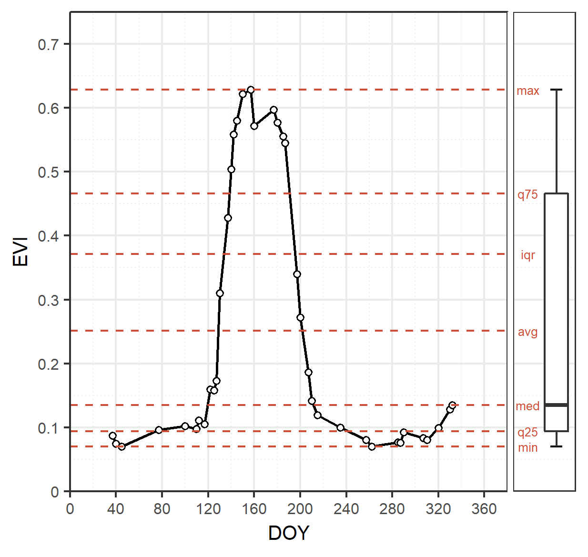
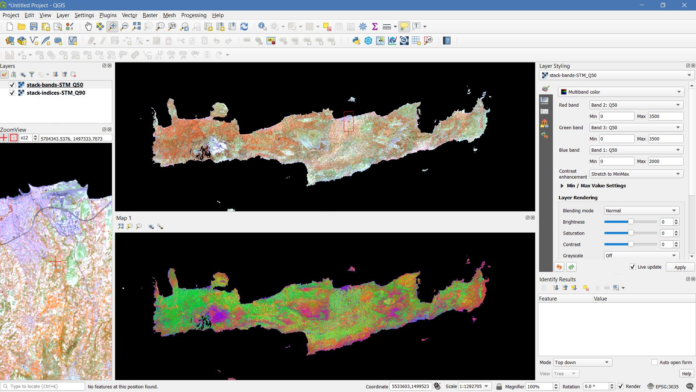

.. _tut-stm:

.. sidebar:: About

   .. image:: profile/dfrantz.jpg

   This tutorial was written by `David Frantz <https://davidfrantz.github.io>`_, main developer of FORCE. 
   Views are his own.

   **EO**, **ARD**, **FORCE**, **Data Science**, **Open Science**

Spectral Temporal Metrics
=========================

.. sidebar:: About2

   .. image:: profile/dfrantz.jpg

   This tutorial was written by `David Frantz <https://davidfrantz.github.io>`_, main developer of FORCE. 
   Views are his own.

   **EO**, **ARD**, **FORCE**, **Data Science**, **Open Science**

**How to aggregate time series**

This tutorial explains what Spectral Temporal Metrics are, and how to generate them using the Time Series Analysis (TSA) submodule of the FORCE Higher Level Processing system (HLPS).

.. admonition:: Info

   *This tutorial uses FORCE v. 3.5*

What are Spectral Temporal Metrics?
-----------------------------------

There are also other names around, which describe the same concept.

However, regardless of how you name it, Spectral Temporal Metrics (or simply STMs) are band-wise descriptive statistics, which summarize reflectance (or an index derived thereof) within a defined time period.
This can be the annual mean, standard deviation or median.
Before calculating the statistics, the data is quality filtered, e.g. clouds are removed.

   *STM concept &copy; Stefan Ernst*

It is important to note that STMs are statistical aggregations - and not composites as in *“we select the full spectrum for the optimal observation”*.

Thus, some care should be taken when dealing with these kinds of metrics: an STM spectrum cannot be interpreted in the classic remote-sensing-textbook sense.

As an example, computing the NDVI from the 25% quantile of red and near infrared reflectance may yield unexpected results as they are not originating from the same acquisition date… 
Funny things may happen when you do.

To emphasize this distinction, this is why we generally do not term them composites - but STMs (*this is debatable, I know*).

Anyway, STMs are powerful, yet simple (*simple is good!*) metrics that are often used as features for Machine Learning algorithms, both for classification and regression problems.

Due to their robustness (as compared to more advanced metrics) and their spatial completeness, they simplify the extrapolation/mapping of a response variable (qualitative or quantitative, e.g. classification labels or forest biomass) across very large areas.

Parameterfile
-------------

STMs are available within the [Time Series Analysis (TSA)](https://force-eo.readthedocs.io/en/latest/components/higher-level/tsa/index.html) submodule of the [FORCE Higher Level Processing system (HLPS)](https://force-eo.readthedocs.io/en/latest/components/higher-level/index.html).

You can use ``force-parameter`` to generate an empty parameterfile.

To familiarize yourself with the TSA submodule, I suggest taking a detour to the [interpolation tutorial]() before advancing.

Temporal extent
"""""""""""""""

The temporal extent defines the time period, which is used for aggregating the Level 2 observations into STMs.

Broader windows generally result in cleaner metrics, although at the expense of seasonal information.

It is hard to give a suggestion here, as this is a complex decision, which depends on sensors used, data availability, environmental conditions, cloud occurence, phenology, what you want to do with the data etc.

To demonstrate, we are generating annual STMs for entire 2018:

``TIME_RANGE = 2018-01-01 2018-12-31``

Sensors
"""""""

FORCE HLPS allows you to easily combine data from different sensors - provided that we only use mutually available bands.

For this tutorial, we are using data from Landsat 8, Sentinel-2A and Sentinel-2B.
We are setting the output resolution to 30m.
For Landsat, this is the native resolution.

For the 10m Sentinel-2, we degrade the resolution using an approximated Point Spread Function (Gaussian lowpass with FWHM = analysis resolution), which approximates the acquisition of data at lower spatial resolution.

.. code-block:: bash

   SENSORS = LND08 SEN2A SEN2B
   RESOLUTION = 30
   REDUCE_PSF = TRUE

Bands / Indices
"""""""""""""""

We will produce STMs for some spectral bands, as well as some indices:

``INDEX = RED NIR SWIR1 NDVI NDBI MNDWI``

Outlier detection
"""""""""""""""""

If you see cloud remnants in your STMs, you might want to experiment with the outlier detection option.

For now, lets disable it with:

.. code-block:: bash

   ABOVE_NOISE = 0
   BELOW_NOISE = 0

Interpolation
"""""""""""""

Before temporally aggregating the L2 observations, we can interpolate the time series.
Try this out! But for now, let’s go without:

``INTERPOLATE = NONE``

STMs
""""

Now, we define the statistics for producing the STMs.

You can specify a list with all statistics at once.

Currently available are

+-----+------------------------------------------------+
+ ID  + Description                                    +
+=====+================================================+
+ AVG + Average                                        +
+-----+------------------------------------------------+
+ STD + Standard deviation                             +
+-----+------------------------------------------------+
+ MIN + Minimum                                        +
+-----+------------------------------------------------+
+ MAX + Maximum                                        +
+-----+------------------------------------------------+
+ RNG + Range                                          +
+-----+------------------------------------------------+
+ QXX + Quantiles, replace XX with any 2-digit number, +
+     + e.g. Q50 for the median.                       +
+     + Multiple quantiles can be given                +
+-----+------------------------------------------------+
+ IQR + Inter-quartile range                           +
+-----+------------------------------------------------+
+ SKW + Skewness                                       +
+-----+------------------------------------------------+
+ KRT + Kurtosis                                       +
+-----+------------------------------------------------+
+ NUM + Number of observations                         +
+     +(after outlier detection and interpolation)     +
+-----+------------------------------------------------+

Let’s go with these metrics for now:

.. code-block:: bash

   STM = Q10 Q25 Q50 Q75 Q90 AVG STD
   OUTPUT_STM = TRUE

Explode Output?
"""""""""""""""

By default, HLPS will produce multi-band files for each spectral band/index, i.e. you will get one file for each index, which will have as many bands as there are STMs.

If you rather prefer single-band images, i.e. one file for each index and each STM, use 

OUTPUT_EXPLODE = TRUE

Other parameters
""""""""""""""""

The other parameters are not relevant for generating STMs.
However, please note that you can generate STMs AND use the other options at the same time, e.g. Trend Analysis, Land Surface Phenology, etc.
This saves time as data is only read once.

Processing
----------

Processing is straightforward.
Simply use:

.. code-block:: bash

   force-higher-level /data/europe/stm/stm.prm

   number of processing units: 280
    (active tiles: 28, chunks per tile: 10)
   ________________________________________
   Progress:                        100.00%
   Time for I/C/O:           087%/008%/004%
   ETA:             00y 00m 00d 00h 00m 00s
   
   ________________________________________
   Real time:       00y 00m 00d 00h 19m 05s
   Virtual time:    00y 00m 00d 00h 21m 35s
   Saved time:      00y 00m 00d 00h 02m 30s
   
   ________________________________________
   Virtual I-time:  00y 00m 00d 00h 18m 53s
   Virtual C-time:  00y 00m 00d 00h 01m 47s
   Virtual O-time:  00y 00m 00d 00h 00m 55s
   
   ________________________________________
   I-bound time:    00y 00m 00d 00h 17m 10s
   C-bound time:    00y 00m 00d 00h 00m 07s
   O-bound time:    00y 00m 00d 00h 00m 03s

After this, we generate a mosaic.

With ``OUTPUT_EXPLODE = TRUE``, you get one image for each requested index and statistical aggregation, i.e. 42 images in our case:

.. code-block:: bash

  force-mosaic /data/europe/stm

   mosaicking 42 products:
   1 2018-2018_001-365_HL_TSA_LNDLG_MNW_STM_AVG.tif
   2 2018-2018_001-365_HL_TSA_LNDLG_MNW_STM_Q10.tif
   3 2018-2018_001-365_HL_TSA_LNDLG_MNW_STM_Q25.tif
   4 2018-2018_001-365_HL_TSA_LNDLG_MNW_STM_Q50.tif
   ...
   40 2018-2018_001-365_HL_TSA_LNDLG_SW1_STM_Q75.tif
   41 2018-2018_001-365_HL_TSA_LNDLG_SW1_STM_Q90.tif
   42 2018-2018_001-365_HL_TSA_LNDLG_SW1_STM_STD.tif
   
   mosaicking 2018-2018_001-365_HL_TSA_LNDLG_MNW_STM_AVG.tif
   26 chips found.
   
   mosaicking 2018-2018_001-365_HL_TSA_LNDLG_MNW_STM_Q25.tif
   26 chips found.

   ... 

   mosaicking 2018-2018_001-365_HL_TSA_LNDLG_SW1_STM_AVG.tif
   26 chips found.

Visualization
-------------

Visualizing an RGB color composite in QGIS, wherein the 3 bands come from different physical files, does not work out of the box.. Thus, we need to put the required bands into one file.
Luckily, a virtual data format suffices.
This example here stacks the 50% quantiles of the reflectance bands, as well as the 90% quantiles of the indices.

For fast visualization, we are computing pyramids.

.. code-block:: bash

   cd /data/europe/stm/mosaic
   force-stack *RED_STM_Q50.vrt *NIR_STM_Q50.vrt *SW1_STM_Q50.vrt stack-bands-STM_Q50.vrt
   force-stack *NDB_STM_Q90.vrt *NDV_STM_Q90.vrt *MNW_STM_Q90.vrt stack-indices-STM_Q90.vrt
   ls *.vrt | parallel force-pyramid {}

   file 1:
     /data/europe/stm/mosaic
     2018-2018_001-365_HL_TSA_LNDLG_RED_STM_Q50.vrt
     9000 4000 1
   file 2:
     /data/europe/stm/mosaic
     2018-2018_001-365_HL_TSA_LNDLG_NIR_STM_Q50.vrt
     9000 4000 1
   file 3:
     /data/europe/stm/mosaic
     2018-2018_001-365_HL_TSA_LNDLG_SW1_STM_Q50.vrt
     9000 4000 1
   
   Same number of bands detected. Stacking by band.
   
   Band 0001: 2018-2018_001-365_HL_TSA_LNDLG_RED_STM_Q50.vrt band 1
   Band 0002: 2018-2018_001-365_HL_TSA_LNDLG_NIR_STM_Q50.vrt band 1
   Band 0003: 2018-2018_001-365_HL_TSA_LNDLG_SW1_STM_Q50.vrt band 1
   
   file 1:
     /data/europe/stm/mosaic
     2018-2018_001-365_HL_TSA_LNDLG_NDB_STM_Q90.vrt
     9000 4000 1
   file 2:
     /data/europe/stm/mosaic
     2018-2018_001-365_HL_TSA_LNDLG_NDV_STM_Q90.vrt
     9000 4000 1
   file 3:
     /data/europe/stm/mosaic
     2018-2018_001-365_HL_TSA_LNDLG_MNW_STM_Q90.vrt
     9000 4000 1
   
   Same number of bands detected. Stacking by band.
   
   Band 0001: 2018-2018_001-365_HL_TSA_LNDLG_NDB_STM_Q90.vrt band 1
   Band 0002: 2018-2018_001-365_HL_TSA_LNDLG_NDV_STM_Q90.vrt band 1
   Band 0003: 2018-2018_001-365_HL_TSA_LNDLG_MNW_STM_Q90.vrt band 1
   
   computing pyramids for 2018-2018_001-365_HL_TSA_LNDLG_MNW_STM_Q10.vrt
   0...10...20...30...40...50...60...70...80...90...100 - done.
   computing pyramids for 2018-2018_001-365_HL_TSA_LNDLG_MNW_STM_Q25.vrt
   0...10...20...30...40...50...60...70...80...90...100 - done.
   ...
   computing pyramids for stack-bands-STM_Q50.vrt
   0...10...20...30...40...50...60...70...80...90...100 - done.
   computing pyramids for stack-indices-STM_Q90.vrt
   0...10...20...30...40...50...60...70...80...90...100 - done.

   *RGB composite of STMs - Top: Q50 reflectance - Bottom: Q90 Indices*

