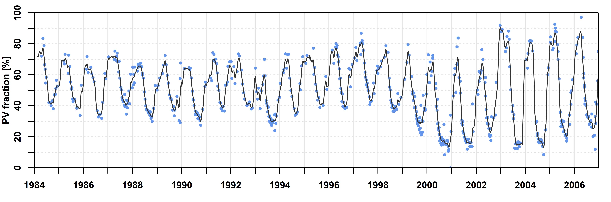
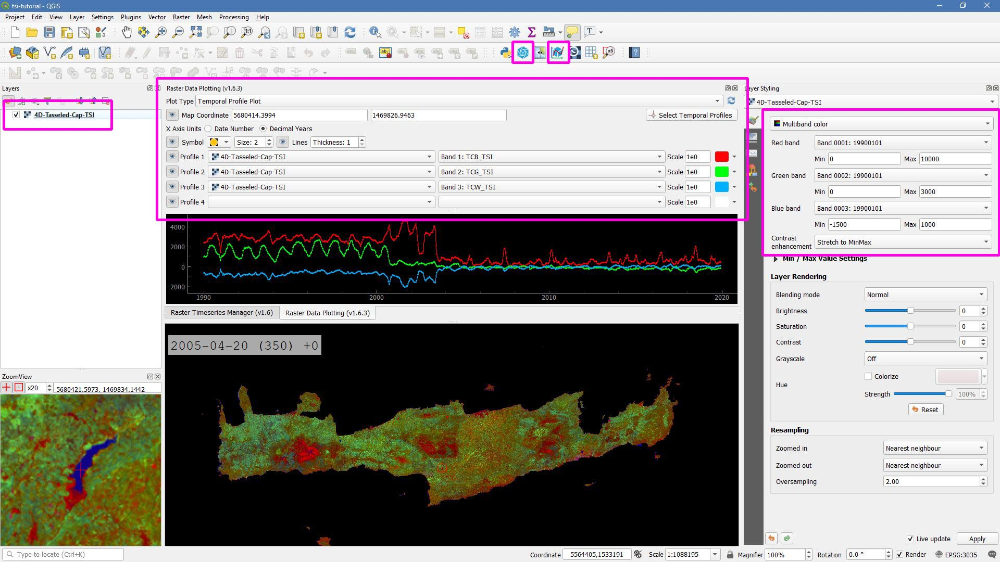

.. _tut-tsi:

Time Series Interpolation
=========================

.. |copy|   unicode:: U+000A9 .. COPYRIGHT SIGN

**How to interpolate and animate time series**

This tutorial introduces the Time Series Analysis (TSA) submodule of the FORCE Higher Level Processing system (HLPS), shows how to interpolate time series, and how to visualize and animate them via QGIS plugins.

.. admonition:: Info

   *This tutorial uses FORCE v. 3.5*

Why interpolation?
------------------

Despite regular observations, EO time series are generally not equidistant.
Nominal equidistance is only given for areas that are not covered by orbital overlaps (16 days revisit at nadir for a single Landsat).
For areas in lateral overlaps, we have alternating revisits of 1 and 7 days.
If we are getting closer to the poles, we even get triple, quadruple etc. overlaps, which complicates this alternating pattern.
The same applies if we consider multiple sensors, e.g. two Landsat and two Sentinel-2 satellites.
And of course, nominal revisit != actual revisit.
We cannot see through clouds (unless we are talking radar).
Probably, you want to remove snow observations.
There might have been some sensor or ground segment outages, or the data couldn't have been processed to our quality requirements (e.g. tier 2 data).
The sensor might not have looked on Earth as the satellite took a detour to avoid space debris etc. etc.. 

Interpolation might simply be used to close these gaps.
It smoothes the time series, and thus effectively reduces noise.
Equidistance is established, which might be needed for following processing steps.

Time Series interpolation is a basic option within the :ref:`tsa` submodule of the FORCE :ref:`hlps` Processing system (HLPS), and may be performed before using more advanced time series analysis methods:

.. figure:: ../components/higher-level/tsa/tsa-workflow.jpg

   *Time Series Analysis Workflow*

RBF interpolation
-----------------

In FORCE, a couple of interpolation methods are implemented.

Most often, we use ensembles of Radial Basis Function (RBF) convolution filters (see `this paper <https://www.sciencedirect.com/science/article/pii/S0303243416301003>`_).
As this is a convolution filter, no fitting is involved (as e.g. compared to splines or Savitzky-Golay filters), thus the method is really fast, while keeping a good balance between retaining detail and smoothing.

The method is basically a moving average filter on steroids.
A kernel is moved over the time series, and the observations are weighted according to a Gaussian distribution (Gaussian lowpass).

This means that an observation in the middle of the kernel gets a higher weight.

Now, data density is usually variable, which means that we have seasons with higher data availability (e.g. in the summer) - and seasons with poor data availability.

For good data situations, we would want to have a narrow Gaussian to more closely follow the actual time series.

For bad data situations, however, a narrow kernel would result in many nodata values and wouldn't smooth the time series appropriately.

Therefore, we use multiple kernels of different widths.

The estimates from those kernels are eventually aggregated using a weighted average, wherein the weights correspond to the data availability within each kernel.
This gives preference to the kernel with better data coverage.

This tutorial will show you how to generate an RBF-interpolated time series, and how to dynamically look at the data.
I will demonstrate this for the island of Crete (greece) in the Mediterranean Sea.
An interpolated time series looks like this:

   *Interpolated time series using RBF ensembles*

Parameterfile
-------------

We start by generating an empty TSA parameterfile, and rename the file.

.. code-block:: bash

   mkdir /data/europe/interpolation
   force-parameter /data/europe/interpolation TSA 1
   cd /data/europe/interpolation
   mv TSA-skeleton.prm tsi.prm

   TSA
   An empty parameter file skeleton was written to
     /data/europe/interpolation/TSA-skeleton.prm
   Note that all parameters need to be given, even though some may not be used
   with your specific parameterization.
   You should rename the file, e.g. my-first-TSA.prm.
   Parameterize according to your needs and run with
   force-higher-level /data/europe/interpolation/my-first-TSA.prm

If you prefer a more compact parameterfile without all the comments, use ``0`` instead of ``1`` as the last parameter.
The full set of parameters is also documented here: :ref:`tsa-param`.

Input / Output directories
""""""""""""""""""""""""""

For this tutorial, we assume that we already have an existing Level 2 ARD datapool, which contains preprocessed data for multiple years (see :ref:`tut-ard` tutorial).
The parent directory of this datapool goes into the ``DIR_LOWER`` parameter.

The ``DIR_HIGHER`` parameter names the output directory, where the interpolated time series will be generated (although technically possible, I suggest to use a different file path).
Example:

.. code-block:: bash

   DIR_LOWER = /data/europe/level2
   DIR_HIGHER = /data/europe/interpolation

Analysis mask
"""""""""""""

As we are only interested in the land surface - and there is a lot of water around Crete - we use a processing mask.
Have a look at the :ref:`tut-mask` tutorial for further details.

.. code-block:: bash

   mkdir -p /data/europe/masks
   cp /data/europe/level2/datacube-definition.prj -t /data/europe/masks
   force-cube /data/gis/admin/crete.gpkg /data/europe/masks rasterize 30

   0...10...20...30...40...50...60...70...80...90...100 - done.
   0...10...20...30...40...50...60...70...80...90...100 - done.
   0...10...20...30...40...50...60...70...80...90...100 - done.
   ... 

In the parameterfile, use the masks like this:

.. code-block:: bash

   DIR_MASK = /data/europe/masks
   BASE_MASK = crete.tif

Output options
""""""""""""""

For interoperability with the QGIS plugins, we will generate one output image (for each index) in GeoTiff format, which will have the interpolated dates as bands:

.. code-block:: bash

   OUTPUT_FORMAT = GTiff
   OUTPUT_EXPLODE = FALSE

All other parameters are not relevant for now.
However, please note that you can generate a lot of time series based outputs at the same time, e.g. Trend Analysis, Land Surface Phenology, etc.
This saves time as data is only read once.

Spatial extent
""""""""""""""

FORCE HLPS requires a square processing extent, which can be set using ``X_TILE_RANGE`` and ``Y_TILE_RANGE``.
Then, if the extent of our region of interest is not square, we can further refine the processing extent by specifying a tile allow-list (``FILE_TILE``).
Please see the :ref:`tut-datacube` tutorial for more details, and I also suggest you to have a look at the :ref:`hl-compute` of HLPS.

There are different ways to obtain these values, e.g. by generating, and filtering a shapefile with tiles via ``force-tabulate-grid``.
The easiest way, however, is to use ``force-tile-extent`` with a vector geometry.
Example for Crete, Greece:

.. code-block:: bash

   force-tile-extent /data/gis/admin/crete.gpkg /data/europe/level2 /data/europe/interpolation/crete.txt

   Suggested Processing extent:
   X_TILE_RANGE = 103 111
   Y_TILE_RANGE = 101 105
   
   Processing extent is not square.
   Suggest to use the tile allow-list:
   FILE_TILE = /data/europe/interpolation/crete.txt

Block size
""""""""""

.. tip::

   The block size is a parameter that you should only adjust if you are running in RAM-shortages.
   First, try the default value and don’t worry*

However, if the program is *killed* by the system, this can be mitigated by adjusting ``BLOCK_SIZE``.

Please have a look at the :ref:`hl-compute` to understand how blocks are implemented and used in FORCE.

The block size is a value, which was set in Level 2 Processing; thus the default block size aligns with the physical layout of the files, and can be considered optimal for reading speed.
If you adjust it, it is recommended to use a block size, which is a fraction of the original block size (without remainder, e.g. 1/2 of the original value).

Quality screening
"""""""""""""""""

This here is **super-important**, and cannot be stressed enough!

Without proper quality screening, the results will look like s#%$, trash-in, trash-out!
By default, FORCE screens for nodata values, various cloud types, cloud shadows, snow, sub-zero or saturated reflectance.

.. code-block:: bash

   SCREEN_QAI = NODATA CLOUD_OPAQUE CLOUD_BUFFER CLOUD_CIRRUS CLOUD_SHADOW SNOW SUBZERO SATURATION

In addition, recognizing that cloud masks are never perfect, TSA offers an outlier detection routine.
This screens each pixel’s time series and might be used to remove undetected cloud, cloud shadow, or snow remnants.

The outlier detection is iteratively removing outliers until the time series noise is smaller than the given value.
Note however: this method might also remove some *valid* data points, e.g. mowing events in intensively managed grasslands.
This risk increases with decreasing data availability.

Following the outlier removal, there is an inliner restoration.
If an observation (flagged as cloud, cloud shadow etc.) fits well into the time series trajectory, it will be restored.

For our purpose, using this option is fine, thus, let's keep the default values:

.. code-block:: bash

   ABOVE_NOISE = 3
   BELOW_NOISE = 1

Temporal extent, Sensor, Index
""""""""""""""""""""""""""""""

To eventually generate a long term animation, let’s use 30 years of Landsat data:

.. code-block:: bash

   TIME_RANGE = 1990-01-01 2019-12-31

FORCE HLPS allows you to easily combine data from different sensors - provided that we only use mutually available bands.

For this tutorial, we are using data from the Landsat sensors:

.. code-block:: bash

   SENSORS = LND04 LND05 LND07 LND08
   RESOLUTION = 30

All processing in the TSA submodule is performed band-wise.

You can choose from a fairly long list of :ref:`spectral bands and indices<tsa-param-index>`.

HLPS will only read required bands to reduce I/O.

In order to generate a nice-looking and information-rich animation, we are using the three tasseled cap components:

.. code-block:: bash

   INDEX = TC-BRIGHT TC-GREEN TC-WET

Interpolation
"""""""""""""

Now, let’s define the interpolation parameters.

We wil be using the RBF interpolation to create a smoothed time series with 16-day interpolation steps.

.. code-block:: bash

   INTERPOLATE = RBF
   INT_DAY = 16

We are commonly using following widths for the gaussians.
The width (in days) refers to full-width-at-half-maximum.
This generally works fine, but feel free to experiment here.

.. code-block:: bash

   RBF_SIGMA = 8 16 32

The cutoff parameter determines the width of the kernels.
It works similar to the confidence level in statistical tests, i.e. 0.95 means that we cut the kernel such that 95% of the Gaussian is retained.
Essentially, this paramter determines how many nodata values will remain in the time series.
You will have less nodata values with values closer to one.
However, the interpolated values will also be less reliable when the next valid observations are too far away (remember: trash-in, trash-out).
It also determines processing speed: more narrow kernels are faster.
Commonly, we are using the default value ``0.95``.
However, as our primary goal is to generate a nice-looking animation, we bump this parameter up:

.. code-block:: bash

   RBF_CUTOFF = 0.995

..and of course, we request outputting the interpolated time series:

.. code-block:: bash

   OUTPUT_TSI = TRUE

Parallelization
"""""""""""""""

HLPS uses a computing model, which *streams* the data.
Please have a detailed look the at the :ref:`hl-compute` of HLPS.

Most often, generating interpolated time series (without doing anything else) is input-, or output-bound.

However, this strongly varies with data density, the number of requested indices, disc speed (SSD vs HDD, RAID or not, …), CPU clock speed, if you read/write from/to different (or the same) discs etc... 
The progress bar will tell you how much time is spent for reading, computing, and writing.

This helps you identify if your job is e.g. input-limited.
You might want to adjust the settings accordingly (also note that you may have more or less CPUs than me).

Please also note: fairly often, inexperienced users tend to overdo parallel reads/writes beyond a value that is reasonable - if reading/writing doesn’t accelerate when you add more CPUs, this is likely the case (you might even slow down your job by overdoing I/O).

.. code-block:: bash

   NTHREAD_READ = 8
   NTHREAD_COMPUTE = 7
   NTHREAD_WRITE = 3

Processing
----------

Processing is straightforward:

.. code-block:: bash

   force-higher-level /data/europe/interpolation/tsi.prm

   number of processing units: 280
    (active tiles: 28, chunks per tile: 10)
   ________________________________________
   Progress:                        100.00%
   Time for I/C/O:           054%/037%/008%
   ETA:             00y 00m 00d 00h 00m 00s
   
   ________________________________________
   Real time:       00y 00m 00d 00h 58m 41s
   Virtual time:    00y 00m 00d 01h 32m 54s
   Saved time:      00y 00m 00d 00h 34m 13s
   
   ________________________________________
   Virtual I-time:  00y 00m 00d 00h 50m 30s
   Virtual C-time:  00y 00m 00d 00h 34m 31s
   Virtual O-time:  00y 00m 00d 00h 07m 53s
   
   ________________________________________
   I-bound time:    00y 00m 00d 00h 23m 42s
   C-bound time:    00y 00m 00d 00h 07m 10s
   O-bound time:    00y 00m 00d 00h 00m 26s

After this, we do some postprocessing for simplified data handling, and to prepare the data for ingestion into the QGIS plugins.

First, we generate a mosaic:

.. code-block:: bash

   force-mosaic /data/europe/interpolation

   mosaicking 3 products:
   1 1990-2019_001-365_HL_TSA_LNDLG_TCB_TSI.tif
   2 1990-2019_001-365_HL_TSA_LNDLG_TCG_TSI.tif
   3 1990-2019_001-365_HL_TSA_LNDLG_TCW_TSI.tif

   mosaicking 1990-2019_001-365_HL_TSA_LNDLG_TCW_TSI.tif
   27 chips found.

   mosaicking 1990-2019_001-365_HL_TSA_LNDLG_TCB_TSI.tif
   27 chips found.

   mosaicking 1990-2019_001-365_HL_TSA_LNDLG_TCG_TSI.tif
   27 chips found.

Then, we build a four-dimensional stack from the three tasseled cap components.
This stack is sorted by date, but interleaved by thematic band.
This data model is a prerequisite to the usage of the following QGIS plugins.

.. note::

   For very long time series, ``force-stack`` still seems a bit slow - but at least it works... 

.. code-block:: bash

   cd mosaic
   force-stack *TCB*TSI.vrt *TCG*TSI.vrt *TCW*TSI.vrt 4D-Tasseled-Cap-TSI.vrt

   file 1:
     /data/europe/interpolation/mosaic
     1990-2019_001-365_HL_TSA_LNDLG_TCB_TSI.vrt
     9000 4000 684
   file 2:
     /data/europe/interpolation/mosaic
     1990-2019_001-365_HL_TSA_LNDLG_TCG_TSI.vrt
     9000 4000 684
   file 3:
     /data/europe/interpolation/mosaic
     1990-2019_001-365_HL_TSA_LNDLG_TCW_TSI.vrt
     9000 4000 684
   
   Same number of bands detected. Stacking by band.
   
   Band 0001: 1990-2019_001-365_HL_TSA_LNDLG_TCB_TSI.vrt band 1
   Band 0002: 1990-2019_001-365_HL_TSA_LNDLG_TCG_TSI.vrt band 1
   Band 0003: 1990-2019_001-365_HL_TSA_LNDLG_TCW_TSI.vrt band 1
   Band 0004: 1990-2019_001-365_HL_TSA_LNDLG_TCB_TSI.vrt band 2
   Band 0005: 1990-2019_001-365_HL_TSA_LNDLG_TCG_TSI.vrt band 2
   Band 0006: 1990-2019_001-365_HL_TSA_LNDLG_TCW_TSI.vrt band 2
   Band 0007: 1990-2019_001-365_HL_TSA_LNDLG_TCB_TSI.vrt band 3
   Band 0008: 1990-2019_001-365_HL_TSA_LNDLG_TCG_TSI.vrt band 3
   Band 0009: 1990-2019_001-365_HL_TSA_LNDLG_TCW_TSI.vrt band 3
   ...
   Band 2050: 1990-2019_001-365_HL_TSA_LNDLG_TCB_TSI.vrt band 684
   Band 2051: 1990-2019_001-365_HL_TSA_LNDLG_TCG_TSI.vrt band 684
   Band 2052: 1990-2019_001-365_HL_TSA_LNDLG_TCW_TSI.vrt band 684

For rapid display, we compute pyramids:

.. code-block:: bash

   force-pyramid 4D-Tasseled-Cap-TSI.vrt

   /data/europe/interpolation/mosaic/4D-Tasseled-Cap-TSI.vrt
   computing pyramids for 4D-Tasseled-Cap-TSI.vrt
   0...10...20...30...40...50...60...70...80...90...100 - done.

Visualization
-------------

Layer Styling
"""""""""""""

Let's drag'n'drop the ``4D-Tasseled-Cap-TSI.vrt`` into **QGIS**, and visualize the Tasseled Cap components of the 1st timestamp as RGB composite (using the ``Multiband color`` renderer), i.e. we put the first three bands into the red (Brightness), green (Greenness), and blue (Wetness) channels for intuitive color interpretation.
The chosen stretch will later be applied to the animation as well.

Time Series Plots
"""""""""""""""""

You can conveniently look at the pixels's time series using the `Raster Data Plotting <https://raster-data-plotting.readthedocs.io/en/latest/>`_ plugin (|copy| `Andreas Rabe <https://www.geographie.hu-berlin.de/en/professorships/eol/people/labmembers/andreas_rabe>`_).
I am using red, green, and blue lines for the Brigthness, Greenness, and Wetness components, respectively, and decrease the symbol size a bit.

   *Raster Data Plotting plugin*

Time Series Animation
"""""""""""""""""""""

Let's use the `Raster Timeseries Manager <https://raster-timeseries-manager.readthedocs.io/en/latest/>`_ plugin (|copy| `Andreas Rabe <https://www.geographie.hu-berlin.de/en/professorships/eol/people/labmembers/andreas_rabe>`_) to generate a web- or presentation-ready animation.

.. admonition:: One-time setup

   For preparing the animation, go to the plugin's ``System`` tab.
   This needs to be done only once and will set up all necessary tools for saving the animation.
   For this, you need to install `ImageMagick <https://imagemagick.org/script/download.php>`_, and then tell the plugin where the ``imagemagick`` and ``ffmpeg`` executables are located.

Simply select ``4D-Tasseled-Cap-TSI`` in the ``Timeseries`` field.
Now, you can already look at the animation (hit play ``>``).
While the animation is running, you can even pan and zoom in the map canvas.

IMHO, this is a great way of virtually exploring 4D data!

In the temporal tab, you can set the temporal range for the animation.

For the animation shown below, I only use the last 5 years of data (otherwise the GIF will be too large).

For saving the animation, go to the ``Video Creator`` tab, and set an output directory.
The export process takes two steps:

1) Export the frames as images.
   This is done by pushing the movie tape button.
   
   .. note::
   
      The size of the exported images depends on the size of the map canvas.
      This will have a direct effect on the size of the final animation.
      Adjust the canvas size to your needs.

2) Generate the animation by pushing the ``MP4`` or ``GIF`` button.

.. figure:: img/tutorial-tsi-rtm.gif

   *Animation of interpolated Tasseled Cap time series*

That's it.
Have fun exploring your 4D data.

------------

.. |author-pic| image:: profile/dfrantz.jpg

+--------------+--------------------------------------------------------------------------------+
+ |author-pic| + This tutorial was written by                                                   +
+              + `David Frantz <https://davidfrantz.github.io>`_,                               +
+              + main developer of **FORCE**,                                                   +
+              + postdoc at `EOL <https://www.geographie.hu-berlin.de/en/professorships/eol>`_. +
+              + *Views are his own.*                                                           +
+--------------+--------------------------------------------------------------------------------+
+ **EO**, **ARD**, **Data Science**, **Open Science**                                           +
+--------------+--------------------------------------------------------------------------------+
