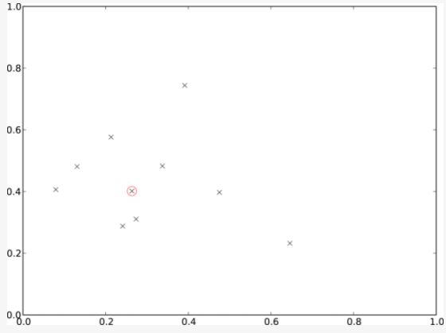
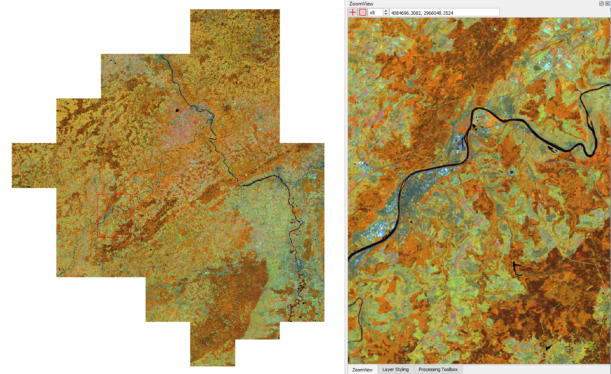
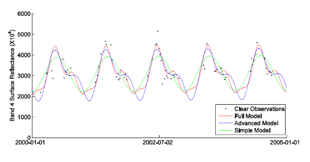
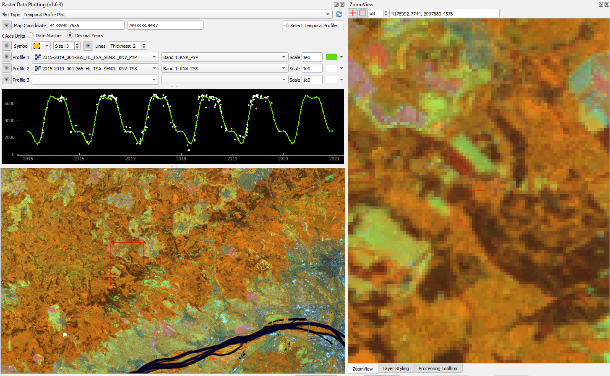
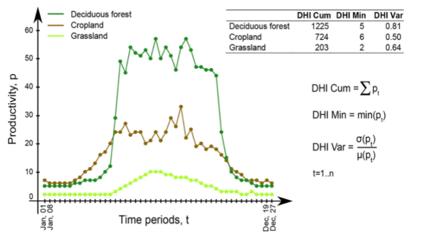
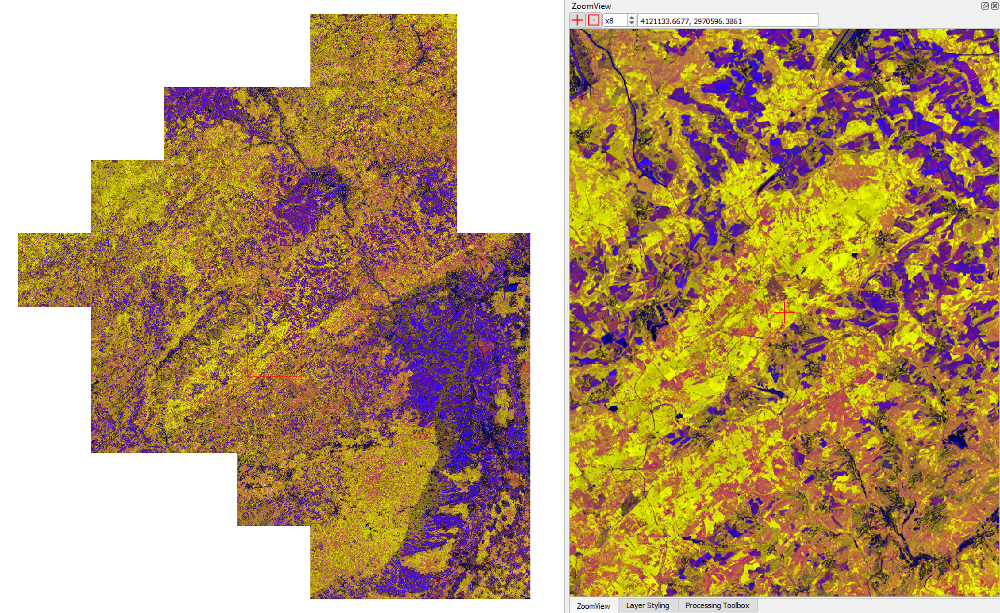
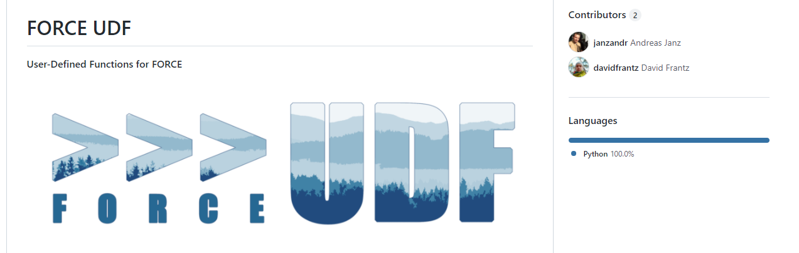

.. _tut-udf_py:
 
User-Defined Functions (Python)
===============================
 
.. |copy|   unicode:: U+000A9 .. COPYRIGHT SIGN

**How to customize your processing**
 
This tutorial introduces User-Defined Functions (Python) in the FORCE Higher Level Processing system (HLPS).
 
.. admonition:: Info

  *This tutorial uses FORCE v. 3.7.4*.

  We assume that you already have an existing Level 2 ARD data pool, which contains preprocessed data for multiple years (see :ref:`tut-ard` tutorial). 
  We also assume that you have a basic understanding of the higher-level processing system (see :ref:`tut-tsi` tutorial).
  *Python* skills are mandatory, too.

------------

FORCE and UDFs
--------------

FORCE is an all-in-one processing engine for medium-resolution Earth Observation image archives. 
FORCE uses the data cube concept and enables you to perform all essential tasks in a typical EO Analysis workflow, i.e. going from data to information.
So far, FORCE merely consisted of rather generic, hand-picked workflows, which are

  1) proven to fulfill a plethora of research requirements, 
  2) computationally optimized, multithreaded algorithms written in *C*,
  3) easily parameterized without any programming expertise.

Thus, FORCE already packs a mouthful of efficient functionality to reduce the entry barrier of large-scale / long-term / dense time-series / big-data applications, and all this in a reproducible manner.
However, what FORCE lacks is full flexibility that can only be provided by interpreted languages like *Python* (or *R*, etc.). 
Yet, to pythonize (is that a word?) a large-scale / long-term / dense time-series / big-data workflow, 
**a big pile** of boilerplate code needs to be written to deal with cumbersome things like 
filtering datasets, 
selecting files that match some criteria (dates, sensors, etc.), 
subsetting and matching bands, 
file access, 
input checks, 
reading input, 
parsing the quality information, 
looping over tiles, 
blocks and pixels, 
the output of data, 
the output of metadata, 
parallelization, 
and whatnot...

Now, we developed one possible solution and aimed at combining the best of both worlds. 
We use 

1) FORCE as “backend” to handle all the boring but necessary stuff that a regular user wants no part of, and
2) introduce User-Defined Functions (UDF) written in *Python* to implement, well, whatever you can think of.

These UDFs only contain the algorithm itself with minimal boilerplate. 
You can write simple scripts, or even plug in complicated algorithms. 
You have a BFAST, LandTrendr, or CCDC implementation in *Python*? Plug-it in! 
You don’t even need to re-compile FORCE, just name the path to the UDF and run. 
The FORCE Docker images even pack some UDFs that are instantly ready to go (we will come back to this later).

FORCE currently provides two entry points for UDFs, both in the Higher Level Processing module.

------------

Entry Point 1: The generic entry point for ARD
----------------------------------------------

Example 1: Compositing
**********************

The ``UDF`` submodule provides you a high level of flexibility 
as it gives you access to the complete reflectance profile of multi-temporal and multi-sensor FORCE data collections. 

In this tutorial, we will implement the medoid, a compositing technique heavily used by our `Australian colleagues <https://www.mdpi.com/2072-4292/5/12/6481>`_ - but not yet natively available in FORCE. 

   *Illustrative example of medoid selection in 2-dimensional space* |copy| `Neil Flood / Remote Sensing <https://www.mdpi.com/2072-4292/5/12/6481>`_

First, we generate a FORCE parameter file:

.. code-block:: none

   force-parameter -c /data/udf/medoid.prm UDF

Then, you have to specify the regular things like input and output directories, processing extent, parallelization options, etc. 
We will not go into detail here, please see the :ref:`basic HLPS tutorial <tut-tsi>` for general usage.

We are going to use one year of Landsat data:

.. code-block:: none

   SENSORS = LND07 LND08
   DATE_RANGE = 2019-01-01 2019-12-31

Then, we tell FORCE where to find the UDF script, and that the UDF shall be a pixel function. 
This means that we need to provide some *Python* code that works on the *time series of a single pixel*. 
The last parameter tells FORCE that we activate UDF processing and output the designated product (``PYP`` - **Py**thon **P**lugin that is).

.. code-block:: none

   FILE_PYTHON = /udf/ard/medoid.py
   PYTHON_TYPE = PIXEL
   OUTPUT_PYP = TRUE

On FORCE’s end, we are now set up and ready to go. In the next step, we have to write the UDF.
For this, create a file (same filename as defined above), and edit it with the IDE / text editor of your choice.

In the global scope, we can import any module that you may need (you have to install it beforehand, but installing it in your userspace is sufficient - 
**although this might not work when using the FORCE Docker container**).
Input and output arrays are *numpy*, so we always need this. 
Additionally, we use *scipy* for some algebra (note: some versions don't work... ``v. 1.6.0`` was successfully used here).

.. code-block:: python

    import numpy as np
    from scipy.spatial.distance import squareform, pdist

Then, each UDF needs an initializer. 
**Important: do not change the function signature or name!**
This function will set up the output and informs FORCE how much memory to allocate. 
You need to define some output bands. 
You can use fixed strings - or dynamically work with the variables that are provided through the function arguments. 
As we want to implement a compositing technique, i.e., reduce a time series to a single spectrum, 
we want to match the output bands with the input, thus, we simply pass through the bandnames:

.. code-block:: python

    def forcepy_init(dates, sensors, bandnames):
        """
        dates:     numpy.ndarray[nDates](int) days since epoch (1970-01-01)
        sensors:   numpy.ndarray[nDates](str)
        bandnames: numpy.ndarray[nBands](str)
        """

        return bandnames

In the next step, we implement the pixel-based algorithm in the ``forcepy_pixel`` function. 
**Do not rename, do not change the function signature.**

.. code-block:: python

    def forcepy_pixel(inarray, outarray, dates, sensors, bandnames, nodata, nproc):
        """
        inarray:   numpy.ndarray[nDates, nBands, nrows, ncols](Int16), nrows & ncols always 1
        outarray:  numpy.ndarray[nOutBands](Int16) initialized with no data values
        dates:     numpy.ndarray[nDates](int) days since epoch (1970-01-01)
        sensors:   numpy.ndarray[nDates](str)
        bandnames: numpy.ndarray[nBands](str)
        nodata:    int
        nproc:     number of allowed processes/threads (always 1)
        Write results into outarray.
        """

The input is a 4D numpy array with dimensions for dates, bands, rows, and columns. 
When writing a "pixel-function", rows and columns are always 1 (we will come later to "block-functions"), 
thus our first step is to collapse the spatial dimensions. 
We check against the nodata value, and skip early if none of the time steps holds data: 

.. code-block:: python

        inarray = inarray[:, :, 0, 0]
        valid = np.where(inarray[:, 0] != nodata)[0]  # skip no data; just check first band
        if len(valid) == 0:
            return

This small piece of code implements the medoid. 
It extracts the spectrum of the observation that is most central in our multidimensional space:

.. code-block:: python

        pairwiseDistancesSparse = pdist(inarray[valid], 'euclidean')
        pairwiseDistances = squareform(pairwiseDistancesSparse)
        cumulativDistance = np.sum(pairwiseDistances, axis=0)
        argMedoid = valid[np.argmin(cumulativDistance)]
        medoid = inarray[argMedoid, :]

Finally, we copy the medoid spectrum to the pre-allocated output array. 
This one-dimensional array is as long as defined via ``forcepy_init``. 
Each band should go to one index.

.. code-block:: python

        outarray[:] = medoid

This is it, save the script,
and conveniently roll out the UDF using FORCE:

.. code-block:: none

    force-higher-level /data/udf/medoid.prm

   *Medoid composite for Rhineland Palatinate, Germany (R: NIR, G: SWIR1, B: Red)*

------------

Entry Point 2: Time series analysis entry point
-----------------------------------------------

Example 2: Interpolation
************************

The second entry point is within the ``TSA`` submodule. 
The mode of operation is similar to above, but here, the user profits from other functions already implemented in FORCE, 
among others the calculation of spectral indices or time series interpolation.

But probably, you want interpolate the data with a different method? 
How about the popular `harmonic model <https://www.sciencedirect.com/science/article/abs/pii/S0034425715000590?via%3Dihub>`_? 

   *Harmonic models fitted to a Landsat time series* |copy| `Zhe Zhu / Remote Sensing of Environment <https://www.sciencedirect.com/science/article/abs/pii/S0034425715000590?via%3Dihub>`_

Let’s generate a FORCE parameter file:

.. code-block:: none

   force-parameter -c /data/udf/harmonic.prm TSA

We are going to use multiple years of Landsat and Sentinel-2 data without interpolation:

.. code-block:: none

   SENSORS = LND07 LND08 SEN2A SEN2B
   DATE_RANGE = 2015-01-01 2020-12-31
   INTERPOLATE = NONE

Another new feature in FORCE >= v. 3.7: `land-cover-adaptive spectral harmonization <https://doi.org/10.1016/j.rse.2020.111723>`_, so let’s try this as well:

.. code-block:: none

   SPECTRAL_ADJUST = TRUE

As spectral index, we will use the recently developed `kernelized NDVI <https://doi.org/10.1126/sciadv.abc7447>`_:

.. code-block:: none

   INDEX = kNDVI

Again, a pixel-based UDF:

.. code-block:: none

   FILE_PYTHON = /udf/ts/harmonic.py
   PYTHON_TYPE = PIXEL
   OUTPUT_PYP = TRUE

We create a new *Python* script, and start by loading some modules to deal with dates, 
as well as *scipy* for fitting a regressor.

.. code-block:: python

    from datetime import datetime, timedelta
    import numpy as np
    from scipy.optimize import curve_fit

We can use the global scope to define parameters, e.g. config variables like the start/end dates and interpolation step:

.. code-block:: python

    # some global config variables
    date_start = 16436  # days since epoch (1970-01-01)
    date_end   = 18627  # days since epoch (1970-01-01)
    step = 16  # days

In the initializer function, we use these variables to generate formatted bandnames. 
As a rule, FORCE will automatically check whether the 1st word is an 8-digit date, and if so, it will set the metadata correctly.

.. code-block:: python

    def forcepy_init(dates, sensors, bandnames):

        bandnames = [(datetime(1970, 1, 1) + timedelta(days=days)).strftime('%Y%m%d') + ' sin-interpolation'
                    for days in range(date_start, date_end, step)]
        return bandnames

In the next step, we define the regressor, 
e.g. Zhe Zhu’s `time series model based on harmonic components <https://www.sciencedirect.com/science/article/pii/S0034425715000590>`_. 
We are not going into detail here as we assume that the reader is familiar with how these things work in *Python*:

.. code-block:: python

    # regressor
    # - define all three models from the paper
    def objective_simple(x, a0, a1, b1, c1):
        return a0 + a1 * np.cos(2 * np.pi / 365 * x) + b1 * np.sin(2 * np.pi / 365 * x) + c1 * x

    def objective_advanced(x, a0, a1, b1, c1, a2, b2):
        return objective_simple(x, a0, a1, b1, c1) + a2 * np.cos(4 * np.pi / 365 * x) + b2 * np.sin(4 * np.pi / 365 * x)

    def objective_full(x, a0, a1, b1, c1, a2, b2, a3, b3):
        return objective_advanced(x, a0, a1, b1, c1, a2, b2) + a3 * np.cos(6 * np.pi / 365 * x) + b3 * np.sin(
            6 * np.pi / 365 * x)

    # - choose which model to use
    objective = objective_full

In ``forcepy_pixel``, we flatten the input array. 
We can do this because the TSA module is only considering one index at a time, thus dimensions 2-3 are of length 1. 
If we use multiple Indices (e.g. ``INDEX = kNDVI TC-GREEN NDVI``), the function is simply invoked multiple times.
If there is no data, we are exiting early and safe.

.. code-block:: python

    def forcepy_pixel(inarray, outarray, dates, sensors, bandnames, nodata, nproc):

        # prepare dataset
        profile = inarray.flatten()
        valid = profile != nodata
        if not np.any(valid):
            return

We fit a harmonic model to the VI time series (``y``) along the date axis (``x``):

.. code-block:: python

        # fit
        xtrain = dates[valid]
        ytrain = profile[valid]
        popt, _ = curve_fit(objective, xtrain, ytrain)

Then, we predict the VI at each interpolation step ...

.. code-block:: python

        # predict
        xtest = np.array(range(date_start, date_end, step))
        ytest = objective(xtest, *popt)

... and put the values into the output array:

.. code-block:: python

        outarray[:] = ytest

Save the script, and roll-out with FORCE:

.. code-block:: none

   force-higher-level /data/udf/medoid.prm

The interpolated time series look like this:

   *Harmonic fit for a deciduous forest pixel. White points: individual kNDVI observations. Green curve: fitted values.*

.. note::
    As described above, FORCE sets the dates in the metadata, such that the 
    ``Raster Data Plotting`` and ``Raster Time Series Manager`` ``QGIS`` plug-ins can visualize these data.

------------

Example 3: Predictive features
******************************

So far, we have written pixel functions. 
These are parallelized according to the ``NTHREAD_COMPUTE`` parameter using a *Python* multiprocessing pool, 
i.e., a *Python* layer that is hidden from you for your convenience. 
FORCE also offers to provide block functions, wherein the *Python* UDF receives a whole block of data. 
In this case, FORCE does not parallelize the computation, 
but this can be well compensated for if your UDF is constrained to a series of fast *numpy* array functions.

A potential use case is the generation of predictive features. 
FORCE already packs a lot of that functionality, but in case you need more flexibility, 
the following recipe might be interesting for you. 

We will implement the `Dynamic Habitat Indices <https://www.sciencedirect.com/science/article/abs/pii/S0034425717301682>`_, 
which were designed for biodiversity assessments and to describe habitats of different species 
(these are **very** similar to the STMs already included in FORCE, but not exactly the same).

There are three DHIs:

1) DHI cum – cumulative DHI, i.e., the area under the phenological curve of a year
2) DHI min – minimum DHI, i.e., the minimum value of the phenological curve of a year
3) DHI var – seasonality DHI, i.e., the coefficient of variation of the phenological curve of a year

   *Calculation of the DHIs* |copy| `Martina Hobi / Remote Sensing of Environment <https://www.sciencedirect.com/science/article/abs/pii/S0034425717301682>`_

Generate a FORCE parameter file:

.. code-block:: none

   force-parameter -c /data/udf/dhi.prm TSA

We are going to use exactly one year of Landsat and Sentinel-2 data. 
We enable RBF interpolation with extraordinarily large kernels to make sure that the time series does not contain any nodata values. 
The latter is necessary as the **cumulative** DHI is sensitive to the number of observations *N*.

    I personally would prefer to normalize by *N*, i.e., the mean, but we here want to implement the original DHI.

.. code-block:: none

   SENSORS = LND07 LND08 SEN2A SEN2B
   DATE_RANGE = 2018-01-01 2018-12-31
   INTERPOLATE = RBF
   RBF_SIGMA = 8 16 32 64
   RBF_CUTOFF = 0.95
   INT_DAY = 16

As above, we also use spectrally harmonized kNDVI: 

.. code-block:: none

   SPECTRAL_ADJUST = TRUE
   INDEX = kNDVI

Then, we tell FORCE that we will provide a **block function**:

.. code-block:: none

   FILE_PYTHON = /udf/ts/dhi.py
   PYTHON_TYPE = BLOCK
   OUTPUT_PYP = TRUE

The *Python* script has a very similar structure to the previous examples. 
We load some modules ...

.. code-block:: python

    import numpy as np
    import warnings

... and define the three DHI output bands:

.. code-block:: python

    def forcepy_init(dates, sensors, bandnames):

        return ['cumulative', 'minimum', 'variation']

``forcepy_block`` has the same function signature as ``forcepy_pixel``, 
but the input array holds a complete block of data, i.e., 
nrows and ncols are greater than 1. 
In the TSA submodule, nbands is always 1, thus, 
we strip away the band dimension, convert the array to Float, 
and replace nodata values by NaN to enable *np.nan*-functions.
Again, we assume that you know how these things work in *Python*, thus, 
we do not provide much explanation here.

.. code-block:: python

    def forcepy_block(inarray, outarray, dates, sensors, bandnames, nodata, nproc):
        """
        inarray:   numpy.ndarray[nDates, nBands, nrows, ncols](Int16)
        outarray:  numpy.ndarray[nOutBands](Int16) initialized with no data values
        dates:     numpy.ndarray[nDates](int) days since epoch (1970-01-01)
        sensors:   numpy.ndarray[nDates](str)
        bandnames: numpy.ndarray[nBands](str)
        nodata:    int
        nproc:     number of allowed processes/threads
        Write results into outarray.
        """

        # prepare data
        inarray = inarray[:, 0].astype(np.float32) # cast to float ...
        invalid = inarray == nodata
        if np.all(invalid):
            return
        inarray[invalid] = np.nan        # ... and inject NaN to enable np.nan*-functions

Next, we catch and ignore warnings. 
This is a cosmetic procedure as numpy will print some warnings if one pixel only contains nodata values (not critical, but ugly). 
The DHI computation itself is simple: 
we simply use numpy statistical aggregations along the temporal axis. 
The scaling factors are necessary as FORCE expects to receive 16bit Integers from *Python*.

.. code-block:: python

        # calculate DHI
        with warnings.catch_warnings():
            warnings.simplefilter("ignore", RuntimeWarning)
            cumulative = np.nansum(inarray, axis=0) / 1e2
            minimum    = np.nanmin(inarray, axis=0)
            variation  = np.nanstd(inarray, axis=0) / np.nanmean(inarray, axis=0) * 1e4

The three DHI indices are then copied to the output array ...

.. code-block:: python

        # store results
        for arr, outarr in zip([cumulative, minimum, variation], outarray):
            valid = np.isfinite(arr)
            outarr[valid] = arr[valid]

... and we roll out with:

.. code-block:: none

   force-higher-level /data/udf/dhi.prm

If we generate for a large extent (multiple tiles), use mosaics and pyramids:

.. code-block:: none

   force-pyramid /data/udf/X*/*.tif
   force-mosaic /data/udf

   *Dynamic Habitat Indices for Rhineland Palatinate, Germany (R: cumulative, G: minimum, B: variation)*

In yellow, we have land covers that have photosynthetically active vegetation across the entire year (high cumulation and high minimum), e.g. coniferous forests.
In red, we have a fairly high cumulation, too, but a low minimum, e.g. deciduous forests that shed their leaves in the winter.
In blue, we have land covers with high seasonality and a complete barren surface at one point in the year. 
These are mostly agricultural areas.
The gradient from blue to purple indicates that biomass is present for a longer time throughout the year for some of the fields. 
This may be related to different crop types (that take longer to grow) or where double cropping is present.

------------

FORCE UDF repository
--------------------

Now, it’s your turn! 
Plug your *Python* algos into FORCE and roll them out. 

If you do, we encourage you to share your UDFs, such that the community as a whole benefits, 
and gains access to a broad variety of workflows. 
This extra step of publishing your workflow is a small step to overcome the so-called 
`"Valley of Death" <https://twitter.com/gcamara/status/1127887595168514049>`_ in Earth observation applications and 
fosters reproducible research! 

To make it easier for you, we have created a `FORCE UDF repository <https://github.com/davidfrantz/force-udf>`_, 
where you can pull-request your UDF (only minimal documentation needed, see the examples). 

All examples from this tutorial are included there, too. 

As a bonus, the UDFs in that repository are automatically shipped with the FORCE Docker containers 
(`davidfrantz/force <https://hub.docker.com/r/davidfrantz/force>`_) (mounted under ``/home/docker``, e.g. ``/home/docker/udf/python/ard/medoid/medoid.py``), 
thus making it easier than ever to contribute to the FORCE project.

------------

.. |df-link| replace:: Trier University
.. _df-link: https://www.uni-trier.de/universitaet/fachbereiche-faecher/fachbereich-vi/faecher/kartographie/personal/frantz

.. |ar-link| replace:: Humboldt-Universität zu Berlin
.. _ar-link: https://www.geographie.hu-berlin.de/en/professorships/eol/people/labmembers/andreas_rabe

+--------------+--------------------------------------------------------------------------------+
+ |df-pic|     + This tutorial was written by                                                   +
+              + `David Frantz <https://davidfrantz.github.io>`_,                               +
+              + main developer of **FORCE**,                                                   +
+              + Assistant Professor at |df-link|_                                              +
+              + *Views are his own.*                                                           +
+--------------+--------------------------------------------------------------------------------+
+ **EO**, **ARD**, **Data Science**, **Open Science**                                           +
+--------------+--------------------------------------------------------------------------------+
+ |ar-pic|     + The FORCE-Python bridge and UDF mechanic was co-developed by                   +
+              + Andreas Rabe,                                                                  +
+              + research assistant at |ar-link|_                                               +
+              + *Views are his own.*                                                           +
+--------------+--------------------------------------------------------------------------------+
+ **Software Development**, **Remote Sensing**, **Data Science**, **Python**, **QGIS**          +
+--------------+--------------------------------------------------------------------------------+
