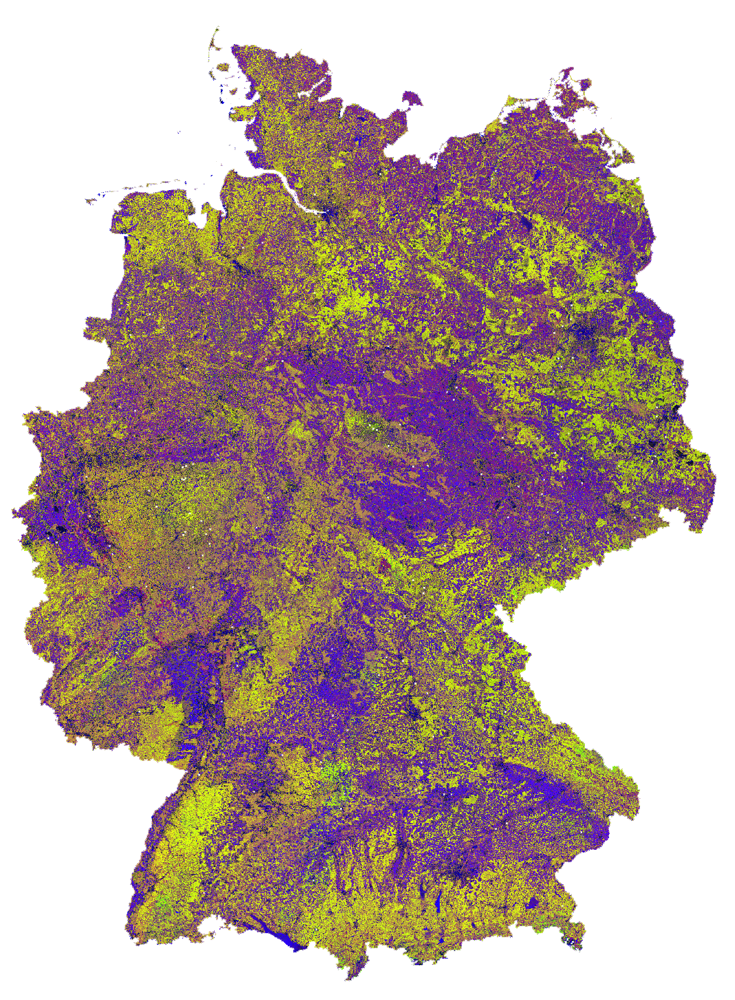

.. _tut-udf_r:
 
User-Defined Functions (R)
==========================
 
.. |copy|   unicode:: U+000A9 .. COPYRIGHT SIGN

**How to customize your processing**
 
This tutorial introduces User-Defined Functions (R) in the FORCE Higher Level Processing system (HLPS).
 
.. admonition:: Info

  *This tutorial uses FORCE v. 3.7.11*.

  We assume that you already have an existing Level 2 ARD data pool, which contains preprocessed data for multiple years (see Level 2 ARD tutorial). 
  We also assume that you have a basic understanding of the higher-level processing system (see interpolation tutorial), 
  and have read through the **Python UDF tutorial that describes how UDFs work in FORCE**.
  *R* skills are mandatory, too, of course.

.. image:: ../img/force-udf.png
    :target: https://github.com/davidfrantz/force-udf

------------

FORCE and UDFs
--------------

Since FORCE v. 3.7.11, user-provided *R*-code can be plugged into FORCE to provide flexibility beyond the features already implemented.
Thus, we use 

1) FORCE as “backend” to handle all the boring but necessary stuff that a regular user wants no part of, and
2) introduce User-Defined Functions (UDF) written in *R* to implement, well, whatever you can think of.

These UDFs only contain the algorithm itself with minimal boilerplate. 
You can write simple scripts, or even plug in complicated algorithms. 
You have a BFAST, LandTrendr, or CCDC implementation in *R*? Plug-it in! 
You don't even need to re-compile FORCE, just name the path to the UDF and run. 
The FORCE Docker images even pack some UDFs that are instantly ready to go (we will come back to this later).

Please read through the :ref:`tut-udf_py` Tutorial for a basic understanding of UDFs in FORCE 
(and also if you prefer your UDFs in Python).

Entry points
------------

FORCE currently provides two entry points for UDFs, both in the Higher Level Processing module.

1) **The generic entry point for ARD**: 
    Entry point 1 is used through the ``UDF`` submodule and gives you flexible access to the complete 
    reflectance profile of multi-temporal and multi-sensor FORCE data collections. 
   
2) **Time series analysis entry point**:
    Entry point 2 is within the ``TSA`` submodule. 
    Here, the user profits from other functions already implemented in FORCE, 
    among others the calculation of spectral indices or time series interpolation.
    Instead of the full spectral profile, the user gets access to the time series of
    the requested spectral index (e.g. NDVI), potentially already interpolated.

For both entry points, firstly generate a parameter file with ``force-parameter``, 
either with ``UDF`` or ``TSA`` submodule.

FORCE's parameter file 
----------------------

Let's assume that we want to generate some predictive features. 
FORCE already packs a lot of that functionality, but in case you need more flexibility, 
the following recipe might be interesting for you. 

We will implement the `Dynamic Habitat Indices <https://www.sciencedirect.com/science/article/abs/pii/S0034425717301682>`_, 
which were designed for biodiversity assessments and to describe habitats of different species 
(these are **very** similar to the STMs already included in FORCE, but not exactly the same).

There are three DHIs:

1) DHI cum - cumulative DHI, i.e., the area under the phenological curve of a year
2) DHI min - minimum DHI, i.e., the minimum value of the phenological curve of a year
3) DHI var - seasonality DHI, i.e., the coefficient of variation of the phenological curve of a year

.. figure:: img/tutorial-udf-dhi-hobi.png

   *Calculation of the DHIs* |copy| `Martina Hobi / Remote Sensing of Environment <https://www.sciencedirect.com/science/article/abs/pii/S0034425717301682>`_

For this, we will use entry point 2 (``TSA``), and set some suitable settings in the parameter file.
This will give us Landsat data for 2022.
The 16-day interpolated kNDVI time series will be made available to the R UDF that we are about to write.

.. code-block:: none

   SENSORS = LND08 LND09
   DATE_RANGE = 2022-01-01 2022-12-31
   INDEX = kNDVI
   INTERPOLATE = RBF
   RBF_SIGMA = 8 16 32 64
   RBF_CUTOFF = 0.95
   INT_DAY = 16

The R UDFs are configured with three simple parameters:

.. code-block:: none

   FILE_RSTATS = /udf/ts/dhi.r
   RSTATS_TYPE = PIXEL
   OUTPUT_RSP = TRUE

``FILE_RSTATS`` defines the UDF script that should be plugged into FORCE.
``RSTATS_TYPE`` is either a ``PIXEL`` or a ``BLOCK`` function.
``OUTPUT_RSP`` is a flag that activates UDF processing and outputs the designated product (``RSP`` - **R** **Stats** **P** lugin that is).

The UDF
-------

Now is the time to write the UDF (in this case: ``/udf/ts/dhi.r``)

The UDF needs to include two functions - 
one for initializing the UDF, and one for implementing the UDF functionality.
These functions need specific names and function signatures.
The processing will abort if these functions are not present.

Additionally, a global header can be included. 
And you can add other functions, too.

All in all, you have a lot of flexibility - 
only the two required functions require sticking to the specification.

Global header (optional)
++++++++++++++++++++++++

The UDF can contain a global header. 
Everything in this header is executed at the beginning of the processing (*only once!*).
This can be handy to load packages that you need in your UDF, e.g.

.. code-block:: r

    library(dplyr)

You can use all R packages that are available on your system!

If you are working with FORCE in Docker, there is one thing to take care of, though: 
In the Docker container, only few packages are pre-installed and 
the R instance in the container won't recognize packages installed on your host system. 
However, you can make this work by mounting your home directory in Docker with ``-v $HOME:$HOME``.
In the global header, add something like this:

.. code-block:: r

    .libPaths(c(.libPaths(), "/home/frantz/R/x86_64-pc-linux-gnu-library/4.2"))

This adds the R libraries on my host system to the library trees within which packages are looked for.
Every package that I installed with ``install.packages()`` is now available in Docker, too.

*You have to provide the path to your own libraries, of course.*
*And I have no idea what happens when the R version on your host is different from the one in the container :)*

Initializing the UDF
++++++++++++++++++++

Each UDF needs an initializer. 
**Important: do not change the function signature or name!**

This function will inform FORCE how much memory to allocate. 
Therefore, you need to return the bandnames for the output layers that you will generate in the UDF.
The number of bandnames **needs to strictly match** the number of bands in your UDF output.

You can use fixed strings - or dynamically work with the variables that are provided through the function arguments. 
This function has the same structure for each UDF type (PIXEL/BLOCK)  and submodule (UDF/TSA).

For implementing the DHI, we need to define three output bands:

.. code:: r

    # dates:     vector with dates     of input data (class: Date)
    # sensors:   vector with sensors   of input data (class: character)
    # bandnames: vector with bandnames of input data (class: character)
    force_rstats_init <- function(dates, sensors, bandnames){

        return(c("cumulative", "minimum", "variation"))
    }

Implementing the UDF functionality
++++++++++++++++++++++++++++++++++

In the next step, we write the actual code.
Depending on the settings of ``RSTATS_TYPE``, we either write a function named

- ``force_rstats_pixel <- function(inarray, dates, sensors, bandnames, nproc){ ... }``, or
- ``force_rstats_block <- function(inarray, dates, sensors, bandnames, nproc){ ... }``.

The function signature is the same, but they behave a bit differently.

The pixel function will receive the time series of one single pixel, 
and hence is the easiest to implement.
I guess that most users will simply use the PIXEL-functions, 
thus I focus on these (but see notes on BLOCK-functions below).

For PIXEL-functions, ``inarray`` is a 2D-array with dimensions ``(number of dates, number of bands)``.

- For the UDF-submodule, the number of bands depends on the sensor constellation used, 
  e.g., 10 bands when using Sentinel-2 only.
- For the TSA-submodule, the number of bands is always 1, and refers to the requested index or band.
  If you have requested multiple indices/bands, the UDF will be invoked multiple times - 
  but separately for each index.
- BTW, the number of bands corresponds to the input bandnames in the initializer function.

For PIXEL-functions, ``nproc`` is always 1. 
This is, because the parallelization is taken care of on FORCE's end.
Internally, FORCE uses the ``snow/snowfall`` packages to call your PIXEL-UDF parallely.
The snowfall cluster is initialized with as many CPUs as given by the ``NTHREAD_COMPUTE`` parameter in the parameter file.
Note that printing (``print()``) in the UDF only works when ``NTHREAD_COMPUTE = 1`` -
in this case, FORCE uses ``apply()`` instead of ``sfApply()`` to call your UDF 
(somehow printing does not work in the latter, so don't include ``print()`` statements as it will only slow down the process.
If you want to print, consider using ``PRETTY_PROGRESS = FALSE`` in the parameter file).

Now, let's implement the DHI as PIXEL-function in the TSA submodule:

.. code:: r

    # inarray:   2D-array with dim = c(length(dates), length(bandnames))
    #            No-Data values are encoded as NA.  (class: Integer)
    # dates:     vector with dates     of input data (class: Date)
    # sensors:   vector with sensors   of input data (class: character)
    # bandnames: vector with bandnames of input data (class: character)
    # nproc:     number of CPUs the UDF may use. Always 1 for pixel functions (class: Integer)
    force_rstats_pixel <- function(inarray, dates, sensors, bandnames, nproc){

        s <- sum(inarray[,1], na.rm = TRUE) / 1e2
        m <- min(inarray[,1], na.rm = TRUE)
        v <- sd(inarray[,1],  na.rm = TRUE) / mean(inarray[,1],  na.rm = TRUE) * 1e4

        return(c(s, m, v))
    }

As we only have 1 band, we simply aggregate the values along the time axis.
Then, we return values for our three output bands.
The scaling factors make sure that FORCE can convert the result into a 16bit datatype (-32768 ... 32767).

And this is it. Save the UDF, run ``force-higher-level``, compute some pyramids and mosaics, and have a look at the results.
If you are running in Docker, all should be set up already. 
If you are running a FORCE version that is directly installed on your machine, 
you need to define two environment variables before running:

.. code-block:: none

    # not needed when using Docker!
    export R_HOME=$(R RHOME)
    export LD_LIBRARY_PATH=$R_HOME/lib

.. code-block:: none

   force-higher-level /data/udf/dhi.prm
   force-pyramid /data/udf/X*/*.tif
   force-mosaic /data/udf

   *Dynamic Habitat Indices for Germany (R: cumulative, G: minimum, B: variation)*

In yellow, we have land covers that have photosynthetically active vegetation across the entire year (high cumulation and high minimum), e.g. coniferous forests.
In red, we have a fairly high cumulation, too, but a low minimum, e.g. deciduous forests that shed their leaves in the winter.
In blue, we have land covers with high seasonality and a complete barren surface at one point in the year. 
These are mostly agricultural areas.
The gradient from blue to purple indicates that biomass is present for a longer time throughout the year for some of the fields. 
This may be related to different crop types (that take longer to grow) or where double cropping is present.

BLOCK-functions
+++++++++++++++

BLOCK-functions behave a bit differently from the PIXEL-functions.

They receive a full block of data, i.e., a 4D-array with following dimensions:

1) number of dates
2) number of bands
3) number of rows
4) number of columns

For BLOCK-functions, no parallelization is done on FORCE's end. 
``nproc`` will be set to the value of ``NTHREAD_COMPUTE`` and you can implement your own parallelization if needed.

The returned object must be a 3D-array with following dimensions:

1) number of output bands (as initialized)
2) number of rows
3) number of columns

The usage of BLOCK-functions is most helpful if you manage to implement your UDF with matrix computations.

**If you find yourself looping over the pixels, either with a for-loop, apply or sfApply function: stop it and just use the PIXEL-function!**
*PIXEL-functions are easier to write and FORCE will internally use sfApply to loop over the pixels anyway.*

This is the function signature of the BLOCK-function:

.. code:: r

    # inarray:   4D-array with dim = c(length(dates), length(bandnames), length(rows), length(cols))
    #            No-Data values are encoded as NA.   (class: Integer)
    # dates:     vector with dates     of input data (class: Date)
    # sensors:   vector with sensors   of input data (class: character)
    # bandnames: vector with bandnames of input data (class: character)
    # nproc:     number of CPUs the UDF may use      (class: Integer)
    force_rstats_pixel <- function(inarray, dates, sensors, bandnames, nproc){

        array_3d <- ...

        return(array_3d)
    }

FORCE UDF repository
--------------------

Now, it's your turn! 
Plug your *R* algos into FORCE and roll them out. 

If you do, we encourage you to share your UDFs, such that the community as a whole benefits, 
and gains access to a broad variety of workflows. 
This extra step of publishing your workflow is a small step to overcome the so-called 
`"Valley of Death" <https://twitter.com/gcamara/status/1127887595168514049>`_ in Earth observation applications and 
fosters reproducible research! 

To make it easier for you, we have created a `FORCE UDF repository <https://github.com/davidfrantz/force-udf>`_, 
where you can pull-request your UDF (only minimal documentation needed, see the examples). 

All examples from this tutorial are included there, too. 

As a bonus, the UDFs in that repository are automatically shipped with the FORCE Docker containers 
(`davidfrantz/force <https://hub.docker.com/r/davidfrantz/force>`_) (mounted under ``/home/docker``, e.g. ``/home/docker/udf/rstats/ts/dynamic-habitat-indices/dhi.r``), 
thus making it easier than ever to contribute to the FORCE project.

.. image:: img/tutorial-udf-repo.png
    :target: https://github.com/davidfrantz/force-udf

------------

.. |df-pic| image:: profile/dfrantz.jpg
.. |ar-pic| image:: profile/arabe.jpg

.. |df-link| replace:: Trier University
.. _df-link: https://www.uni-trier.de/universitaet/fachbereiche-faecher/fachbereich-vi/faecher/kartographie/personal/frantz

+--------------+--------------------------------------------------------------------------------+
+ |df-pic|     + This tutorial was written by                                                   +
+              + `David Frantz <https://davidfrantz.github.io>`_,                               +
+              + main developer of **FORCE**,                                                   +
+              + Assistant Professor at |df-link|_                                              +
+              + *Views are his own.*                                                           +
+--------------+--------------------------------------------------------------------------------+
+ **EO**, **ARD**, **Data Science**, **Open Science**                                           +
+--------------+--------------------------------------------------------------------------------+

